# Warping Text to a Bézier curves


http://www.planetclegg.com/projects/WarpingTextToSplines.html

https://csswarp.eleqtriq.com/

svg textPath

# 延贝塞尔曲线排列文本

## Background

A while back I got curious about how certain text effects could be achieved, and one of the things I explored was warping text along a curve to achieve a kind of sweeping effect. I created a prototype for this, to explore different solutions. This article contains some general notes on the subject, as I reflect back on this work. The information given here could be used as a kind of cookbook to replicate the work. The original work was done using C# and GDI+, although the concepts are applicable to other frameworks. 


## 背景

不久前，我对文本能实现哪些特效比较好奇，探索的其中之一便是将文本延曲线排列实现类似擦除的特效。

为此我弄了个原型，尝试不同的解决方案。这篇文章记录了一此通用解决方案，作为我的工作回顾。

这些记录的实现方法可作为实现类似效果的工作手册。

我最开始用的是 C# 和 GDI+ 实现，当然这一实现方法也适用于其它框架。

## Bendy Text

Given some arbitrary spline, how can text be drawn in such a way that it appears to follow the curve in a way that is appealing to the eye?
A sample of the desired result.

## 弯曲的文本

给定一些任意的样条曲线，如何延曲线将文本绘制在上面且吸引人


;
>期望实现的效果

Looking around the interwebbietubes, there seemed to be few examples of doing this, and most examples were crude, i.e. involving rotating individual letters with linear transforms to align each character with the curve, which results in a very odd, non-fluid appearance. Much good information was gleaned from old articles written by Don Lancaster, in particular one about Nonlinear Graphics Transforms from 1995. As always, it is good to keep in mind that in this field, we stand on the shoulders of giants. Many thanks to Don for putting so much good and accessible information out there over the years. 

在网上找了一圈，发现实现例子比较少，大部分实现的很糙，比如将字母单独延曲线进行线性旋转变幻，这样实现的结果非常生硬，不流畅。

更好的实现方法被收集在了一篇 1995 年的老文章内，作者是 ~[Don Lancaster](https://www.tinaja.com/), 比较特殊的一点是非线性图形变幻（Nonlinear Graphic Transforms）。

牢记在这一领域我们是站在巨人的肩膀上。非常感谢 Don 这些年产出的非常优质且易理解的知识。

## Vector text

Normally when thinking about drawing text in GDI+, most people think of Graphics.DrawString() and the like, which given a string will draw into a Graphics context. The result is a bunch of pixels, not exactly useful for doing non-linear transformations. What would be preferable is to get vector outlines of the rendered text, with points that can be transformed to get the desired effect. Fortunately, GraphicsPath provides a mechanism for doing this, even if the API is a little obtuse. It helps to understand what a GraphicsPath is: GraphicsPath is a form of display list, consisting of a very small number of simple vector primitives. Pixels just don't exist as far as a GraphicsPath is concerned, until it's rendered using Pens and/or Brushes. In fact, here is a complete list of all the primitives that are used under the hood by GraphicsPath: 

- Start: Defines a point that is used to denote the starting point of a path
- Line: a line. includes the endpoint, the start point was the last point from the last instruction.
- Bezier: a cubic Bézier curve. Defines 3 of the 4 control points, the start point is the last point from the last instruction
- Bezier3: A quadratic Bézier curve. (see below)
- CloseSubpath: marks the endpoint of a subpath this is used for
- PathMarker: defines a marker for a path. Not used for rendering as far as I can tell, this is for information purposes
- DashMode: marks a segment as dashed, which gives a suggestion on how it should be rendered


There are just two that render something visible when a GraphicsPath is drawn: Line and Bézier. Note that the MSDN documentation mixes up quadratic and cubic Splines. (Imagine that! misleading MSDN docs. Grumble.) In practice, I've never run across a GraphicsPath that actually contains a quadratic spline (Bezier3).

What about other shapes?   After all, an ellipse can be added to a GraphicsPath, it must have an ellipse primitive, right? Nope. If an ellipse is added to a GraphicsPath, under the hood it will be approximated using several Bézier splines.

What about adding text to a GraphicsPath? Once again, it reduces to a bunch of points and instructions for lines and cubic Béziers. These are derived directly from the description of the font, which is vector based as well. The nice thing is that if a bunch of things drawn into a GraphicsPath, one can iterate over these primitives and get a complete description of what it is doing under the hood. And with that information, an identical path can reconstructed from the primitives. During the process, the points can be pushed around using some kind of transform to achieve the text warping effect. 


## 矢量文本

一般来讲要用 GDI+ 绘制文本，大部分人首先想到的就是 Graphics.DrawString() 类似这样的 API, 它可以用于提供字一个符串传进图形上下文(Graphics context)。结果是一堆像素信息，对于非线性变形没啥用处。

更好的方式是获取渲染文本包含可用于形变点的外边形矢量，可用于形变成我们期望的效果。幸运的是 GraphicsPath 提供了此功能方法，即便 API 比较别扭。

帮助我们理解 GraphicsPath 的一点是：GraphicsPath 是一个标准化的显示列表，持有非常少的矢量元信息。

就 GraphicsPath 而言它不关注像素信息, 直到它用 Pens 或 Brushes 渲染。

事实上，以下就是我们会用到的 GraphicsPath 元数据的完整列表：

- Start: 定义路径起始点

- Line: 线条。包含结束点，最后一条指令起始点作为最后一个点。

- Bezier: 三阶贝塞尔曲线

- Bezier3： 二阶贝塞尔曲线

- CloseSubpath: 用于子路径的闭合

- PathMarker: 定义一条路径的标记，只是标记了信息并不用于渲染

- DashMode: 是否虚线模式渲染


当使用 GraphicsPath 进行绘制时，跟显示相关的方法仅有两个：线条和贝塞尔曲线。注意 MSDN 文档混淆了二阶与三阶样条曲线（想象一下! 官方文档居然进行错误引导）。

在实际使用中，在 GraphicsPath 上从未用到过二阶样条曲线（Bezier3）

其它形状怎么办？在最后椭圆可以被添加进 GraphicsPath， 它应该有椭圆元数据对吧？错！，如果一个椭圆被添加进了 GraphicsPath, 在内部它会用数条贝塞尔样条曲线模拟实现。


那么使用 GraphicsPath 添加文本呢？再次的，它会被简化为一堆点，线条，和贝塞尔曲线。这些都直接来源于字体描述，它也是基于矢量的。

比较好的一件事是在 GraphicsPath 内一堆绘制，可通过迭代获取内部用于绘制的完整的描述信息。

有了这些元信息就可重建这条路径。在处理过程中，这些点可用一些形变操作达到文本缠绕效果。


> 文本被添加进 一个 GraphicsPath 然后渲染出来且没有填充
> 所有这条路径的点被标记为红色(包含用于样条的控制点)

## Bézier curves

For my first pass at this, I decided to use a Bézier spline to define the path of the text. Cubic Béziers are supported by GDI+, there are methods for drawing them on the Graphics object, and they are one of the few primitives supported by GraphicsPath. The formulas for Béziers are simple to calculate, they can be used to approximate other curves, and getting a set of points along a cubic Bézier given its four control points is mostly a trivial exercise. More complex shapes/curves would come later.

Getting a point on a Bézier curve is not something that GDI+ provides for, so understanding the formulas for cubic Béziers is necessary for this work. I won't go into exhaustive detail on the math behind this, as plenty of information is readily available on this subject, from Wikipedia and elsewhere. 

## 贝塞尔曲线

在此我第一次尝试，我决定使用贝塞尔样条定义文本的路径。GDI+ 支持三阶贝塞尔， 图形对象上有一些用于绘制的方法， 为数不多中的一个可用于获取元数据。

贝塞尔公式计算比较简单，它们可被用于摸拟其它曲线，通过控制点创建一条贝塞尔曲线练习获取一堆延贝塞尔曲线的点信息比较容易。更复杂的图形/曲线稍后会有。

获取贝塞尔曲线上的一个点 GDI+ 并未提供，所以搞懂三阶贝塞尔公式在此是必须的。我并不打算讲解背后的大量数学细节。此课题在Wikipedia 和其它地方有大量的资料可供查询。

## Formulas for cubic Béziers

OK, math time! It is most illustrative to look at how a cubic Bézier is constructed geometrically, which is pictured below. 

## 贝塞尔曲线公式

好了，数学时间到！大多数贝塞尔曲线的几何形成图形应该像以下图


> The geometric construction of a cubic Bézier (image from Wikipedia) 

The curve is defined by four control points P0 through P3. The first and last point are the start and end point of the curve, the other two are colloquially referred to as "handles" to control the shape of the curve. The four control points can be connected to form three line segments (pictured in gray). Three points are interpolated using the parameter t on the line segments connecting the control points, and these form the two green segments above. A final line segment is constructed by interpolating points along the previous two segments for t in the same way (shown in blue). A final point is interpolated along this last line segment, and that point is a point on the curve for value t. 


曲线由 P0-P3 共 4 个点控制。第一个和最后一个是曲线的起始与结束点， 另两个是点通常被称为 “手柄” 用于控制曲线形状。

四个点被连接成三条线断(图中灰色线)。

在控制点连接形成的线段上的三个点由参数 t 插值形成，在上面构成了两条绿色线断。

最后一条蓝色线断由前两条绿色插值线与 t 同样方式产生。

最后一个点是延最后这条线断插值产生，且这个点就 曲线 t 值 对应曲线上的点


The linear interpolation (lerp) between two scalar values is defined as follows: 

两个标量之间的线性插值如下：

```
vlerp = v0 + ( v1 - v0 ) * t 
```

From which one can create a lerp function between two 2D points: 

可用写个 2 个 2D 点之间的线性插值方法：

```
lerp(P0, P1, t) :
    xlerp = x0 + ( x1 - x0 ) * t 
    ylerp = y0 + ( y1 - y0 ) * t 
    return point (xlerp, ylerp)
```

The geometric picture above can then be expressed as follows: 

上面的几何图形就可被以下方式表达：

```
P4 = lerp(P0, P1, t);
P5 = lerp(P1, P2, t);
P6 = lerp(P2, P3, t);
P7 = lerp(P4, P5, t);
P8 = lerp(P5, P6, t);
P9 = lerp(P7, P8, t);

P9 就是曲线上 t 对应的点
```

A cubic Bézier can also be expressed as a cubic polynomial with eight coefficients: (I'll describe how to calculate the coefficients from the four control points in a later) 

贝塞尔曲线也可被表达为8个系数的三阶多项式方程：（稍后我会解释如何通过计算从4个控制点获取8个系数）

```
x = At3 + Bt2 + Ct + D 
y = Et3 + Ft2 + Gt + H 
```

For values of t between 0 to 1, these polynomials produce the x and y coordinates for a point on the curve. Values outside of that range continue the function out to infinity somewhere. The formula is really the same for the x and y versions, just with different coefficients. The equations independently relate x and y to the value parametric value t. Because of this splines can be extended into three dimensions (or more!) very easily.

让 t 范围从 0 到 1， 多项式会产生曲线上的一个 x, y 坐标点。当值超范围此方法还会在某处继续产生无限的坐标点。x 与 y 的版本公式非常相似，只是系数不同。

So where do those coefficients (A..H) come from? For a full explanation of the math, check the resources section at the bottom, but for now I'll just give the formulas for converting control points to coefficients.
Given four control points for the spline P0 .. P3, having values of (x0,y0) .. (x3,y3) , the coefficients are: 

那么 系数（A..H）从哪里来的？完整的数学解释在最后一节，现在我只会给出控制点转换到系数的公式。

给定样条 4 个控制点 P0 .. 03， 点的值为 (x0,y0) .. (x3,y3)，系数则是：

```
A = x3 - 3 * x2 + 3 * x1 - x0
B = 3 * x2 - 6 * x1 + 3 * x0
C = 3 * x1 - 3 * x0
D = x0

E = y3 - 3 * y2 + 3 * y1 - y0
F = 3 * y2 - 6 * y1 + 3 * y0
G = 3 * y1 - 3 * y0
H = y0
```

Should it be necessary to calculate control points from coefficients, here are the inverse operations:

如果有必要从系数转为控制点的话，下面是反转操作：

```
x0 = D;
x1 = D + C / 3
x2 = D + 2 * C / 3 + B / 3
x3 = D + C + B + A

y0 = H;
y1 = H + G / 3
y2 = H + 2 * G / 3 + F / 3
y3 = H + G + F + E
```

So to illustrate what has been covered so far, here is some pseudocode, using control points P0..P3: 

为了说明到目前为止所涵盖的内容，以下是一些伪代码，使用控制点 P0..P3: 

```
// draw the Bézier using GDI+ function (g is Graphics object)
g.DrawBezier(Pens.Black,P0, P1, P2, P3);

// draw lines connecting the control points

g.DrawLine(redPenWithEndCap, P0,P1);
g.DrawLine(redPenWithEndCap, P2,P3);

[[compute coefficients A thru H as described above]]
[[用以上提到的方法计算出 A 到 H 系数]]

// draw 20 points, with a fixed increment for the parameter t
for (float t = 0; t <= 1; t += 0.05f)  
{
    x = At3 + Bt2 + Ct + D 
    y = Et3 + Ft2 + Gt + H 
    
    // call function that draws a filled rect at x,y coord.
    DrawBoxAtPoint(g, Color.Blue, x, y);  
}
```

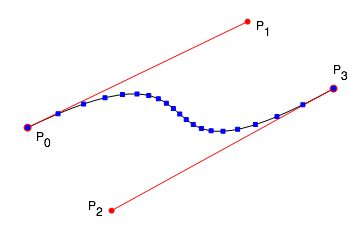
> 伪代码输出黑色曲线，控制点由红线连接，20个计算出的点标为了蓝色

As t varies from 0 to 1, these points "travel" along the curve from the start point to the end point. If enough values are used, a good approximation of the Bézier could be drawn. In fact, under the hood, most graphics systems draw Bézier curves using recursive subdivision, dividing the curve to the level of pixels or sufficiently small enough to draw with short line segments.

One other interesting thing to note is that even though the values for t used varied by a fixed increment, some of the resulting points are closer together than others, depending on where they lie on the curve. Any two sequential points may have different "arc-lengths" (distance measured along the curve, rather than straight-line distance) from another two. It may help to think of it as the rate at which the output values move along the curve "speeds up" and "slows down" even though the change in t is constant. We'll revisit to this later. 

随着 t 从 0 - 1， 这些点延曲线从起始点至结束点“散布” 。如果用的点足够多，它可以很好的模拟绘制出贝塞尔曲线。

事实上，在内部，很多图形系统绘制贝塞尔曲线使用递归细分法，分割曲线至像素级别或足够小的短线绘制。

另一件值得关注的有趣的点是，尽管 t 的增长是定值的，根据它们处在曲线的位置,一些点却比另一些靠的更近。

任意两个连续的点与其它任意两个点之间可能拥有不同的弧长 “arc-lengths” (延曲线测量长度，而不是直线距离)。

可以把它想像成延曲线 “提速” 和 “减速” 时 rate 速率不同，这有助于帮助理解，尽管 t 值的增长是固定的。稍后还会再讨论这点


## Tangents and perpendiculars

In order to use the text points with the Bézier formula, the x values must first be normalized (scaled) into the range of 0..1, so that they used for the t parameter of the Bézier formula. If the text starts at or near the X origin, and the width of the text is known, this normalization is done simply by: 

## 切线和垂线

为了让贝塞尔曲线公式应用于文本点， 这个 x 值必须首先格式化成 0..1 范围，这样才能被贝塞尔公式的 t 参数使用。

如果文本开始或接近 X 原点，且文本长度已知，则格式化非常简单：

```
xnorm =  x / textwidth
```

The Y coordinates for the text need to project out away from the curve in a direction perpendicular to the curve at that point. In order to do that, a vector is needed that is perpendicular to the curve for the point produced by t. That can be obtained by finding the tangent for the curve at that point, and rotating it 90 degrees.

Calculating the tangent vector for a Bézier is trivial, as it is simply the derivative of the Bézier polynomial: 

文本的 Y 坐标点需要从曲线上的点垂直投影(译者注：相当于法线呗)。为了实现，需要通过 t 计算出一个曲线点对应的一个垂直向量。可以通过曲线上点的切线获取，并将其旋转 90 度。

计算贝塞尔的切线向量比较简单，只要对贝塞尔多项式求导：

```
Vx = 3At2 + 2Bt + C 
Vy = 3Et2 + 2Ft + G 
```

We can rotate the vector 90 degrees by using linear algebra, or by simply swapping the terms and negating one of them. If V = (x, y) then Vrotate90 = (y, -x) or (-y, x), depending on which way one wants to rotate the vector. That gives a vector that is perpendicular to the Bézier for the point produced by the parameter t. Drawing those perpendicular vectors on top of the points would look something like this: 

我们可以通过线性代数对这个向量进行旋转 90 度， 或更简单的只需要交互这两项并将其中一项取负值。

如果 V = (x, y) 那么 Vrotate90 = (y, -x) 或 (-y, x), 具体用哪一种方式取决于你。

计算出一个向量垂直于贝塞尔曲线上一个点，这个点它由参数 t 求得。

在点的上面把垂直向量画出来，像下图这样：

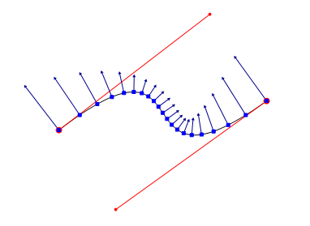
> 原始垂直向量. 为了绘制已经被缩短了. (末端还添加了小箭头) 


The Y coordinates for the text points need to be translated in the direction defined by the perpendicular vectors, but the magnitude (length) of those vectors is not important, just their direction. For convenience the perpendicular vectors can to be normalized into unit vectors, making them all exactly 1 unit long. For a vector having components x and y, this is done as follows: 

文本点的 Y 坐标需要调整到垂直向量方向，但是这些向量的长度其实不重要，重要的是方向。为了方便垂直向量可以格式化为标准向量，让它们都变为 1 单位的长度。一个向量拥有 x 和 y , 像下面这样做即可：

```
magnitude = sqrt( x2 + y2 )  // 距离公式
x = x / magnitude
y = y / magnitude
// 注意：magnitude 为 0，则 x,y 也为 0 或 undefined
```

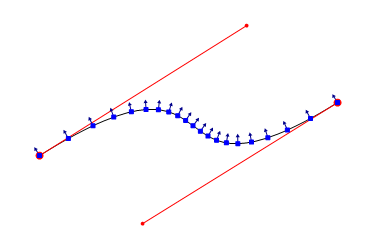
> 20 个格式化垂直向量，由参数 t 定义
> 为了绘图，向量长度为 10 像素

That covers most of the math needed to make a first pass at warping text onto a Bézier curve. 

对于首次接触使用贝塞尔曲线缠绕文本来说，这点数学知识足够了

## First attempt: Stretchy Text

Here is a first try at warping text, given Bézier control points P0..P3, and a graphics context g to draw on: 

## 首试：伸缩文本

在缠绕文本上首次尝试，给定贝塞尔控制点 P0..P3，还有图形上下文 g 绘制：

```
string text = "Some text to wrap";

[[ Calculate coefficients A thru H from the control points ]]

GraphicsPath textPath = new GraphicsPath();

// the baseline should start at 0,0, so the next line is not quite correct
path.AddString(text, someFont, someStyle, someFontSize, new Point(0,0));

RectangleF textBounds = textPath.GetBounds();
 
for (int i =0; i < textPath.PathPoints.Length; i++)
{
    PointF pt = textPath.PathPoints[i];
    float textX = pt.X;
    float textY = pt.Y;
    
    // normalize the x coordinate into the parameterized value
    // with a domain between 0 and 1.
    float t =  textX / textBounds.Width;  
       
    // calculate spline point for parameter t
    float Sx = At3 + Bt2 + Ct + D 
    float Sy = Et3 + Ft2 + Gt + H 
        
    // calculate the tangent vector for the point        
    float Tx = 3At2 + 2Bt + C 
    float Ty = 3Et2 + 2Ft + G 
    // rotate 90 or 270 degrees to make it a perpendicular
    float Px =   Ty
    float Py = - Tx
    
    // normalize the perpendicular into a unit vector
    float magnitude = sqrt(Px2 + Py2)
    Px = Px / magnitude
    Py = Py / magnitude
    
    // assume that input text point y coord is the "height" or 
    // distance from the spline.  Multiply the perpendicular vector 
    // with y. it becomes the new magnitude of the vector.
    Px *= textY;
    Py *= textY;
    
    // translate the spline point using the resultant vector
    float finalX = Px + Sx
    float finalY = Py + Sy
    
    // I wish it were this easy, actually need 
    // to create a new path.
    textPath.PathPoints[i] = new PointF(finalX, finalY);
}

// draw the transformed text path		
g.DrawPath(Pens.Black, textPath);

// draw the Bézier for reference
g.DrawBezier(Pens.Black, P0,  P1,  P2,  P3);
```

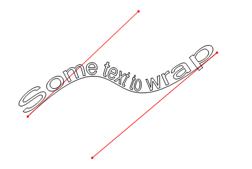

Output of pseudocode, with control points added 
用控制点伪代码生成的结果

Looks pretty good, but there are a few problems. The text appears scrunched together in the middle, and stretched out on the ends. Remember that the arc-length between points can vary, even if t is incremented by a fixed amount. I'll add some points using an fixed increment for t, and overlay direction vectors to show how they were used to warp the text: 

看起来不错，但还存在一些问题。文本中间挤在一起了，边上又比较松散。牢记 arc-length 在点之间是变化的，即便 t 增加是定死的。

我将通过 定增的 t 添加一些点，并盖在方向向量上用于显示它们是如何用于缠绕文本的：

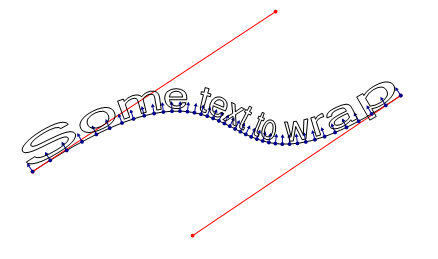
Illustrating that the formula for a Bézier is not
arc-length parameterized, and the problem this creates. 
如图贝塞尔的公式 arc-length 是非参数化的，问题就在于此。

As the parameter t varies by a fixed amount, the output points have varying arc-lengths from one to the next. This characteristic of the Bézier formula is what causes the text to be compressed or stretched along the curve.

There is another problem with the algorithm: text is always stretched or compressed to fit the length of the curve, as shown below: 


当参数 t 定增时，计算得出的前后点之间 arc-lengths 是变化的。

贝塞尔的公式的这一特点，导致了文本在曲线上产生挤压或拉伸的效果。

此外算法还有另一个问题：文本总是被挤压或拉伸， 如下所示：

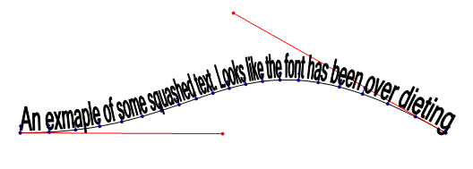
Text squashed to fit because of directly mapping its width to the domain of t (0..1) 
由于直接从0..1范围映射文本被挤压

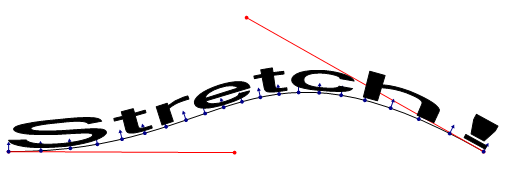
Text stretched to fit because of directly mapping its width to the domain of t (0..1) 
由于直接从0..1范围映射文本被拉伸

What would be better is to map the text's x coordinate to the parameter t in such a way that the text does not try to exactly fit the text to the full length of the Bézier. In order to do that, the arc-length of the curve must be known. This problem is related to the first one. 

我们期望更好的效果是参数 t 映射至文本 x 轴坐标不要试图将文本填满完整的贝塞尔曲线。为了实现这一目的， 曲线的 弧长 必须是已知的。问题又回到了起点。

## Fixing the text length problem (and how long is that Bézier, anyway)

The fix to the second problem (total text length) is trivial, if the arc-length of the curve is known. Rather than map the actual width of the text from 0..1 for t, the text can be drawn into a bounding box that is the same width as the arc-length of the spline, then x coordinates of the box are scaled to 0..1 by dividing all x coordinates by the arc-length. This is a little easier to understand visually: 

## 解决文本长度问题（计算贝塞尔曲线长度）

解决提出的第二点问题（文本长度）比较简单，如果曲线的 弧长已知。

相比于映射文本真实宽度 0..1 对应到 t ，文本可以先绘制进“边界盒”（译者注：通常图形计算中的 AABB 中的 BB），边界盒的宽度是样条曲线的 弧长， 然后盒子的 x 坐标通过除以所有 弧长 的 x 坐标值后被缩放至 0..1。看图更容易理解：

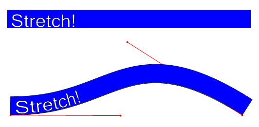
Bézier above has an arc-length of 500 units, so a 500 unit wide bounding box
(shown at top in blue) is used for text, and scaled to the domain of 0..1.
Bounding box is shown as it would look if it were somehow wrapped to the curve.
上图的贝塞尔曲线 arc-length 为 500 个单位，即边界盒的宽度也要 500 个单位（上半部分蓝色的）是为文本准备的，并缩放到 0..1 范围。
边界盒就像则以某种方式缠绕到了曲线上

The text can also be clipped to the bounding box to prevent it from overrunning the end of the spline.

That leaves the problem of calculating the arc-length of a cubic Bézier curve. After doing some research, I discovered that there is apparently no closed form solution to this problem. There are a number of ways of approximating the arc-length, some involving moderately complex calculus. Even the most sophisticated and accurate solutions involve an iterative approach. (See resources for more info).

However, there is a very simple way to estimate the arc-length: divide the curve into a bunch of line segments based on a fixed increment for t, then sum the straight-line length of those line segments. It turns out that even a small number of divisions can give a fairly good estimate, as it exploits a characteristic of the Bézier formula that the output points are close together in sharp curves. Some empirical investigation showed that around 100 divisions would yield estimates with less than .001 error, which would be half a pixel for a 500 pixel long curve. Close enough for the purpose at hand.

The process can be visualized by drawing the line segments on top of a Bézier: 


在样条曲线上超出边界框部分的文本会被剪除掉。

然后，遗留的问题就剩如何计算贝塞尔曲线的 弧长了。在经过一翻研究后，我发现很明显没有一个标准的解决方案。

模拟 弧长的方法非常多，有一些解决方案涉及中等复杂度的微积分。而且最复杂和最精确的解决方案涉及迭代逼近法。

然而，有一种非常简单的估算 弧长方法：基于定增的 t 将曲线分割成一堆线段，然后统计所有线段的长度。它产生的结果是分割的越小，得到的模拟估算越准，它运用了贝塞尔曲线的特征输出点靠的越近曲线越平滑。

一些经验调查表明大约 100 份的分割仅会产生小于 0.001 的估算错误，这仅是 500 像素长的曲线的一半。用于我们手头的这点儿活来说精度足够了。


处理过程可以被可视化成在贝塞尔曲线上面画多条线段：

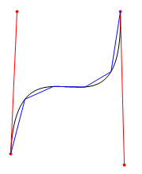
Estimating arc-length with four divisions.
segments shown in blue have large error.
用蓝色的 4 段线去估算弧长精度不够

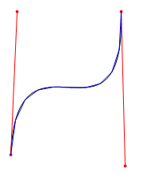
With eight divisions, segments start to converge
on the curve, estimation error is smaller.
用 8 段的话精度就高多了


The pseudocode for this is very simple. There are a few optimizations that can be made, but the basic algorithm is fairly efficient as long as the number of divisions is not too large. 

伪代码非常简单。有许多可优化之处，但基础的算法足够高效了，只要分割数不要太大。

```
int numberOfDivisions = 100;
int maxPoint = numberOfDivisions + 1;

// _formula.GetPoint(t) 通过 t 获取点坐标
// 点通过贝塞尔公式计算

PointF previousPoint = _formula.GetPoint(0);  // 曲线起点

float sum = 0;

for (int i = 1; i <= maxPoint; i++)
{
    PointF p = _formula.GetPoint( i / (float) maxPoint );
    sum += distance(previousPoint, p);
    previousPoint = p;
}

// 计算两点距离的方法:
float distance(PointF a, PointF b) { return sqrt( (bx - ax)2 + (by - ay)2 ); }
```

This code could easily be generalized for any single-valued parameterized algorithm that is continuous, has a fixed domain, and returns points, such as the formula for an ellipse or different types of splines.

It may be possible to estimate the error and dynamically pick an "ideal" number of divisions. This could be done by subdividing until segment lengths are below some threshold or by comparing the tangents of the line segments to the tangents of the curve, but I have not explored either of these ideas. Fixing the number of divisions at around 100 seems to work well enough for the purpose at hand. 

该代码可以很容易地被通用化到任何连续的单值参数化算法，它拥有固定的范围，返回多个点，比如椭圆公式或其它不同类型的样条曲线。

估算误差并动态地选择一个“理想的”除数是可能的。这可以通过细分来完成，直到线段长度低于某个阈值，或者通过比较线段的切线和曲线的切线，但我没有探索这两种想法。

我用固定数 100 似乎对当前的目的足够有效。

## Arc-length parameterization

Even after the text width problem is fixed, there is still an issue with text getting squashed or stretched due to the non-uniform arc-lengths between uniform values of t. 

## 弧长参数化

即使文本宽度问题解决后，由于在标准化 t 值之间弧长还没有被标准化 文本被挤压和拉伸的问题还是存在。


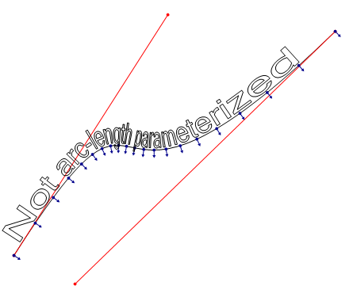
This graphic illustrates that the lack of arc-length parameterization.
This issue is independent of the other problem, but has a related solution.
(Perpendicular vectors rotated 180° so they are not obscured) 
该图说明了弧长参数化的缺乏。这个问题独立于另一个问题，但有一个相关的解决方案。
(垂直矢量旋转了180°，因此不会被遮挡)

 The solution to this problem is called arc-length parameterization. The idea is to map an input value u to a value t which can be passed to the Bézier formula, and will produce points that have uniform arc-length distances for uniform values of u. Stated another way, for values 0..1 for u it would map to values of t in such a way to produce a point that is a fractional arc-length distance from the start of the curve equal to u. For example, a value of .25 for u would always produce a point that is one-fourth of the arc-length distance along the curve. The intermediate value of t in this case is unknown, and must be calculated by the mapping function somehow.

The implementation I came up with (based on suggestions from friend who is much more mathematically inclined than I) was to approximate this mapping function using a table of arc-lengths. It consists of saving a list of the sums produced by the arc-length algorithm already covered. For a spline having an arc-length of 500, divided into 100 divisions, the table might for a certain spline might look like this:

解决该问题的方法被称为孤长参数化。其思想是将一个输入值 u 映射到贝塞尔公式的参数 t 上，并且将产生对于 u 一样标准化的等距弧长的点。

换句话说，若 u 的值是 0..1 ，它将映射到 t 的值，通过此方法产生的某个点值就是弧长距离起点的某个分数值。

举个例子，u 值如果为  0.25 , 它将总是会返回整条曲线弧长距离的 1/4。在此例中中间值 t 还是未知，必须通过某种映射方法计算得到。

我使用的实现方法（基于数学比我更好的朋友的建议）是 用一张孤长表近似。它保存了我们已讨论过的孤长公式计算的所有弧长。如果某条曲线弧长为 500，分为 100 份，表格将会显示如下：

```
  0.0
  5.2
 10.5
 15.7 
 ... (more points) ...
494.8
500.0
```

The index of values in this table equates to some parameter t, for example, if the list contained 101 values, index 0 contains the arc-length for t=0.0, index 100 has the arc-length for t=1.0, and index 50 contains the arc-length for t=.5. If the table were stored in a 0-indexed array called arcLengths, the value of t for a given index would be: 

值索引对应参数 t 的某个值，如果列表包含了 101 个值，索引 0 包含了 t = 0.0 时的弧长， 索引 100 对应了 t=1.0 时孤长， 索引 50 对应了 t=0.5 时孤长。

如果表被存放在了名为 arcLength 的数组中，索引对应的 t 值即：

```
t = index / (float) (arcLengths.Length - 1)
```

Given such a table, it is possible to find values of t that are close to a desired arc-length. So we could take and input value of u, calculate the desired arcLength (u * totalArcLength), then find the index of the largest entry in the table that is smaller than or equal to the desired arcLength. This could be done using a brute force traversal, or preferably, a binary search. If this value happens to be equal to the arcLength, then the value of t for the input value of u can be calculated as previously described. More often then not, the search will find the largest value that is smaller than the desired arc-length. In this case, linear interpolation can be used between the found entry and the next one to find an estimate for t. Assuming sufficient divisions were used to create the table, the distance between those to points will be sufficiently small that the error for the mapping will be negligible.

The following pseudocode demonstrates the technique: 

有了这样一张表格，找到 t 对应的孤长就成为了可能。通过获取输入值 u ， 计算期望的弧长( u * totalArcLength)，然后在表中找到输入值对应的最大值，值大小于等于希望的弧长。可以用简单的遍历或更好的二分搜索。

如果恰好值等于弧长，输入值 u 对应的 t 值可以按之前那样算。通常情况下，找到的最大值会小于期望的弧长。在这种情况下，线性插值被用于输入值与下一个值之间估算 t 值。

假设使用了足够大的除数来创建表，那么这些点之间的距离将足够小，映射的误差可以忽略不计

以下的伪代码将演示这项技术：

```
float u = // 参数值 u , 范围 0 到 1 之间
float t; // 通过 u 要寻找的 t

float [] _arcLengths = // 预先计算好的贝塞尔曲线弧长列表

// u 对应的目标弧长
float targetArcLength = u * _arcLengths[ _arcLengths.Length - 1 ];

// 二分搜索
int index = IndexOfLargestValueSmallerThan(_arcLengths, targetArcLength)

// 如果精确匹配，返回基于精确 index 的 t
if (_arcLengths[index] == targetArcLength)
{
    t = index / (float) (arcLengths.Length - 1);
}
else  // 否则需要在两个点之间插值
{
    float lengthBefore = _arcLengths[index];
    float lengthAfter = _arcLengths[index+1];
    float segmentLength = lengthAfter - lengthBefore; // 两个点之间的距离

    // 决定在“前”和“后”点之间的位置
    float segmentFraction = (targetLength - lengthBefore) / segmentLength;
                          
    // add that fractional amount to t 
    // 加上额外的这部分分数 segmentFraction 给 t
    t = (index + segmentFraction) / (float) (_arcLengths.Length -1);
}
```


The basic algorithm can be generalized to arc-length parameterize the same class of functions that can be handled by the arc-length estimation code. The output, when using this mapping algorithm, is much more appealing: 

这个基本算法可以封装成通用的类用于处理弧长估算。以下就是使用此映射算法生成的图，表现好多了:

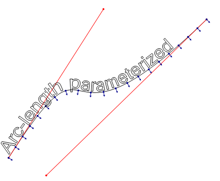
After arc-length parameterization. Note the uniform values
for u (plotted in blue) are now evenly distributed on the curve.
(Perpendicular vectors shown rotated 180° so they are not obscured) 

在弧长参数化后，注意标准化 u (标成蓝色的)现已均分在曲线上。（垂直向量旋转了 180 度以不被遮挡）

Solving other minor issues

The algorithms presented still may have some minor issues. In particular, long horizontal line segments may cause the characters to distort when going around a sharp curve. This problem can be overcome in all but the most severe cases by iterating through the text path and dividing long line segments into shorter ones. 


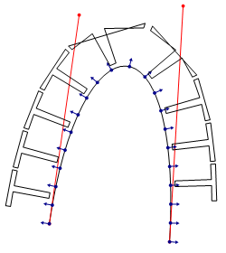
The T's have a single line for the top, so it can't
bend, causing gross distortions in sharp curves

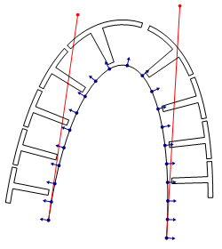
Dividing long lines into sufficiently
shorter segments can improve appearance,
at some expense to performance. 


In some cases, this technique can benefit from using short Bézier curves instead of short line segments. However, it is not enough to simply replace all line segments with Bézier curves, as this gives a different and sometimes unpleasant appearance for long segments. It is left as an exercise to the reader to find out why. 


## Extending the techniques to complex paths

The techniques can easily be expanded to allow for warping to arbitrary paths of increasing complexity. All that need be done is calculate the arc-length of the entire path (by summing the arc-lengths of its components), and then parameterize the whole thing. A wrapper class for the formula can be written which contains multiple sub-paths as children, and could decide which child to use for a particular parameter through reverse interpolation over the total length. Alternatively this could be built into the arc-length estimation algorithm.

One could even wrap text around other text! 

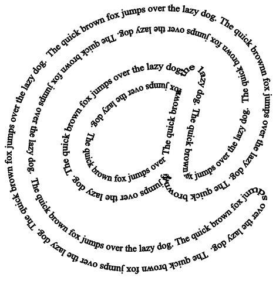
Wrapping text around an arbitrary path. 


This potentially introduces new problems to solve, particularly for warping around other text paths. Discontinuities (places where the path stops at one place and restarts elsewhere), can cause severe 'garbling' if a character or other object straddles those points. A good general algorithm would need to account for these, and make sure that they are handled appropriately, perhaps by pushing the characters beyond the break. Also, many characters contain acute bends and corners that may result in excessive warping that looks unpleasant (as seen in a few places in the figure above). 


Conclusion

The use of these techniques for distorting text (or any path!) can give a fairly natural and fluid appearance. The algorithms presented allow for real time manipulation of the curves, even on low-end modern hardware. Several optimizations can be made that were not covered in this article for the sake of simplicity. The techniques can be readily adapted to any graphics framework that has a vector path object (such as WPF, Cocoa, Postscript, etc). Subtle use of warped vector paths can be used for fun aesthetic effects. 