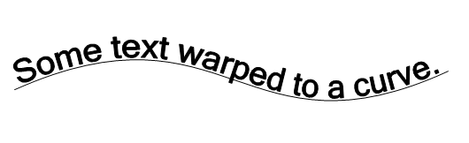
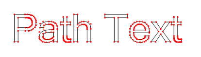

# Warping Text to a Bézier curves

# 延贝塞尔曲线排列文本

## Background

A while back I got curious about how certain text effects could be achieved, and one of the things I explored was warping text along a curve to achieve a kind of sweeping effect. I created a prototype for this, to explore different solutions. This article contains some general notes on the subject, as I reflect back on this work. The information given here could be used as a kind of cookbook to replicate the work. The original work was done using C# and GDI+, although the concepts are applicable to other frameworks. 


## 背景

不久前，我对文本能实现哪些特效比较好奇，探索的其中之一便是将文本延曲线排列实现类似擦除的特效。

为此我弄了个原型，尝试不同的解决方案。这篇文章记录了一此通用解决方案，作为我的工作回顾。

这些记录的实现方法可作为实现类似效果的工作手册。

我最开始用的是 C# 和 GDI+ 实现，当然这一实现方法也适用于其它框架。

## Bendy Text

Given some arbitrary spline, how can text be drawn in such a way that it appears to follow the curve in a way that is appealing to the eye?
A sample of the desired result.

## 弯曲的文本

给定一些任意的样条曲线，如何延曲线将文本绘制在上面且吸引人


;
>期望实现的效果

Looking around the interwebbietubes, there seemed to be few examples of doing this, and most examples were crude, i.e. involving rotating individual letters with linear transforms to align each character with the curve, which results in a very odd, non-fluid appearance. Much good information was gleaned from old articles written by Don Lancaster, in particular one about Nonlinear Graphics Transforms from 1995. As always, it is good to keep in mind that in this field, we stand on the shoulders of giants. Many thanks to Don for putting so much good and accessible information out there over the years. 

在网上找了一圈，发现实现例子比较少，大部分实现的很糙，比如将字母单独延曲线进行线性旋转变幻，这样实现的结果非常生硬，不流畅。

更好的实现方法被收集在了一篇 1995 年的老文章内，作者是 ~[Don Lancaster](https://www.tinaja.com/), 比较特殊的一点是非线性图形变幻（Nonlinear Graphic Transforms）。

牢记在这一领域我们是站在巨人的肩膀上。非常感谢 Don 这些年产出的非常优质且易理解的知识。

## Vector text

Normally when thinking about drawing text in GDI+, most people think of Graphics.DrawString() and the like, which given a string will draw into a Graphics context. The result is a bunch of pixels, not exactly useful for doing non-linear transformations. What would be preferable is to get vector outlines of the rendered text, with points that can be transformed to get the desired effect. Fortunately, GraphicsPath provides a mechanism for doing this, even if the API is a little obtuse. It helps to understand what a GraphicsPath is: GraphicsPath is a form of display list, consisting of a very small number of simple vector primitives. Pixels just don't exist as far as a GraphicsPath is concerned, until it's rendered using Pens and/or Brushes. In fact, here is a complete list of all the primitives that are used under the hood by GraphicsPath: 

- Start: Defines a point that is used to denote the starting point of a path
- Line: a line. includes the endpoint, the start point was the last point from the last instruction.
- Bezier: a cubic Bézier curve. Defines 3 of the 4 control points, the start point is the last point from the last instruction
- Bezier3: A quadratic Bézier curve. (see below)
- CloseSubpath: marks the endpoint of a subpath this is used for
- PathMarker: defines a marker for a path. Not used for rendering as far as I can tell, this is for information purposes
- DashMode: marks a segment as dashed, which gives a suggestion on how it should be rendered


There are just two that render something visible when a GraphicsPath is drawn: Line and Bézier. Note that the MSDN documentation mixes up quadratic and cubic Splines. (Imagine that! misleading MSDN docs. Grumble.) In practice, I've never run across a GraphicsPath that actually contains a quadratic spline (Bezier3).

What about other shapes?   After all, an ellipse can be added to a GraphicsPath, it must have an ellipse primitive, right? Nope. If an ellipse is added to a GraphicsPath, under the hood it will be approximated using several Bézier splines.

What about adding text to a GraphicsPath? Once again, it reduces to a bunch of points and instructions for lines and cubic Béziers. These are derived directly from the description of the font, which is vector based as well. The nice thing is that if a bunch of things drawn into a GraphicsPath, one can iterate over these primitives and get a complete description of what it is doing under the hood. And with that information, an identical path can reconstructed from the primitives. During the process, the points can be pushed around using some kind of transform to achieve the text warping effect. 


## 矢量文本

一般来讲要用 GDI+ 绘制文本，大部分人首先想到的就是 Graphics.DrawString() 类似这样的 API, 它可以用于提供字一个符串传进图形上下文(Graphics context)。结果是一堆像素信息，对于非线性变形没啥用处。

更好的方式是获取渲染文本包含可用于形变点的外边形矢量，可用于形变成我们期望的效果。幸运的是 GraphicsPath 提供了此功能方法，即便 API 比较别扭。

帮助我们理解 GraphicsPath 的一点是：GraphicsPath 是一个标准化的显示列表，持有非常少的矢量元信息。

就 GraphicsPath 而言它不关注像素信息, 直到它用 Pens 或 Brushes 渲染。

事实上，以下就是我们会用到的 GraphicsPath 元数据的完整列表：

- Start: 定义路径起始点

- Line: 线条。包含结束点，最后一条指令起始点作为最后一个点。

- Bezier: 三阶贝塞尔曲线

- Bezier3： 二阶贝塞尔曲线

- CloseSubpath: 用于子路径的闭合

- PathMarker: 定义一条路径的标记，只是标记了信息并不用于渲染

- DashMode: 是否虚线模式渲染


当使用 GraphicsPath 进行绘制时，跟显示相关的方法仅有两个：线条和贝塞尔曲线。注意 MSDN 文档混淆了二阶与三阶样条曲线（想象一下! 官方文档居然进行错误引导）。

在实际使用中，在 GraphicsPath 上从未用到过二阶样条曲线（Bezier3）

其它形状怎么办？在最后椭圆可以被添加进 GraphicsPath， 它应该有椭圆元数据对吧？错！，如果一个椭圆被添加进了 GraphicsPath, 在内部它会用数条贝塞尔样条曲线模拟实现。


那么使用 GraphicsPath 添加文本呢？再次的，它会被简化为一堆点，线条，和贝塞尔曲线。这些都直接来源于字体描述，它也是基于矢量的。

比较好的一件事是在 GraphicsPath 内一堆绘制，可通过迭代获取内部用于绘制的完整的描述信息。

有了这些元信息就可重建这条路径。在处理过程中，这些点可用一些形变操作达到文本包裹效果。



> 文本被添加进 一个 GraphicsPath 然后渲染出来且没有填充
> 所有这条路径的点被标记为红色(包含用于样条的控制点)

## Bézier curves

For my first pass at this, I decided to use a Bézier spline to define the path of the text. Cubic Béziers are supported by GDI+, there are methods for drawing them on the Graphics object, and they are one of the few primitives supported by GraphicsPath. The formulas for Béziers are simple to calculate, they can be used to approximate other curves, and getting a set of points along a cubic Bézier given its four control points is mostly a trivial exercise. More complex shapes/curves would come later.

Getting a point on a Bézier curve is not something that GDI+ provides for, so understanding the formulas for cubic Béziers is necessary for this work. I won't go into exhaustive detail on the math behind this, as plenty of information is readily available on this subject, from Wikipedia and elsewhere. 

## 贝塞尔曲线

在此我第一次尝试，我决定使用贝塞尔样条定义文本的路径。GDI+ 支持三阶贝塞尔， 图形对象上有一些用于绘制的方法， 为数不多中的一个可用于获取元数据。

贝塞尔公式计算比较简单，它们可被用于摸拟其它曲线，通过控制点创建一条贝塞尔曲线练习获取一堆延贝塞尔曲线的点信息比较容易。更复杂的图形/曲线稍后会有。

获取贝塞尔曲线上的一个点 GDI+ 并未提供，所以搞懂三阶贝塞尔公式在此是必须的。我并不打算讲解背后的大量数学细节。此课题在Wikipedia 和其它地方有大量的资料可供查询。

## Formulas for cubic Béziers

OK, math time! It is most illustrative to look at how a cubic Bézier is constructed geometrically, which is pictured below. 

## 贝塞尔曲线公式

好了，数学时间到！大多数贝塞尔曲线的几何形成图形应该像以下图


> The geometric construction of a cubic Bézier (image from Wikipedia) 

The curve is defined by four control points P0 through P3. The first and last point are the start and end point of the curve, the other two are colloquially referred to as "handles" to control the shape of the curve. The four control points can be connected to form three line segments (pictured in gray). Three points are interpolated using the parameter t on the line segments connecting the control points, and these form the two green segments above. A final line segment is constructed by interpolating points along the previous two segments for t in the same way (shown in blue). A final point is interpolated along this last line segment, and that point is a point on the curve for value t. 


曲线由 P0-P3 共 4 个点控制。第一个和最后一个是曲线的起始与结束点， 另两个是点通常被称为 “手柄” 用于控制曲线形状。

四个点被连接成三条线断(图中灰色线)。

在控制点连接形成的线段上的三个点由参数 t 插值形成，在上面构成了两条绿色线断。

最后一条蓝色线断由前两条绿色插值线与 t 同样方式产生。

最后一个点是延最后这条线断插值产生，且这个点就 曲线 t 值 对应曲线上的点


The linear interpolation (lerp) between two scalar values is defined as follows: 

两个标量之间的线性插值如下：

```
vlerp = v0 + ( v1 - v0 ) * t 
```

From which one can create a lerp function between two 2D points: 

可用写个 2 个 2D 点之间的线性插值方法：

```
lerp(P0, P1, t) :
    xlerp = x0 + ( x1 - x0 ) * t 
    ylerp = y0 + ( y1 - y0 ) * t 
    return point (xlerp, ylerp)
```

The geometric picture above can then be expressed as follows: 

上面的几何图形就可被以下方式表达：

```
P4 = lerp(P0, P1, t);
P5 = lerp(P1, P2, t);
P6 = lerp(P2, P3, t);
P7 = lerp(P4, P5, t);
P8 = lerp(P5, P6, t);
P9 = lerp(P7, P8, t);

P9 就是曲线上 t 对应的点
```

A cubic Bézier can also be expressed as a cubic polynomial with eight coefficients: (I'll describe how to calculate the coefficients from the four control points in a later) 

贝塞尔曲线也可被表达为8个系数的三阶多项式方程：（稍后我会解释如何通过计算从4个控制点获取8个系数）

```
x = At3 + Bt2 + Ct + D 
y = Et3 + Ft2 + Gt + H 
```

For values of t between 0 to 1, these polynomials produce the x and y coordinates for a point on the curve. Values outside of that range continue the function out to infinity somewhere. The formula is really the same for the x and y versions, just with different coefficients. The equations independently relate x and y to the value parametric value t. Because of this splines can be extended into three dimensions (or more!) very easily.

让 t 范围从 0 到 1， 多项式会产生曲线上的一个 x, y 坐标点。当值超范围此方法还会在某处继续产生无限的坐标点。x 与 y 的版本公式非常相似，只是系数不同。

So where do those coefficients (A..H) come from? For a full explanation of the math, check the resources section at the bottom, but for now I'll just give the formulas for converting control points to coefficients.
Given four control points for the spline P0 .. P3, having values of (x0,y0) .. (x3,y3) , the coefficients are: 

那么 系数（A..H）从哪里来的？完整的数学解释在最后一节，现在我只会给出控制点转换到系数的公式。

给定样条 4 个控制点 P0 .. 03， 点的值为 (x0,y0) .. (x3,y3)，系数则是：

```
A = x3 - 3 * x2 + 3 * x1 - x0
B = 3 * x2 - 6 * x1 + 3 * x0
C = 3 * x1 - 3 * x0
D = x0

E = y3 - 3 * y2 + 3 * y1 - y0
F = 3 * y2 - 6 * y1 + 3 * y0
G = 3 * y1 - 3 * y0
H = y0
```

Should it be necessary to calculate control points from coefficients, here are the inverse operations:

如果有必要从系数转为控制点的话，下面是反转操作：

```
x0 = D;
x1 = D + C / 3
x2 = D + 2 * C / 3 + B / 3
x3 = D + C + B + A

y0 = H;
y1 = H + G / 3
y2 = H + 2 * G / 3 + F / 3
y3 = H + G + F + E
```

So to illustrate what has been covered so far, here is some pseudocode, using control points P0..P3: 

为了说明到目前为止所涵盖的内容，以下是一些伪代码，使用控制点 P0..P3: 

```
// draw the Bézier using GDI+ function (g is Graphics object)
g.DrawBezier(Pens.Black,P0, P1, P2, P3);

// draw lines connecting the control points

g.DrawLine(redPenWithEndCap, P0,P1);
g.DrawLine(redPenWithEndCap, P2,P3);

[[compute coefficients A thru H as described above]]
[[用以上提到的方法计算出 A 到 H 系数]]

// draw 20 points, with a fixed increment for the parameter t
for (float t = 0; t <= 1; t += 0.05f)  
{
    x = At3 + Bt2 + Ct + D 
    y = Et3 + Ft2 + Gt + H 
    
    // call function that draws a filled rect at x,y coord.
    DrawBoxAtPoint(g, Color.Blue, x, y);  
}
```


> 伪代码输出黑色曲线，控制点由红线连接，20个计算出的点标为了蓝色

As t varies from 0 to 1, these points "travel" along the curve from the start point to the end point. If enough values are used, a good approximation of the Bézier could be drawn. In fact, under the hood, most graphics systems draw Bézier curves using recursive subdivision, dividing the curve to the level of pixels or sufficiently small enough to draw with short line segments.

One other interesting thing to note is that even though the values for t used varied by a fixed increment, some of the resulting points are closer together than others, depending on where they lie on the curve. Any two sequential points may have different "arc-lengths" (distance measured along the curve, rather than straight-line distance) from another two. It may help to think of it as the rate at which the output values move along the curve "speeds up" and "slows down" even though the change in t is constant. We'll revisit to this later. 

随着 t 从 0 - 1， 这些点延曲线从起始点至结束点“散布” 。如果用的点足够多，它可以很好的模拟绘制出贝塞尔曲线。

事实上，在内部，很多图形系统绘制贝塞尔曲线使用递归细分法，分割曲线至像素级别或足够小的短线绘制。

另一件值得关注的有趣的点是，尽管 t 的增长是定值的，根据它们处在曲线的位置,一些点却比另一些靠的更近。

任意两个连续的点与其它任意两个点之间可能拥有不同的 “arc-lengths” (延曲线测量长度，而不是直线距离)。

可以把它想像成延曲线 “提速” 和 “减速” 时 rate 速率不同，这有助于帮助理解，尽管 t 值的增长是固定的。稍后还会再讨论这点


## Tangents and perpendiculars

In order to use the text points with the Bézier formula, the x values must first be normalized (scaled) into the range of 0..1, so that they used for the t parameter of the Bézier formula. If the text starts at or near the X origin, and the width of the text is known, this normalization is done simply by: 

## 切线和垂线

为了让贝塞尔曲线公式应用于文本点， 这个 x 值必须首先格式化成 0..1 范围，这样才能被贝塞尔公式的 t 参数使用。

如果文本开始或接近 X 原点，且文本长度已知，则格式化非常简单：

```
xnorm =  x / textwidth
```

The Y coordinates for the text need to project out away from the curve in a direction perpendicular to the curve at that point. In order to do that, a vector is needed that is perpendicular to the curve for the point produced by t. That can be obtained by finding the tangent for the curve at that point, and rotating it 90 degrees.

Calculating the tangent vector for a Bézier is trivial, as it is simply the derivative of the Bézier polynomial: 

文本的 Y 坐标点需要从曲线上的点垂直投影(译者注：相当于法线呗)。为了实现，需要通过 t 计算出一个曲线点对应的一个垂直向量。可以通过曲线上点的切线获取，并将其旋转 90 度。

计算贝塞尔的切线向量比较简单，只要对贝塞尔多项式求导：

```
Vx = 3At2 + 2Bt + C 
Vy = 3Et2 + 2Ft + G 
```

We can rotate the vector 90 degrees by using linear algebra, or by simply swapping the terms and negating one of them. If V = (x, y) then Vrotate90 = (y, -x) or (-y, x), depending on which way one wants to rotate the vector. That gives a vector that is perpendicular to the Bézier for the point produced by the parameter t. Drawing those perpendicular vectors on top of the points would look something like this: 

我们可以通过线性代数对这个向量进行旋转 90 度， 或更简单的只需要交互这两项并将其中一项取负值。

如果 V = (x, y) 那么 Vrotate90 = (y, -x) 或 (-y, x), 具体用哪一种方式取决于你。

计算出一个向量垂直于贝塞尔曲线上一个点，这个点它由参数 t 求得。

在点的上面把垂直向量画出来，像下图这样：


> 原始垂直向量. 为了绘制已经被缩短了. (末端还添加了小箭头) 


The Y coordinates for the text points need to be translated in the direction defined by the perpendicular vectors, but the magnitude (length) of those vectors is not important, just their direction. For convenience the perpendicular vectors can to be normalized into unit vectors, making them all exactly 1 unit long. For a vector having components x and y, this is done as follows: 

文本点的 Y 坐标需要调整到垂直向量方向，但是这些向量的长度其实不重要，重要的是方向。为了方便垂直向量可以格式化为标准向量，让它们都变为 1 单位的长度。一个向量拥有 x 和 y , 像下面这样做即可：

```
magnitude = sqrt( x2 + y2 )  // 距离公式
x = x / magnitude
y = y / magnitude
// 注意：magnitude 为 0，则 x,y 也为 0 或 undefined
```


> 20 个格式化垂直向量，由参数 t 定义
> 为了绘图，向量长度为 10 像素

That covers most of the math needed to make a first pass at warping text onto a Bézier curve. 

对于首次接触使用贝塞尔曲线包裹文本来说，这点数学知识足够了


