## 未能实现曲线的 AABB

这不是行业不景气业务下降了么..

互联网行业是肉眼可见的不景气

业务量也下降了，业务相关的工作也变的不再饱和

我的工作积极性降低了，啊..开始摆烂了

可以将时间花一部分在自己感兴趣的内容上了，想到哪里干到哪里

怎么形容我自己呢，对编程是又菜又爱

而最近在翻译文章时贝塞尔曲线又回顾了一下

这让我想起了 2020 年遇到过的一个技术问题：曲线的 AABB

AABB 即图形界中常说的 AABB (axis-aligned bounding box) 包围盒, 严格来说是未能实现 BB

规则的图形很容易通过顶点距离就可以计算出 BB， 但像贝塞尔曲线这样的曲线就不太好算

是时候解决一下了


要实现的效果

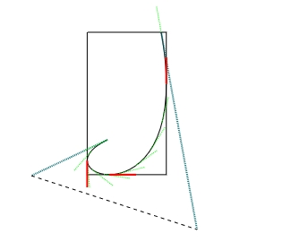

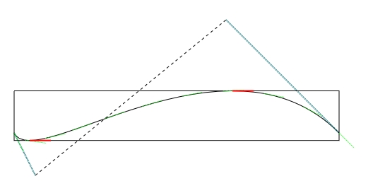

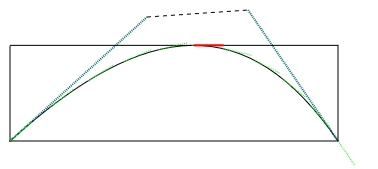


## 源起 2020 年写微信小程序

在当年写了个简单图形库，但曲线未能实现 AABB

那是在 2020 年上一家公司，公司安排我负责微信小程序的开发

其中经常要用微信小程序生成海报，保存在图片用于在手机上的传播

单独手工去拼接生成海报还是比较麻烦的， Canvas 提供的 api 相对比较低级，

当时看到一些人开源出来的类似 json 配置形式生成海报图

这种配置类型的实现原理是大多是通过配置的坐标，大小，颜色，以及一些简单的 CSS 样式解析后在 canvas 上绘制

相对于纯手工去画，确实进步了很多，但遇到复杂一点儿的海报绘制，还是会有一定的局限性

而小程序中又没办法使用 Pixi.js、EaseJs 这类 Canvas 的图形库

当时就抽空写了一个简易的 Canvas 操作库 DuduCanvas

DuduCanvas 基本封装实现了图片，文本，形状等相关对象的绘制

调用的方式相比于配置要稍低级一点，拥有更大的自由度，例如添加一个圆形的头像图片：

```
const avatar = new Image({
      image: loader.get('avatar'),
      width: 100, 
      height: 100,
})

// 将头像变成圆形
avatar.borderRadius = '100%'

// 添加一个文本
const t1 = new Text()
t1.text = '你好世界Hello'
t1.color = 'red'
t1.x = 100
t1.y = 300
// 添加到舞台
stage.addChild(img, t1)

```

至少对于当时的项目来讲，DuduCanvas 运行的还不错，毕竟不是用它做动画或者游戏


[image](https://images.cnblogs.com/cnblogs_com/willian/547588/o_230921093807_WX20211214-192038.png)

[image](https://images.cnblogs.com/cnblogs_com/willian/547588/o_230921093807_WX20211214-192132.png)


还好，我代码存到了 github 上，在新公司临时做项目时还派上了用场用它画了个积分统计图

[image](https://images.cnblogs.com/cnblogs_com/willian/547588/o_230921093807_WX20211214-192419.png)

但它有几个缺点：

1. 没有实现事件系统，当然它大部分时间只是用于生成海报，用不到事件交互

2. 绘制曲线图形后的 BB 未能实现，需要自己手动指定

3. 由于是 2020 年 当时微信小程序的 Canvas 2D 版本还牌测试版，所以使用的旧版 Canvas API

4. graphics 实现过于简单好多重复命令未去除

没过多久离职了，工作重心也从小程序转到其它前端项目


## 先从三阶贝塞尔曲线开始

之前在翻译 [贝塞尔曲线文字路径](https://www.cnblogs.com/willian/p/17706242.html) 一文中提到过三阶贝塞尔曲线

它是用 C# 伪代码来讲解的

定义 4 个控制点：

```
(x1, y1), (x2, y2), (x3, y3), (x4,y4)
```

定义 A..H 系数

```
A = x3 - 3 * x2 + 3 * x1 - x0
B = 3 * x2 - 6 * x1 + 3 * x0
C = 3 * x1 - 3 * x0
D = x0

E = y3 - 3 * y2 + 3 * y1 - y0
F = 3 * y2 - 6 * y1 + 3 * y0
G = 3 * y1 - 3 * y0
H = y0
```

得到多项式：

```
x = At3 + Bt2 + Ct + D 
y = Et3 + Ft2 + Gt + H 
```

那么我们先用 Javascript 实现一下那篇文章中提到过的垂直于曲线的单位向量

假设我们要绘制的三阶贝塞尔曲线的四个控制点

```
[
      { x: 120, y: 320 },
      { x: 135, y: 440 },
      { x: 320, y: 280 },
      { x: 480, y: 340 },
];
```

下面是它三阶贝塞尔曲线采样点，t 取值 0-1 ：

```
// 用 t 获取“样条曲线” 采样点
let sx = A * Math.pow(t, 3) + B * Math.pow(t, 2) + C * t + D
let sy = E * Math.pow(t, 3) + F * Math.pow(t, 2) + G * t + H
```

sx, sy 就是 t 从 0 - 1 时算出的曲线上的每个点

如果 t 取值足够小，那么在 canvas 上画出所有的点它就是一条贝塞尔曲线

t 间隔为 0.1 时:

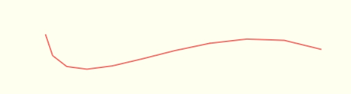

t 间隔为 0.001 时:

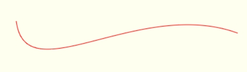

画出垂直于曲线的向量关键, 在于对三阶贝塞尔曲线多项式的求导

如果你忘记了什么是求导（导函数）, 没关系, 直接用公式就完了

我这个学渣都会用，你肯定也可以，

当然最好是回去复习一下高中后期的导函数部分，有助于理解曲线切线的几何意义

求导后得到向量：

```
// 求导前
x = At3 + Bt2 + Ct + D 
y = Et3 + Ft2 + Gt + H 

// 求导后
Vx = 3At2 + 2Bt + C 
Vy = 3Et2 + 2Ft + G 
```

用 Javascript 实现如下：

```
// (求导)用于计算曲线上采样点的切线向量
let tx = 3 * A * Math.pow(t, 2) + 2 * B * t + C
let ty = 3 * E * Math.pow(t, 2) + 2 * F * t + G

// 旋转 90 度或 270 度垂直于曲线采样点
let px = ty
let py = -tx

// 缩至单位向量
let magnitude = Math.sqrt(px * px + py * py)
px = px / magnitude
py = py / magnitude

// 为了向量可见，扩大 20 个单位
px *= 20;
py *= 20;

// 从采样点连接至切线向量偏移位置
console.log(sx + px, sy + py);
```

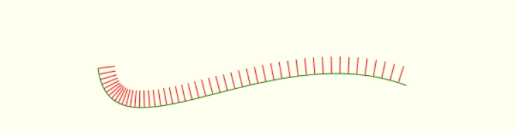

源码尽量平铺直叙：...

https://github.com/willian12345/blogpost/blob/main/curve/bezier/cubic-bezier-tangent-test.html


如果你对贝塞尔曲线感兴趣还可以看一下我翻译的《曲线编程艺术》的 [贝塞尔曲线](https://www.cnblogs.com/willian/p/17476389.html) 这一章


## 把三阶贝塞尔曲线包起来

要实现三阶贝塞尔曲线的AABB(包围合)还是得从切线入手

比如像下面这个曲线

```
let points = [
      {x: 120, y: 160 }, 
      {x:  35, y: 200 }, 
      {x: 220, y: 260 }, 
      {x: 180, y:  40 }, 
];
```
四个点得出的结果：

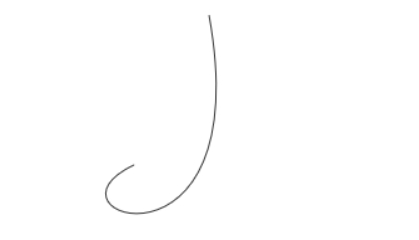


先把它的四个点用直线连接画出来

```
ctx.beginPath();
ctx.lineWidth = 2;
ctx.setLineDash([1, 2]);
ctx.strokeStyle = '#076c75';
ctx.moveTo(points[0].x, points[0].y);
ctx.lineTo(points[1].x, points[1].y);
ctx.stroke()

ctx.beginPath();
ctx.lineWidth = 1;
ctx.moveTo(points[1].x, points[1].y);
ctx.strokeStyle = 'black';
ctx.lineTo(points[2].x, points[2].y);
ctx.stroke()

ctx.beginPath();
ctx.lineWidth = 2;
ctx.strokeStyle = '#076c75';
ctx.moveTo(points[2].x, points[2].y);
ctx.lineTo(points[3].x, points[3].y);
ctx.stroke();
```

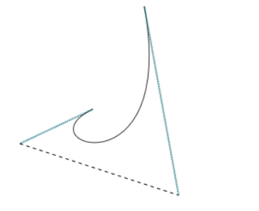


蓝色的线就像是控制手柄

点 points[1] 和 points[2] 分别就是控制手柄

控制手柄就是 PS 内的钢笔工具用过吧？就是这个，长短与位置调节就控制了曲线的形状

BB 包围盒就是找到曲线所有转折点中最小和最大的转折点

找转折点，可理解为找到曲线上的斜率

还是从公式入手

在上一节中贝塞尔公式系数直接把 x, y 都用 A..H 表示出来了

这次先简化到一维比如 x ， 系数用 A..D 表示

x 坐标方程即（y 轴坐标方程其实是一样的，只是算了两遍）：

```
x = A (1-t)^3 +3 B t (1-t)^2 + 3 C t^2 (1-t) + D t^3
```

对其求导，关于 t 的微分，得到微分方程

```
dx/dt =  3 (B - A) (1-t)^2 + 6 (C - B) (1-t) t + 3 (D - C) t^2
      =  [3 (D - C) - 6 (C - B) + 3 (B - A)] t^2
      + [ -6 (B - A) - 6 (C - B)] t
      + 3 (B - A) 
      =  (3 D - 9 C + 9 B - 3 A) t^2 + (6 A - 12 B + 6 C) t + 3 (B - A)
```

合并整理后是一个二次函数： 

```
dx/dt = (3 D - 9 C + 9 B - 3 A) t^2 + (6 A - 12 B + 6 C) t + 3 (B - A)
```

用其 a, b, c 简化系数代替后：

```
dx/dt = a t^2 + b t + c
```

我们要解决的是  dx/dt = 0
      
"斜率为 0 可能意味着曲线在该点处有一个极小值或极大值，或者曲线在该点处是一个水平切线"

反正我这个学渣是这么理解的

那么就是对二交方程求解

a t^2 + b t + c = 0

可用求根公式

```
- b +/- sqrt(b^2-4 a c)
-----------------------
      2 a
```

解方程可得 两个解（根） t0, t1, 无解，或 1 个解


这就有了四个点的极值，起点，终点，和两个解


系数 a, b, c 就是根据公式代入, 比如 x 的坐标代入后：

```
let a = 3 * points[3].x - 9 * points[2].x + 9 * points[1].x - 3 * points[0].x;
let b = 6 * points[0].x - 12 * points[1].x + 6 * points[2].x;
let c = 3 * points[1].x - 3 * points[0].x;
```

还记得初中数学如何判断二次函数有几个根吧？

delta 即 b^2-4ac 判断 大于等于 0 即为有解

```
let delta = b * b - 4 * a * c;
```

判断有解后找到局部极限值 (local extreme)

代入求根公式:

```
t1 = (-b + Math.sqrt(delta)) / (2 * a);
t2 = (-b - Math.sqrt(delta)) / (2 * a);
```

我们只关心 0 <= t <= 1 的情况

将得到和 t1, t2 分别代入贝塞尔曲线公式

```
x = A (1-t)^3 +3 B t (1-t)^2 + 3 C t^2 (1-t) + D t^3
```

得到的就是真实的 x 坐标值，

所以需 x 要判断

```
if (x < xl) xl = x;
if (x > xh) xh = x;
```

记住是求出的二个根 t1, t2 分别代入判断

它有可能是最大值，也有可能是最小值 记作： xl, xh

对 y 同样进行一模一样的计算，t3, t4 也可以得到一最大值与最小值 记作：yl, yh

将它们从起点 左下，左上，右上，右下，左下终点 的顺序连接起来就是我们要的 BB 包围盒

```
ctx.moveTo(xl, yl); // 起点，左下
ctx.lineTo(xl, yh); // 左上
ctx.lineTo(xh, yh); // 右上
ctx.lineTo(xh, yl); // 右下
ctx.lineTo(xl, yl); // 终点，左下
```

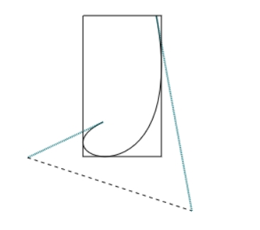

如上图，包围盒围起来了，解决了计算贝塞尔曲线宽高计算的问题

## 画出切线验证

再把曲线的切线画出来，这回我们不画垂直向量，直接画切线

切线向量这道菜已经吃过了..

将 t 步长设为 0.1, 进行曲线采样, 画出绿色的切线

```
for( let t=0; t <=1; t += 0.1){
      // 绘制起点移动到对应的曲线点上
      const sx = calcBezierByT(pointXArray, t);
      const sy = calcBezierByT(pointYArray, t);
      ctx.moveTo(sx, sy)

      // a t^2 + b t + c 
      // 切线向量
      let vx = a1 * Math.pow(t,2) + b1 * t + c1
      let vy = a2 * Math.pow(t,2) + b2 * t + c2
      // 缩至单位向量
      let magnitude = Math.sqrt(vx * vx + vy * vy)
      // vx = -vx / magnitude;
      // vy = -vy / magnitude;
      vx = vx / magnitude;
      vy = vy / magnitude;
      // 向量长度变长 30 个单位
      vx *= 30
      vy *= 30
      ctx.strokeStyle = 'green';  
      ctx.lineTo(sx + vx,  sy + vy);
      }
      ctx.stroke();
}

```

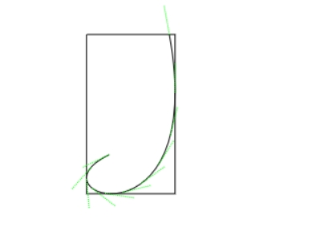
(绿色颜色有点儿淡了感觉...)

代入上一节算出的 t1, t2, t3, t4 用红色画出局部极限值 (local extreme) 验证

注意 曲线不同，t1， t2, t3, t4 的值有可能有，有可能没有，且我们需要的是 t1 >= 0

需要这样处理

```
// 过滤
const tArray = [t1, t2, t3, t4].filter((t)=> t >= 0);

for( let i=0; i <= tArray.length; i++){
      ...与上面生成切线一样，只是 t 值是从 tArray 获取，而不是 0.1 步长
}
```

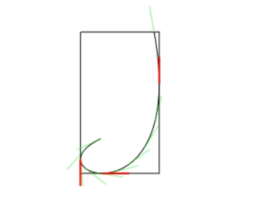

可以看到，红色标出的果然很 “极限”

代入不同的坐标值看看

```
const points = [
      { x: 20, y: 340 },
      { x: 50, y: 400 },
      { x: 320, y: 180 },
      { x: 480, y: 340 },
    ];
```

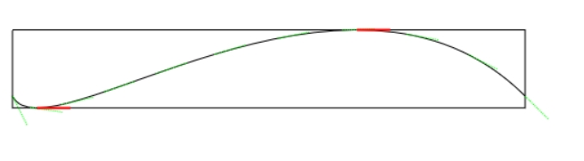

```
const points = [
{x:  13, y: 224 }, 
{x: 150, y: 100 },
{x: 251, y:  93 }, 
{x: 341, y: 224 }, 
];
```

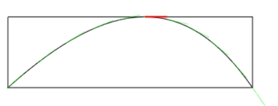
(绿色颜色快看不出来了，PC上的微信截图工具会模糊截图...)

可以看到，有些曲线极限值就不一定有四个

https://github.com/willian12345/blogpost/blob/main/curve/bezier/aabb.html

## 后续

贝塞尔曲线虽然原理很简单，但深入后就会特别复杂，你们好好深入，反正以我的能力是深入不了的

作为一个打工人，就要有打工人的觉悟，主打一个随意，没必要在一个问题上死磕

东看看，西看看，说不定回头再来看问题，已具备足够的知识与资料后就解决了

创业公司麻，就是这么的不稳定，何况是在这样一个环境下

最近公司要让我重新再接触 unity ，这又绕回来了， c# 其实挺好的


----

参考资料:

https://developer.mozilla.org/zh-CN/docs/Web/API/CanvasRenderingContext2D/bezierCurveTo

https://floris.briolas.nl/floris/2009/10/bounding-box-of-cubic-bezier/

https://stackoverflow.com/questions/24809978/calculating-the-bounding-box-of-cubic-bezier-curve

https://pomax.github.io/bezierinfo/#boundingbox

