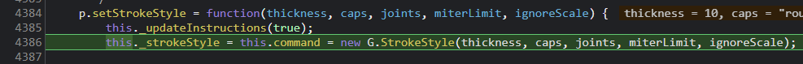
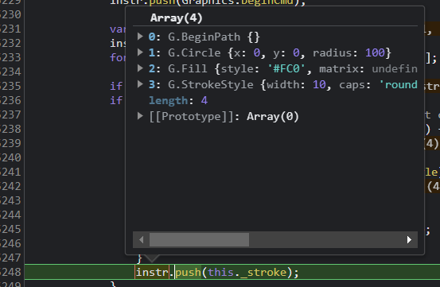
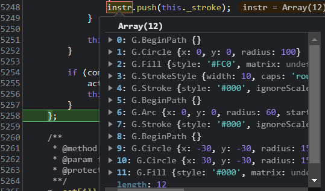

# 显示类 -- Bitmap 、Text 和 Shape

让我们看向例子 examples/Text_simple.html 

它包使用了三个显示对象类 Bitmap 、Text 、 Shape


## Bitmap draw

以下例子中添加了一个 image 

```
var image = new createjs.Bitmap("imagePath.png");
stage.addChild(image);
```

当调用 stage.update 后，会调用显示对象的 draw 方法，如果是 Container 类，则继续递归调用其 draw 方法

这样所有 stage 舞台上的显示对象的 draw 方法都会被调用到，注意 canvas 的上下文对象 ctx 参数都会被传入

分两步：
1. 如果 DisplayObject 类内有缓存，则绘制缓存
2. 如果没有缓存则循环显示列表调用每个 child 的 draw 方法 child 都为 DisplayObject 实例，还判断了 DisplayObject 实例的 isVisible 如果不可见则不绘制

```
// Container 类 源码 160 - 176 行
p.draw = function(ctx, ignoreCache) {
	if (this.DisplayObject_draw(ctx, ignoreCache)) { return true; }
	// 用 slice 的原因是防止绘制过程中 children 发生变更导致出错
	var list = this.children.slice();
	for (var i=0,l=list.length; i<l; i++) {
		var child = list[i];
		if (!child.isVisible()) { continue; }
		
		// draw the child:
		ctx.save();
		child.updateContext(ctx);
		child.draw(ctx);
		ctx.restore();
	}
	return true;
};
```

child 就为一个 Bitmap 对象

直接看 Bitmap 类实现的 draw 方法如下：

```
// Bitmap 类 源码 142-159
p.draw = function(ctx, ignoreCache) {
	if (this.DisplayObject_draw(ctx, ignoreCache)) { return true; }
	var img = this.image, rect = this.sourceRect;
	if (img.getImage) { img = img.getImage(); }
	if (!img) { return true; }
	if (rect) {
		// some browsers choke on out of bound values, so we'll fix them:
		var x1 = rect.x, y1 = rect.y, x2 = x1 + rect.width, y2 = y1 + rect.height, x = 0, y = 0, w = img.width, h = img.height;
		if (x1 < 0) { x -= x1; x1 = 0; }
		if (x2 > w) { x2 = w; }
		if (y1 < 0) { y -= y1; y1 = 0; }
		if (y2 > h) { y2 = h; }
		ctx.drawImage(img, x1, y1, x2-x1, y2-y1, x, y, x2-x1, y2-y1);
	} else {
		ctx.drawImage(img, 0, 0);
	}
	return true;
};
```

就三步：

1. 有缓存则绘制缓存
2. 如果有 rect 限制，有目标尺寸 rect 限制，则绘制成 rect 尺寸，调用 canvas 的 drawImage 原生方法并传入目标尺寸
3. 如果没有 rect 限制，则直接调用 canvas 的 drawImage 原生方法

先不管 `ctx.drawImage(img, x1, y1, x2-x1, y2-y1, x, y, x2-x1, y2-y1);` 这一句，

具体语法可以查询 https://developer.mozilla.org/zh-CN/docs/Web/API/CanvasRenderingContext2D/drawImage

注意： `ctx.drawImage(img, 0, 0);`  后两个参数值是图象的 x, y 坐标，

都传了 0 好家伙直接 "hardcode" 了，绘制时不用考虑图像的位置吗？

都画在了0, 0 位置画在左上角？ 

这不科学，如果用户指定了图像位置比如 x = 100, y = 80 那怎么办？

如果我来实现，直觉上就会想要把此处改为 `ctx.drawImage(img, 0 + x, 0 + y);` 

但 EaselJS 并没有，但却又能正常工作？，先搁置，继续往下看就会明白


## Text draw 

绘制文本

创建一个文本 txt 

```
txt = new createjs.Text("text on the canvas... 0!", "36px Arial", "#FFF");
```

直接看向 Text 的 draw 实例方法：

```
// Text 类 源码 208 - 217 行
p.draw = function(ctx, ignoreCache) {
	if (this.DisplayObject_draw(ctx, ignoreCache)) { return true; }

	var col = this.color || "#000";
	if (this.outline) { ctx.strokeStyle = col; ctx.lineWidth = this.outline*1; }
	else { ctx.fillStyle = col; }
	
	this._drawText(this._prepContext(ctx));
	return true;
};
```

依然先判断缓存

文本默认为黑色

如果有 outline 则 lineWidth 被设置限制宽度，用显示文本周边的框

调用 `this._drawText(this._prepContext(ctx));`  

`_prepContext` 存着的上下文中预设的默认样式

Text 的 `_drawText` 方法是真正执行绘制文本的的逻辑（支持换行）

```
// Text 类 源码 339 - 390 行
p._drawText = function(ctx, o, lines) {
	var paint = !!ctx;
	if (!paint) {
		ctx = Text._workingContext;
		ctx.save();
		this._prepContext(ctx);
	}
	var lineHeight = this.lineHeight||this.getMeasuredLineHeight();

	var maxW = 0, count = 0;
	var hardLines = String(this.text).split(/(?:\r\n|\r|\n)/);
	for (var i=0, l=hardLines.length; i<l; i++) {
		var str = hardLines[i];
		var w = null;
		
		if (this.lineWidth != null && (w = ctx.measureText(str).width) > this.lineWidth) {
			// text wrapping:
			var words = str.split(/(\s)/);
			str = words[0];
			w = ctx.measureText(str).width;
			
			for (var j=1, jl=words.length; j<jl; j+=2) {
				// Line needs to wrap:
				var wordW = ctx.measureText(words[j] + words[j+1]).width;
				if (w + wordW > this.lineWidth) {
					if (paint) { this._drawTextLine(ctx, str, count*lineHeight); }
					if (lines) { lines.push(str); }
					if (w > maxW) { maxW = w; }
					str = words[j+1];
					w = ctx.measureText(str).width;
					count++;
				} else {
					str += words[j] + words[j+1];
					w += wordW;
				}
			}
		}
		
		if (paint) { this._drawTextLine(ctx, str, count*lineHeight); }
		if (lines) { lines.push(str); }
		if (o && w == null) { w = ctx.measureText(str).width; }
		if (w > maxW) { maxW = w; }
		count++;
	}

	if (o) {
		o.width = maxW;
		o.height = count*lineHeight;
	}
	if (!paint) { ctx.restore(); }
	return o;
	};
```

步骤：

1. `paint` 为 false 即没有传 ctx 时 仅用于测量文本的尺寸，并不实际绘制到舞台上

2. 通过 `String(this.text).split(/(?:\r\n|\r|\n)/);` 这一句将通过回车与换行符得到多行文本

3. 循环分解出的文本数组，ctx.measureText 测量文本宽度后判断是否大于 lineWidth 如果加上后面一断文本大于，则需新启一行

4. 调用 `_drawTextLine()` 方法绘制文本

调用 canvas 真实 api ctx.fillText 绘制文本

```
// Text 类 源码 399 - 403 行
p._drawTextLine = function(ctx, text, y) {
	// Chrome 17 will fail to draw the text if the last param is included but null, so we feed it a large value instead:
	if (this.outline) { ctx.strokeText(text, 0, y, this.maxWidth||0xFFFF); }
	else { ctx.fillText(text, 0, y, this.maxWidth||0xFFFF); }
};
```

发现没有 ctx.fillText 处传的 x 还是 hardcode 硬编码 0 而坐标 y 还是相对坐标，都绘制到 canvas 上了还不是绝对坐标能行吗？

不科学啊

是时候探究了！

## updateContext

draw 方法内使用的坐标都是硬编码或相对坐标，但又可以如期绘制正确

是时候看一下之前遗留的 updateContext 方法了

还记得第一篇中 stage.update 内 draw 方法前的一句 `this.updateContext(ctx);` 吗

实际上最终调用的是 DisplayObject 类的 updateContext 实例方法如下：

```
// DisplayObject.js 源码 787-810 行
p.updateContext = function(ctx) {
	var o=this, mask=o.mask, mtx= o._props.matrix;
	
	if (mask && mask.graphics && !mask.graphics.isEmpty()) {
		mask.getMatrix(mtx);
		ctx.transform(mtx.a,  mtx.b, mtx.c, mtx.d, mtx.tx, mtx.ty);
		
		mask.graphics.drawAsPath(ctx);
		ctx.clip();
		
		mtx.invert();
		ctx.transform(mtx.a,  mtx.b, mtx.c, mtx.d, mtx.tx, mtx.ty);
	}
	
	this.getMatrix(mtx);
	var tx = mtx.tx, ty = mtx.ty;
	if (DisplayObject._snapToPixelEnabled && o.snapToPixel) {
		tx = tx + (tx < 0 ? -0.5 : 0.5) | 0;
		ty = ty + (ty < 0 ? -0.5 : 0.5) | 0;
	}
	ctx.transform(mtx.a,  mtx.b, mtx.c, mtx.d, tx, ty);
	ctx.globalAlpha *= o.alpha;
	if (o.compositeOperation) { ctx.globalCompositeOperation = o.compositeOperation; }
	if (o.shadow) { this._applyShadow(ctx, o.shadow); }
};
```

`o._props` 是 `src/easeljs/geom/DisplayProps.js` DisplayProps 类的实例

DisplayProps 主要负责了显示对象的以下属性操作

visible、alpha、shadow、compositeOperation、matrix

`mtx= o._props.matrix` 在 DisplayObject 实例属性 `_props` 对象中得到 matrix

updateContext 就是在上下文中应用不同的 matrix 实现上下文中的“变幻”

首先就是对 mask 遮罩的处理，遮罩是通过绘制 Graphics 后对上下文进行 ctx.clip 实现的

如果存在 mask 当前显示对象有遮罩，通过 mask.getMatrix 把遮罩的 matrix

ctx.transform 将上下文变化至遮罩所在的“状态”

绘制遮罩 mask.graphics.drawAsPath(ctx) 

还原矩阵 mtx.invert(); 回到当前显示对象的“状态”

至此 mask 部分处理完毕

回到当前显示对象的 getMatrix 获取矩阵后应用矩阵变化

getMatrix 做了两件事

1. 如果显示对象有明确指定的 matrix 则应用 matrix
2. 如果没有明确指定，则将显示对象的，x,y,scaleX, scaleY, rotation, skewW, skewY, regX, regY 合到 matrix上


```
// DisplayObject.js 源码 1020-1024 行
p.getMatrix = function(matrix) {
	var o = this, mtx = matrix || new createjs.Matrix2D();
	return o.transformMatrix ?  mtx.copy(o.transformMatrix) :
		(mtx.identity() && mtx.appendTransform(o.x, o.y, o.scaleX, o.scaleY, o.rotation, o.skewX, o.skewY, o.regX, o.regY));
};
```

注意这一句 `mtx.appendTransform(o.x, o.y, o.scaleX, o.scaleY, o.rotation, o.skewX, o.skewY, o.regX, o.regY))`

就是将当前显示对象的变幻属性合到矩阵中

得到新的 matrix 后调用 ctx.transform(mtx.a,  mtx.b, mtx.c, mtx.d, tx, ty); 实现一系列变化

至于 `src/easeljs/geom/Matrix2D.js` 矩阵类

平时在 css 中的使用的变化 scale, rotate, translateX, translateY 最后都是矩阵变幻实现的

矩阵变幻的好处是性能好，一次可以实现多种变化，只是不那么直观

至于矩阵为什么可以实现变幻，我这小学数学水平可讲不清楚，推荐 3blue1brown 的视频看完肯定会醍醐灌顶

如果你懒的看，我的总结是矩阵实现的是对坐标轴的线性变幻

所以在具体 draw 绘制时 x,y 坐标可以硬编码或使用相对坐标，因为 draw 之前已经使用矩阵把整体坐标轴变幻到位了

绘制完后又会重置回来开始新的对象的变幻

## Shape draw

Shape 类代码非常少，实现绘制的是 Graphics 类

Shape 只是作为 Graphics 实例的载体

使用 shape.graphics 属性即可访问

```
Shape.js 源码 106-110 行
p.draw = function(ctx, ignoreCache) {
	if (this.DisplayObject_draw(ctx, ignoreCache)) { return true; }
	this.graphics.draw(ctx, this);
	return true;
};
```

## Graphics

矢量图形类 Graphics 在 src/easeljs/display/Graphics.js 

通常 Graphics 用于绘制矢量图形

可单独使用，也可以在 Shape 实例内调用

```
var g = new createjs.Graphics();
g.setStrokeStyle(1);
g.beginStroke("#000000");
g.beginFill("red");
g.drawCircle(0,0,30);
```

要实现 Grapihcs 绘制，就得组合一系列绘图命令

一系列绘制命令被存储在了 `_instructions` 数组属性内

这些命令被称为 Command Objects 命令对象

源码 1653 行 - 2459 行都是命令对象

命令对象分别都暴露了一个 exec 方法

比如 MoveTo 命令

```
// Graphics.js 源码 1700 - 1702 行
(G.MoveTo = function(x, y) {
	this.x = x; this.y = y;
}).prototype.exec = function(ctx) { ctx.moveTo(this.x, this.y); };
```

比如圆形绘制命令

```
// Graphics.js 源码 2292 - 2295 行
(G.Circle = function(x, y, radius) {
	this.x = x; this.y = y;
	this.radius = radius;
}).prototype.exec = function(ctx) { ctx.arc(this.x, this.y, this.radius, 0, Math.PI*2); };
```
下面是圆角矩形的也是在 Graphics 静态方法

```
(G.RoundRect = function(x, y, w, h, radiusTL, radiusTR, radiusBR, radiusBL) {
		this.x = x; this.y = y;
		this.w = w; this.h = h;
		this.radiusTL = radiusTL; this.radiusTR = radiusTR;
		this.radiusBR = radiusBR; this.radiusBL = radiusBL;
	}).prototype.exec = function(ctx) {
		var max = (this.w<this.h?this.w:this.h)/2;
		var mTL=0, mTR=0, mBR=0, mBL=0;
		var x = this.x, y = this.y, w = this.w, h = this.h;
		var rTL = this.radiusTL, rTR = this.radiusTR, rBR = this.radiusBR, rBL = this.radiusBL;

		if (rTL < 0) { rTL *= (mTL=-1); }
		if (rTL > max) { rTL = max; }
		if (rTR < 0) { rTR *= (mTR=-1); }
		if (rTR > max) { rTR = max; }
		if (rBR < 0) { rBR *= (mBR=-1); }
		if (rBR > max) { rBR = max; }
		if (rBL < 0) { rBL *= (mBL=-1); }
		if (rBL > max) { rBL = max; }

		ctx.moveTo(x+w-rTR, y);
		ctx.arcTo(x+w+rTR*mTR, y-rTR*mTR, x+w, y+rTR, rTR);
		ctx.lineTo(x+w, y+h-rBR);
		ctx.arcTo(x+w+rBR*mBR, y+h+rBR*mBR, x+w-rBR, y+h, rBR);
		ctx.lineTo(x+rBL, y+h);
		ctx.arcTo(x-rBL*mBL, y+h+rBL*mBL, x, y+h-rBL, rBL);
		ctx.lineTo(x, y+rTL);
		ctx.arcTo(x-rTL*mTL, y-rTL*mTL, x+rTL, y, rTL);
		ctx.closePath();
	};
```

exec 方法才是真正调用 canvas context 绘制的地方 

G 就是 Graphics 的简写，在 250 行 `var G = Graphics;`

这些单独的绘图命令其实就是 G 的一些静态方法，只是这些静态方法又拥有各自不同的 exec 实例方法实现具体的绘图

而 Graphics 的实例方法又会将绘图命令 append 一个 “静态方法的实例” 存储数组内

比如 lineTo , 注意是 new G.MoveTo(x,y) 一个命令

```
// Graphics.js 源码 469 - 471 行
p.moveTo = function(x, y) {
	return this.append(new G.MoveTo(x,y), true);
};
```

下面是 append 源码，命令都存在 `_activeInstructions` 数组内


```
// Graphics.js 源码 1024 - 1029 行
p.append = function(command, clean) {
	this._activeInstructions.push(command);
	this.command = command;
	if (!clean) { this._dirty = true; }
	return this;
};
```


再看通用的 draw 方法

```
// Graphics.js 源码 434-440 行
p.draw = function(ctx, data) {
	this._updateInstructions();
	var instr = this._instructions;
	for (var i=this._storeIndex, l=instr.length; i<l; i++) {
		instr[i].exec(ctx, data);
	}
};
```

draw 内的主要逻辑就是用循环调用 `_instructions` 存储的“命令对象”执行命令对象的 exec 方法

`_instructions` 的命令是通过 `_updateInstructions` 方法从 `_activeInstructions` 数组内复制的

```
// Graphics.js 源码 1593-1627 行
p._updateInstructions = function(commit) {
	var instr = this._instructions, active = this._activeInstructions, commitIndex = this._commitIndex;
	debugger
	if (this._dirty && active.length) {
		instr.length = commitIndex; // remove old, uncommitted commands
		instr.push(Graphics.beginCmd);

		var l = active.length, ll = instr.length;
		instr.length = ll+l;
		for (var i=0; i<l; i++) { instr[i+ll] = active[i]; }

		if (this._fill) { instr.push(this._fill); }
		if (this._stroke) {
			// doesn't need to be re-applied if it hasn't changed.
			if (this._strokeDash !== this._oldStrokeDash) {
				instr.push(this._strokeDash);
			}
			if (this._strokeStyle !== this._oldStrokeStyle) {
				instr.push(this._strokeStyle);
			}
			if (commit) {
				this._oldStrokeStyle = this._strokeStyle;
				this._oldStrokeDash = this._strokeDash;
			}
			instr.push(this._stroke);
		}

		this._dirty = false;
	}
	// 如果 commit 了，把 _activeInstructions 当前命令集合清空，且游标指向 this._instructions 的最后位置
	if (commit) {
		active.length = 0;
		this._commitIndex = instr.length;
	}
};
```

还有一些方法(如：beginStroke beginFill) 内调用了 `_updateInstructions(true)`  注意传的是 true

比如：

```
p.beginStroke = function(color) {
	return this._setStroke(color ? new G.Stroke(color) : null);
};
p._setStroke = function(stroke) {
	this._updateInstructions(true);
	if (this.command = this._stroke = stroke) {
		stroke.ignoreScale = this._strokeIgnoreScale;
	}
	return this;
};
```

注意： 这里收集的命令暂时不会被放到  `this._instructions` 数组内

直到有 append 方法执行过 dirty 为 true 了 才会把 stroke 命令添加到 `this._instructions` 数组

因为没有 append 任何实质的内容(圆，线，矩形等)，则不需要执行 stroke ,beginFill 等命令，因为无意义


`p._updateInstructions` 到底干了啥？ 


主要是在 draw 之前不断收集命令, 在多处都有调用  `_updateInstructions` 

这些操作 commit 均为 true 表明后面的绘制是新的开始，将之前的一系列绘制命令归为一个路径绘制，下一个得新启一个路径绘制

使用 `this._commitIndex` 游标重新指示命令数组内的位置

debugger 调试一下看看 

在 easeljs-NEXT.js 的 5226 行加上 debugger

浏览器中打开 examples/Graphics_simple.html 文件，并打开浏览器调试工具

Graphics_simple.html 文件的 javascript 代码内有一个 drawSmiley 方法

```
function drawSmiley() {
	var s = new createjs.Shape();
	var g = s.graphics;

	//Head
	g.setStrokeStyle(10, 'round', 'round');
	g.beginStroke("#000");
	g.beginFill("#FC0");
	g.drawCircle(0, 0, 100); //55,53

	//Mouth
	g.beginFill(); // no fill
	g.arc(0, 0, 60, 0, Math.PI);

	//Right eye
	g.beginStroke(); // no stroke
	g.beginFill("#000");
	g.drawCircle(-30, -30, 15);

	//Left eye
	g.drawCircle(30, -30, 15);

	return s;
}
```

很明显通过 debugger 先调用了 `setStrokeStyle`



当调用 setStrokeStyle、beginStroke、beginFill 等都会执行 `_updateInstructions`  命令

当执行到 `g.drawCircle(0, 0, 100); ` 此时命令才会被一起收集顺序如下



发现没有，与我们在调用顺序不一样

```
g.setStrokeStyle(10, 'round', 'round');
g.beginStroke("#000");
g.beginFill("#FC0");
g.drawCircle(0, 0, 100); //55,53
```

BeginPath -> Circle -> Fill -> StrokeStyle

这是 Canvas 真正正常执行的顺序

BeginPath 也在每次 dirty （append 方法导至 dirty 为 true） 时添加，beginPath 当然是另启一个新的路径绘制了




