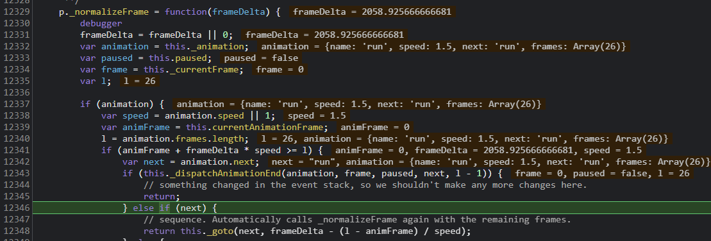

# 显示类 -- Sprite、Movieclip、DOMElement

## SpriteSheet

SpriteSheet 比较简单

它继承自 EventDispatcher 所以 SpriteSheet 并不是显示类

它是显示类 Sprite 的数据来源为 Sprite 传递组装 SpriteSheet 实现动画效果如：

```
var data = {
 			images: ["sprites.jpg"],
 			frames: {width:50, height:50},
 			animations: {
 				stand:0,
 				run:[1,5],
 				jump:[6,8,"run"]
 			}
  };
var spriteSheet = new createjs.SpriteSheet(data);
var animation = new createjs.Sprite(spriteSheet, "run");
```
images 第一帧的图像数据

frames 属性规定的是每一帧的 x, y, width, height, imageIndex*, regX*, regY*

frames 传递数组，则可以为每一帧指定不同的参数

frames 传递对象，则可以为同尺寸的不同帧统一指定参数

animations 表示的是动画播放逻辑，帧之间的跳转，animations 下的各个 key 表示的是一组组的动画

需要播放或暂停动画时可直接使用这些 key 作为名字传递 比如 gotoStop('stand') 、 gotoPlay('jump')

最主要的方法就是 _parseData 和 _calculateFrames

```
// SpriteSheet 类 源码 485 - 564 行
p._parseData = function(data) {		
  var i,l,o,a;
  if (data == null) { return; }

  this.framerate = data.framerate||0;

  // 解析 images 属性
  if (data.images && (l=data.images.length) > 0) {
    a = this._images = [];
    for (i=0; i<l; i++) {
      var img = data.images[i];
      if (typeof img == "string") {
        var src = img;
        img = document.createElement("img");
        img.src = src;
      }
      a.push(img);
      // 如果需要加载图片，则异步加载
      if (!img.getContext && !img.naturalWidth) {
        this._loadCount++;
        this.complete = false;
        (function(o, src) { img.onload = function() { o._handleImageLoad(src); } })(this, src);
        (function(o, src) { img.onerror = function() { o._handleImageError(src); } })(this, src);
      }
    }
  }

  // 解析 frames 属性
  if (data.frames == null) { // nothing
  } else if (Array.isArray(data.frames)) {
    // 如果传递的是数组
    this._frames = [];
    a = data.frames;
    for (i=0,l=a.length;i<l;i++) {
      var arr = a[i];
      // 此处帧的 image 需要判断帧数据内有没有特别指定 images 的 index，如果没有指定则默认取 index 0
      this._frames.push({image:this._images[arr[4]?arr[4]:0], rect:new createjs.Rectangle(arr[0],arr[1],arr[2],arr[3]), regX:arr[5]||0, regY:arr[6]||0 });
    }
  } else {
    // 如果传递的是对象，意味着传的是一整张图（类似css中合并的雪碧图），需要计算分解出每一帧图像
    o = data.frames;
    this._frameWidth = o.width;
    this._frameHeight = o.height;
    this._regX = o.regX||0;
    this._regY = o.regY||0;
    this._spacing = o.spacing||0;
    this._margin = o.margin||0;
    // 注意这里传递的总帧数，需要这个计算帧
    this._numFrames = o.count;
    if (this._loadCount == 0) { this._calculateFrames(); }
  }

  // 解析动画属性
  this._animations = [];
  if ((o=data.animations) != null) {
    this._data = {};
    var name;
    for (name in o) {
      var anim = {name:name};
      var obj = o[name];
      if (typeof obj == "number") { // 单帧
        a = anim.frames = [obj];
      } else if (Array.isArray(obj)) { // 单帧
        if (obj.length == 1) { anim.frames = [obj[0]]; }
        else {
          anim.speed = obj[3];
          anim.next = obj[2];
          a = anim.frames = [];
          for (i=obj[0];i<=obj[1];i++) {
            a.push(i);
          }
        }
      } else { // complex
        anim.speed = obj.speed;
        anim.next = obj.next;
        var frames = obj.frames;
        a = anim.frames = (typeof frames == "number") ? [frames] : frames.slice(0);
      }
      if (anim.next === true || anim.next === undefined) { anim.next = name; } // loop
      if (anim.next === false || (a.length < 2 && anim.next == name)) { anim.next = null; } // stop
      if (!anim.speed) { anim.speed = 1; }
      this._animations.push(name);
      this._data[name] = anim;
    }
  }
};
```

_calculateFrames 用于从一张 Sprite 图中自动生成多个帧

```
// SpriteSheet 类 源码 597 - 628 行
p._calculateFrames = function() {
		if (this._frames || this._frameWidth == 0) { return; }

		this._frames = [];

		var maxFrames = this._numFrames || 100000; // if we go over this, something is wrong.
		var frameCount = 0, frameWidth = this._frameWidth, frameHeight = this._frameHeight;
		var spacing = this._spacing, margin = this._margin;
		
		imgLoop:
		for (var i=0, imgs=this._images; i<imgs.length; i++) {
			var img = imgs[i], imgW = (img.width||img.naturalWidth), imgH = (img.height||img.naturalHeight);

			var y = margin;
			while (y <= imgH-margin-frameHeight) {
				var x = margin;
				while (x <= imgW-margin-frameWidth) {
					if (frameCount >= maxFrames) { break imgLoop; }
					frameCount++;
					this._frames.push({
							image: img,
							rect: new createjs.Rectangle(x, y, frameWidth, frameHeight),
							regX: this._regX,
							regY: this._regY
						});
					x += frameWidth+spacing;
				}
				y += frameHeight+spacing;
			}
		}
		this._numFrames = frameCount;
	};
```

其实就是读取图片，根据指定的帧尺寸与 margin、spacing 从左向右，从上到下的扫描图片

生成每一帧的信息存储到 _frames 中，与手动传的一至

通常我们不会用手指定每一帧，更多的情况是使用图形工具生成“雪碧”图就像在 css 中为了解决降低图片的请求数量，把很多图合成在一起

## Sprite

继承自显示对象, 使用示例代码如下：

```
var spriteSheet = new createjs.SpriteSheet({
  framerate: 30,
  "images": ["../_assets/art/spritesheet_grant.png"],
  "frames": {"regX": 82, "height": 292, "count": 64, "regY": 0, "width": 165},
  // define two animations, run (loops, 1.5x speed) and jump (returns to run):
  "animations": {
    "run": [0, 25, "run", 1.5],
    "jump": [26, 63, "run"]
  }
});
var grant = new createjs.Sprite(spriteSheet, "run");
stage.addChild(grant);
createjs.Ticker.addEventListener("tick", stage);
```

它传递的是 SpriteSheet 的实例作为动画数据

Sprite 的特点是它拥有别于 Tick 的 framerate 控制能力

你可以在 SpriteSheet 或 Sprite 实例中单独指定 framerate


我们还是从 draw 方法入手：

```
// Sprite 类 源码 224 - 232 行
p.draw = function(ctx, ignoreCache) {
		if (this.DisplayObject_draw(ctx, ignoreCache)) { return true; }
		this._normalizeFrame();
		var o = this.spriteSheet.getFrame(this._currentFrame|0);
		if (!o) { return false; }
		var rect = o.rect;
		if (rect.width && rect.height) { ctx.drawImage(o.image, rect.x, rect.y, rect.width, rect.height, -o.regX, -o.regY, rect.width, rect.height); }
		return true;
	};
```

可以看到 draw 本身代码作用非常简单清楚

1. 有过 `spriteSheet.getFrame` 获取当前帧
2. 通过当前帧 的 rect 属性用 drawImage 绘制到 canvas 上下文当中

draw 方法负责绘制 “当前帧”

`_normalizeFrame` 方法负责指定“当前帧”具体为动画组 frames 中的哪一帧


```
// Sprite 类 源码 386-480
p._normalizeFrame = function(frameDelta) {
  frameDelta = frameDelta || 0;
  var animation = this._animation;
  var paused = this.paused;
  var frame = this._currentFrame;
  var l;
  debugger
  if (animation) {
    var speed = animation.speed || 1;
    var animFrame = this.currentAnimationFrame;
    l = animation.frames.length;
    if (animFrame + frameDelta * speed >= l) {
      var next = animation.next;
      // 如果帧播放完毕，则触发 animationEnd 事件
      if (this._dispatchAnimationEnd(animation, frame, paused, next, l - 1)) {
        // something changed in the event stack, so we shouldn't make any more changes here.
        return;
      } else if (next) {
        // sequence. Automatically calls _normalizeFrame again with the remaining frames.
        return this._goto(next, frameDelta - (l - animFrame) / speed);
      } else {
        // end.
        this.paused = true;
        animFrame = animation.frames.length - 1;
      }
    } else {
      animFrame += frameDelta * speed;
    }
    this.currentAnimationFrame = animFrame;
    this._currentFrame = animation.frames[animFrame | 0]
  } else {
    frame = (this._currentFrame += frameDelta);
    l = this.spriteSheet.getNumFrames();
    if (frame >= l && l > 0) {
      if (!this._dispatchAnimationEnd(animation, frame, paused, l - 1)) {
        // looped.
        if ((this._currentFrame -= l) >= l) { return this._normalizeFrame(); }
      }
    }
  }
  frame = this._currentFrame | 0;
  if (this.currentFrame != frame) {
    this.currentFrame = frame;
    this.dispatchEvent("change");
  }
};
```

用 examples/SpriteSheet_simple.html 这个例子来调式

注意想要显示这个例子，必须在服务器环境下，本地跑个服务器后用浏览器打开 examples/SpriteSheet_simple.html



`_normalizeFrame` 内的 `this._dispatchAnimationEnd` 是一组帧播放完毕后触发的事件

可以在 SpriteSheet_simple.html 添加以下代码测试功能, 比如暂停动画

```
grant.on('animationend', function(event){
  event.currentTarget.paused = true;
})
```


在 `_normalizeFrame` 内添加 debugger 断点调试后发现，draw 方法仅绘制 currentFrame

而 Sprite 的 _tick 方法通过与 Tick 类同步 控制 advance 无限循环

还记得 evtObj.delta 吗？ 比如设置 createjs.Ticker.framerate = 60; 那么 evtObj.delta 大约就是 1000/60  = 17

```
// Sprite 类 源码 372-378
p._tick = function(evtObj) {
  if (!this.paused) {
    if (!this._skipAdvance) { this.advance(evtObj&&evtObj.delta); }
    this._skipAdvance = false;
  }
  this.DisplayObject__tick(evtObj);
};
```

advance 内的 _normalizeFrame 传递了 t 值才是控制 currentFrame 变化的关键

time/(1000/fps) 即 evtObj.delta / (1000 / fps)

如果没有 time 那么 t = 1 则频率与舞台的 Tick 频率保持一至

```
// Sprite 类 源码 304-308
p.advance = function(time) {
  var fps = this.framerate || this.spriteSheet.framerate;
  var t = (fps && time != null) ? time/(1000/fps) : 1;
  this._normalizeFrame(t);
};
```

还有值得一提的是 _goto 方法，可通过此方法在不同的动画组之间跳停、跳播等操作

动画组或帧的获取通过 spriteSheet 的 getAnimation 实例方法获取的

等获取到动画组或帧后，还是调用 _normalizeFrame 进行播放而不是 draw 

```
// Sprite 类 源码 461-475
p._goto = function(frameOrAnimation, frame) {
  this.currentAnimationFrame = 0;
  if (isNaN(frameOrAnimation)) {
    var data = this.spriteSheet.getAnimation(frameOrAnimation);
    if (data) {
      this._animation = data;
      this.currentAnimation = frameOrAnimation;
      this._normalizeFrame(frame);
    }
  } else {
    this.currentAnimation = this._animation = null;
    this._currentFrame = frameOrAnimation;
    this._normalizeFrame();
  }
};
```

## Movieclip

Movieclip 继承自 Container 类，它也是个容器

影片剪辑：Sprite 解决的是帧动画问题，而 Movieclip 解决的是管理线性动画的问题

Movieclip 就是将 Timeline 与 TweenJS 结合在一起，这两个类不在 EaselJS 部分

大致看了一眼，em... 定然是没有 greensock 的优秀，就不分析了

由于 Movieclip 工作方式设计的与 Sprite 很像，也是调用 _tick -> advance() ，在查看源码时发现一个注释比较有趣

在源码 512 行发现了一条注释：

```
// Movieclip 类 源码 512-513 行
// adjusted by Dan Zen 3/27/21 for https://github.com/CreateJS/EaselJS/issues/1048
if (this.totalFrames <= 1) { return; }
```
名为 Dan Zen 的人提交了这个修改，作者把它注释在此处，而我知道 Dan Zen 这个人，它是 [zim](https://zimjs.com/) 的作者

zim 又是以 createjs 基础封装的库，功能很强大，教程也很多

zim 的宣传语 `ZIM - JavaScript Canvas Framework - Code Creativity!` 它非常值得探索


## DOMElement

可以将普通 DOM 元素当作 EaselJS 的元素使用

DOMElement 源码非常简单

EaselJS 会将 DOMElement 强制为 position:absolute 绝对定位，以便 DOM 位置与 canvas 内的坐标同步

使用例子 examples/DOMElement.html 为切入点分析

使用的主要 JS 如下：

```
// 新建 DOMElement 
var content = new createjs.DOMElement("foo");
content.regX = 140;
content.regY = 140;
// 添加进 container 
container.addChild(content);

createjs.Ticker.timingMode = createjs.Ticker.RAF;
createjs.Ticker.addEventListener("tick", tick);

function tick(event) {
  // 对 container 进行属性变幻
  container.rotation += event.delta * 0.01;
  container.alpha = 0.5 * (1 + Math.cos(container.rotation * 0.01));
  stage.update(event);
}
```

使用 new createjs.DOMElement("foo") 新建了一个 DOMElement类实例

DOMElement 源文件在 src/easeljs/display/DOMElement.js 

构造函数 DOMElement(htmlElement) 传入 'foo' 

```
// DOMElement 源码 81-83 行
var style = htmlElement.style;
		style.position = "absolute";
		style.transformOrigin = style.WebkitTransformOrigin = style.msTransformOrigin = style.MozTransformOrigin = style.OTransformOrigin = "0% 0%";
```
将 DOM 强制变为绝对定位，且 transformOrigin 归位到元素左上角


DOMElement 的 draw 方法仅是一个直接返回 true 的方法没做任何事，因为 DOM 不需要 canvas 去绘制

cache 相关功能也无法使用，用空的 function 覆写了

DOMElement 交互事件也与普通的 EaselJS 显示对象有别，源码的注释中也可以看到，作者提示了

```
Interaction events should be added to `htmlElement`, and not the DOMElement instance, since DOMElement instances
are not full EaselJS display objects and do not participate in EaselJS mouse events
```

大意是点击之类的交互事件需要直接在 DOM 上添加，而不是 EaselJS 内的一套

DOMElement 实现了 _tick 方法

```
// DOMElement 源码 249-257 行
p._tick = function(evtObj) {
  var stage = this.stage;
  if(stage && stage !== this._oldStage) {
    this._drawAction && stage.off("drawend", this._drawAction);
    this._drawAction = stage.on("drawend", this._handleDrawEnd, this);
    this._oldStage = stage;
  }
  this.DisplayObject__tick(evtObj);
};
```

当 stage 为新的时，监听了 stage 的发出的 drawend 事件

drawend 是在 stage `update = function(props){}` 内最后一行发出的，意味着是绘制更新完成后才轮到 DOMElement 处理更新

真正处理更新事件的是 _handleDrawEnd 

```
// DOMElement 源码 264-290 行
p._handleDrawEnd = function(evt) {
  var o = this.htmlElement;
  if (!o) { return; }
  var style = o.style;
  
  var props = this.getConcatenatedDisplayProps(this._props), mtx = props.matrix;
  
  var visibility = props.visible ? "visible" : "hidden";
  if (visibility != style.visibility) { style.visibility = visibility; }
  if (!props.visible) { return; }
  
  var oldProps = this._oldProps, oldMtx = oldProps&&oldProps.matrix;
  var n = 10000; // precision
  
  if (!oldMtx || !oldMtx.equals(mtx)) {
    var str = "matrix(" + (mtx.a*n|0)/n +","+ (mtx.b*n|0)/n +","+ (mtx.c*n|0)/n +","+ (mtx.d*n|0)/n +","+ (mtx.tx+0.5|0);
    style.transform = style.WebkitTransform = style.OTransform = style.msTransform = str +","+ (mtx.ty+0.5|0) +")";
    style.MozTransform = str +"px,"+ (mtx.ty+0.5|0) +"px)";
    if (!oldProps) { oldProps = this._oldProps = new createjs.DisplayProps(true, null); }
    oldProps.matrix.copy(mtx);
  }
  
  if (oldProps.alpha != props.alpha) {
    style.opacity = ""+(props.alpha*n|0)/n;
    oldProps.alpha = props.alpha;
  }
};
```

总共分四步处理：

1. 利用继承显示对象上的 getConcatenatedDisplayProps 方法得到 “显示属性对象” 显示相关的属性都在内，还有 Matrix
2. visible 属性转变成 css 能处理的 visibility
3. 如果没有旧的 matrix "oldMtx" 或 旧的 matrix 与 当前 matrix 不相等, 就代表需要更新 DOM 样式了，用新的 matrix "mtx", 更新后复制一份到 oldMtrix 用于下一次比较提高性能
4. alpha 变成 css 的 opacity 属性，也有新旧对比

旋转，缩放，位置变更都还是由 css transform 的 matrix 实现的

这倒与 EaselJS 在 canvas 内的用 matrix 统一到了一起

## BitmapText

有了它你可以随意创建自己的字形库，即使中文也可以

位图文本，即文本是位图形式表示的，用来展示图形文字。

演示示例在 src/examples/BitmapText.html

```
var data = {
    "animations": {
      "V": {"frames": [21]},
      "A": {"frames": [0]},
      ",": {"frames": [26]},
      "W": {"frames": [22]},
     ...
    },
    "images": ["../_assets/art/spritesheet_font.png"],
    "frames": [
      [155, 2, 25, 41, 0, -10, -3],
      [72, 2, 28, 43, 0, -8, -1],
      [599, 2, 28, 38, 0, -8, -4],
      ...
    ]
  };
}

var ss = new createjs.SpriteSheet(data);

var text = new createjs.BitmapText("Hello World,\nWhat is Happening?", ss);
```

构造函数接受 一个文本信息和 一个 SpriteSheet

SpriteSheet 传递的 data 包含图片信息以及对应的帧信息

注意 data 的 animations 与 frames 是后面获取具体图像帧的关键


结果是这样的


这是一个有趣的类，它结合了 Bitmap 与 Text 而它又继承自 Container 类

从源码中可以看到它虽然继承自 Container 类，但不支持 addChild 等一类的操作

而 BitmapText 最主要的是 _updateText 方法

```
// BitmapText 类 源码 292-346 行
p._updateText = function() {
  var x=0, y=0, o=this._oldProps, change=false, spaceW=this.spaceWidth, lineH=this.lineHeight, ss=this.spriteSheet;
  var pool=BitmapText._spritePool, kids=this.children, childIndex=0, numKids=kids.length, sprite;
  // 判断是否有变
  for (var n in o) {
    if (o[n] != this[n]) {
      o[n] = this[n];
      change = true;
    }
  }
  // 没有任何变化直接返回不进行任何操作
  if (!change) { return; }
  
  // 获取空格宽度，行高
  var hasSpace = !!this._getFrame(" ", ss);
  if (!hasSpace && !spaceW) { spaceW = this._getSpaceWidth(ss); }
  if (!lineH) { lineH = this._getLineHeight(ss); }
  // 循环文本
  for(var i=0, l=this.text.length; i<l; i++) {
    var character = this.text.charAt(i);
    // 计算 x , y 文本相对坐标值
    if (character == " " && !hasSpace) {
      x += spaceW;
      continue;
    } else if (character=="\n" || character=="\r") {
      if (character=="\r" && this.text.charAt(i+1) == "\n") { i++; } // crlf
      x = 0;
      y += lineH;
      continue;
    }

    // 获取单个文本对应帧的 index 值 _getFrameIndex 调用的是 SpriteSheet 的 getAnimation 
    var index = this._getFrameIndex(character, ss);
    if (index == null) { continue; }
    
    if (childIndex < numKids) {
      sprite = kids[childIndex];
    } else {
      // 将 sprite 放入 kids 即 children 数组
      kids.push(sprite = pool.length ? pool.pop() : new createjs.Sprite());
      sprite.parent = this;
      numKids++;
    }
    // 停在 sprite 的第 0 帧
    sprite.spriteSheet = ss;
    sprite.gotoAndStop(index);
    sprite.x = x;
    sprite.y = y;
    childIndex++;
    // 加上一个文本实际的 x 偏移
    x += sprite.getBounds().width + this.letterSpacing;
  }
  // 存储进 pool 数组复用提高性能
  while (numKids > childIndex) {
      // faster than removeChild.
    pool.push(sprite = kids.pop());
    sprite.parent = null;
    numKids--;
  }
  if (pool.length > BitmapText.maxPoolSize) { pool.length = BitmapText.maxPoolSize; }
};
```
大致步骤：

1. 用一个 for 循环判断 o 属性(o 即 _oldProps {text:0,spriteSheet:0,lineHeight:0,letterSpacing:0,spaceWidth:0})，是否有变, 有变说明需要在 canvas 更新 
2. for 循环整个 text 文本
3. 提取单个文本，用 _getFrameIndex 获取文本在 spritesheet 中的 index
4. 如果 kids 数组中已经有对应的 sprite 就直接复用比如 text 传的是 'aaaaaa'，从第 2 个 a 开始就可以复用了
5. 如果还没有生成过 sprite, 则从 pool 中找，还是没有则直接 new createjs.Sprite() 生成一个全新的 sprite
6. 指定 sprite.spriteSheet = ss; 得到 data
7. 让 sprite 停在第 index 帧，即画面显示在了 index 帧
8. 将 sprite 存进 pool 缓存起来复用

注意  _getFrameIndex 方法

```
// BitmapText 类 源码 245-252 行
p._getFrameIndex = function(character, spriteSheet) {
  var c, o = spriteSheet.getAnimation(character);
  if (!o) {
    (character != (c = character.toUpperCase())) || (character != (c = character.toLowerCase())) || (c=null);
    if (c) { o = spriteSheet.getAnimation(c); }
  }
  return o && o.frames[0];
};
```

它忽略大小写

getAnimation 获取 比如 'A' 对应的就是 data.animations 对象 key 为 'A' 的值  {"A": {"frames": [0]}} 

从而得到 data.frames 对应就的 index 就是 0 , 即 sprite.gotoAndStop(0); 显示的就是 A 对应的 bitmap A


