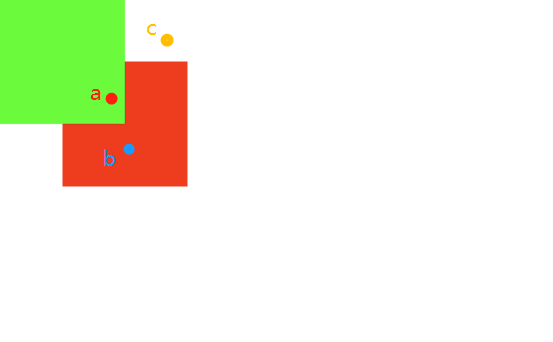

# EaselJS 源码分析系列--第四篇 

## 鼠标交互事件

前几篇关注的是如何渲染，那么鼠标交互如何实现呢？

Canvas context 本身没有像浏览器 DOM 一样的交互事件

EaselJS 如何在 canvas 内实现自己的鼠标事件系统？

原理大致如下：

1. Stage 类内的 canvas 监听标准 DOM 鼠标事件 (比如：mousedown)， window 或 document 对象下监听鼠标事件 (比如： mouseup, mousemove)

2. 一旦监听的 DOM 鼠标事件被触发，碰撞检测就是鼠标当前位置与 Stage 显示列表及其子列表递归判断是否发生碰撞

3. 如果发生碰撞，则用虚拟事件系统 EventDispatcher 派发对应的鼠标事件给碰撞到的显示对象

重点在于如何判断点与显示对象的碰撞!!

## 简单示例调试

写一个特别简单的鼠标交互例子用于 debugger 测试

再次提示 debugger 是要打在 /lib/easeljs-NEXT.js 这个 JS 内！！

我们自己实现一个测试鼠标事件的简单例子，如下：

```
<!DOCTYPE html>
<html lang="en">
<head>
	<meta charset="utf-8">
	<title>EventSimple</title>

	<link href="../_assets/css/shared.css" rel="stylesheet" type="text/css"/>
	<link href="../_assets/css/examples.css" rel="stylesheet" type="text/css"/>
	<script src="../_assets/js/examples.js"></script>

	<script src="../lib/easeljs-NEXT.js"></script>

<script id="editable">
	var stage;

	function init() {
		stage = new createjs.Stage("testCanvas");
		stage.name = "stage";
		stage.enableMouseOver(10);
		var container = new createjs.Container();

		// 红矩形
		var shape1 = new createjs.Shape();
		shape1.name = 'shape1 red';
		shape1.graphics.beginFill("#F00").drawRect(0, 0, 100, 100);
		shape1.x = 50;
		shape1.y = 50;

		// 绿矩形
		var shape2 = new createjs.Shape();
		shape2.name = 'shape2 green';
		shape2.graphics.beginFill("#0F0").drawRect(0, 0, 100, 100);
		shape2.x = 0;
		shape2.y = 0;

		container.addChild(shape1, shape2)
	
		stage.addChild(container)
		createjs.Ticker.addEventListener("tick", stage);

		shape1.on('mousedown', handleClick)
		shape2.on('mousedown', handleClick)
	}

	function handleClick(evt) {
		console.log(evt.target.name, 'clicked')
	}
</script>
</head>

<body onload="init();">
  <div>
    <canvas id="testCanvas" width="960" height="400"></canvas>
  </div>
</body>
</html>

```

把 html 文件同样放到 examples 文件夹 内运行



例子主要功能：

舞台上添加了一红 ('shape1 red')，一绿 ('shape2 green'); 两个矩形, 有部分重叠在了一起

并都监听了 mousedown 事件 handleClick 为事件回调，点击生会输出被点击对象的 name 名字

期望的鼠标事件表现：

* 点击 a 点，绿色矩形输出信息，b 点不输出信息

* 点击 b 点，红色矩形输出信息

* 点击 c 点，不输出信息

## 从 stage 开始

在 Stage.js 类的构造函数内 源码 230 行 `this.enableDOMEvents(true);` 表示默认开启

那么当实例化一个 Stage 后，这个实例对应的 canvas 即开启了  DOM 鼠标事件交互: `mouseup mousemove dblclick mousedown`

```
// Stage.js 源码 546-569 行
p.enableDOMEvents = function(enable) {
  if (enable == null) { enable = true; }
  var n, o, ls = this._eventListeners;
  if (!enable && ls) {
    for (n in ls) {
      o = ls[n];
      o.t.removeEventListener(n, o.f, false);
    }
    this._eventListeners = null;
  } else if (enable && !ls && this.canvas) {
    var t = window.addEventListener ? window : document;
    var _this = this;
    ls = this._eventListeners = {};
    ls["mouseup"] = {t:t, f:function(e) { _this._handleMouseUp(e)} };
    ls["mousemove"] = {t:t, f:function(e) { _this._handleMouseMove(e)} };
    ls["dblclick"] = {t:this.canvas, f:function(e) { _this._handleDoubleClick(e)} };
    ls["mousedown"] = {t:this.canvas, f:function(e) { _this._handleMouseDown(e)} };

    for (n in ls) {
      o = ls[n];
      o.t.addEventListener(n, o.f, false);
    }
  }
};
```

主要功能

1. 判断如果禁用鼠标事件 enable 参数为 false 且 有监听列表，则清掉

2. 如果启用鼠标事件，则在 DOM 最外层（顶层）监听 mouseup、mousemove, 而在 canvas 上监听 dblclick 和 mousedown 事件，这里都是 DOM 原生事件

好了，现在只要 canvas 被点击，就会触发 `_handleMouseDown` 

```
// Stage.js 源码 746-748 行
p._handleMouseDown = function(e) {
  this._handlePointerDown(-1, e, e.pageX, e.pageY);
};
```
调用的是 _handlePointerDown 方法

// Stage.js 源码  759-771 行
```
p._handlePointerDown = function(id, e, pageX, pageY, owner) {
  if (this.preventSelection) { e.preventDefault(); }
  if (this._primaryPointerID == null || id === -1) { this._primaryPointerID = id; } // primaryPointer 鼠标只有一个 pointer  id 直接为 -1 , primaryPointer 主要用于 touch 多点事件
  
  if (pageY != null) { this._updatePointerPosition(id, e, pageX, pageY); }
  var target = null, nextStage = this._nextStage, o = this._getPointerData(id);
  if (!owner) { target = o.target = this._getObjectsUnderPoint(o.x, o.y, null, true); }

  if (o.inBounds) { this._dispatchMouseEvent(this, "stagemousedown", false, id, o, e, target); o.down = true; }
  this._dispatchMouseEvent(target, "mousedown", true, id, o, e);
  
  nextStage&&nextStage._handlePointerDown(id, e, pageX, pageY, owner || target && this);
};
```

> 注意： Stage 类内的 _primaryPointerID、_getPointerData 等 pointer 指针相关属性与方法都是用于抹平处理鼠标事件与多点触摸事件

如果有点击的位置有对象，则向该对象派发 mousedown 事件

nextStage 作用是如果是多个 stage canvas 叠加（比如：作为单独背景层用于优化性能，其中又有某个元素需要鼠标交互），后层的 stage 需要传递鼠标事件，否则就被前面层的 canvas 挡住了

`_handlePointerDown` 方法内最重要的一句是  `target = o.target = this._getObjectsUnderPoint(o.x, o.y, null, true);`  判断点击位置是否存在显示对象

`_getObjectsUnderPoint` 判断获取点击位置下面的所有对象


```
// Container.js 源码 608-649 行
p._getObjectsUnderPoint = function(x, y, arr, mouse, activeListener, currentDepth) {
  currentDepth = currentDepth || 0;
  if (!currentDepth && !this._testMask(this, x, y)) { return null; }
  var mtx, ctx = createjs.DisplayObject._hitTestContext;
  activeListener = activeListener || (mouse&&this._hasMouseEventListener());

  // 每次在专门的用于碰撞检测的  canvas 上下文件 _hitTestContext  上画一个显示对象，并判断是否发生碰撞
  var children = this.children, l = children.length;
  for (var i=l-1; i>=0; i--) {
    var child = children[i];
    var hitArea = child.hitArea;
    if (!child.visible || (!hitArea && !child.isVisible()) || (mouse && !child.mouseEnabled)) { continue; }
    if (!hitArea && !this._testMask(child, x, y)) { continue; }
    
    // 如果有 hitArea 只需要判断 hitArea 本身忽略其子显示对象，hitArea 是人为为显示对象指定的
    if (!hitArea && child instanceof Container) {
      var result = child._getObjectsUnderPoint(x, y, arr, mouse, activeListener, currentDepth+1);
      if (!arr && result) { return (mouse && !this.mouseChildren) ? this : result; }
    } else {
      if (mouse && !activeListener && !child._hasMouseEventListener()) { continue; }
      
      // TODO: can we pass displayProps forward, to avoid having to calculate this backwards every time? It's kind of a mixed bag. When we're only hunting for DOs with event listeners, it may not make sense.
      var props = child.getConcatenatedDisplayProps(child._props);
      mtx = props.matrix;
      
      if (hitArea) {
        mtx.appendMatrix(hitArea.getMatrix(hitArea._props.matrix));
        props.alpha = hitArea.alpha;
      }
      
      ctx.globalAlpha = props.alpha;
      ctx.setTransform(mtx.a,  mtx.b, mtx.c, mtx.d, mtx.tx-x, mtx.ty-y);
      (hitArea||child).draw(ctx);
      if (!this._testHit(ctx)) { continue; }
      ctx.setTransform(1, 0, 0, 1, 0, 0);
      ctx.clearRect(0, 0, 2, 2);
      if (arr) { arr.push(child); }
      else { return (mouse && !this.mouseChildren) ? this : child; }
    }
  }
  return null;
};
```

主要步骤：

1. 获取在 DisplayObject 类上的静态属性 _hitTestContext，它存储着专门用于碰撞检测的 canvas 的上下文

2. 循环显示列表下的 child 显示对象 ，如果 child 还是个 Container 类实例，则递归

3. 获取 child 最终显示属性矩阵 matrix，方式是调用 child.getConcatenatedDisplayProps 合并 child 和 child 递归的父级“显示属性” matrix

4. 将碰撞检测的 ctx 即 canvas context 上下文矩阵变幻至 child 的显示属性矩阵

5. 在碰撞检测 ctx 上绘制 child 对象，注意，这是不可见的，可以理解为仅绘制在用于碰撞检测的 canvas 上

6. _testHit(ctx) 碰撞检测，这个就是最重要的“像素点判断坐标碰撞”

7. 如果发生了碰撞检测则 将 child 放入结果数组 (如果不需要返回多个则直接返回第一个碰撞到的显示对象)


碰撞检测函数, 可以看到它只检测一个像素点，即坐标点判断

```
// DisplayObject.js 源码 1323-1332 行
p._testHit = function(ctx) {
  try {
    var hit = ctx.getImageData(0, 0, 1, 1).data[3] > 1;
  } catch (e) {
    if (!DisplayObject.suppressCrossDomainErrors) {
      throw "An error has occurred. This is most likely due to security restrictions on reading canvas pixel data with local or cross-domain images.";
    }
  }
  return hit;
};
```

通过 `ctx.getImageData(0, 0, 1, 1).data[3] > 1;` 判断像素点透明度是否大于 1 判断有没有碰撞

注意，_getObjectsUnderPoint 内针对 children 的 for 循环倒序的，这保证了首先检测的是最后添加的 child ，而 child 的层级一定是从上至下检测

这就保证了如果有叠在一起的两个 child 被鼠标点击时，只会触发最上层 child 监听的回调， 巧妙！


再看一眼 mouseup 事件

```
// Stage.js 源码 721-739 行
p._handlePointerUp = function(id, e, clear, owner) {
  var nextStage = this._nextStage, o = this._getPointerData(id);
  if (this._prevStage && owner === undefined) { return; } // redundant listener.
  
  var target=null, oTarget = o.target;
  if (!owner && (oTarget || nextStage)) { target = this._getObjectsUnderPoint(o.x, o.y, null, true); }
  
  if (o.down) { this._dispatchMouseEvent(this, "stagemouseup", false, id, o, e, target); o.down = false; }
  
  if (target == oTarget) { this._dispatchMouseEvent(oTarget, "click", true, id, o, e); }
  this._dispatchMouseEvent(oTarget, "pressup", true, id, o, e);
  
  if (clear) {
    if (id==this._primaryPointerID) { this._primaryPointerID = null; }
    delete(this._pointerData[id]);
  } else { o.target = null; }
  
  nextStage&&nextStage._handlePointerUp(id, e, clear, owner || target && this);
};
```

与 `_handlePointerDown` 非常相似，只是 mouseup 它派发是 click、pressup 事件

还有一点值得注意，在 DisplayObject 源码中有这么一句

```
// DisplayObject.js 源码 483 行
DisplayObject._MOUSE_EVENTS = ["click","dblclick","mousedown","mouseout","mouseover","pressmove","pressup","rollout","rollover"];
```

表明了，EaselJS 内部的虚拟事件系列不支持名为 'mouseup' 的事件

## getObjectsUnderPoint

还有个关于鼠标事件的方法需要提一下

DisplayObject 类的有个 `getObjectsUnderPoint` 实例方法，用于获取对应坐标位置下的显示对象,

注意源码内的 arr 变量传递给 `_getObjectsUnderPoint`，它会忽略显示对象重叠，只要是在对应坐标发生碰撞的显示对象都返回

```
// Container.js 源码 490-495 行
p.getObjectsUnderPoint = function(x, y, mode) {
  var arr = [];
  var pt = this.localToGlobal(x, y);
  this._getObjectsUnderPoint(pt.x, pt.y, arr, mode>0, mode==1);
  return arr;
};
```

## Event 与 EventDispatcher

鼠标事件实现最后当然还是要通过虚拟的事件派发实现

在 src/createjs/events/ 目录下有两个事件相关的类 Event 和 EventDispatcher

Event 类就是事件本身，而 EventDispatcher 就是事件派发类

显示对象都继承自 EventDispatcher 类 src/createjs/events/EventDispatcher.js

侦听事件 -> 创建事件 -> 派发事件

本质上还就是实现了事件 “观察者模式”

设计的 api 与 DOM 事件保持一至如下：

```
// EventDispatcher.js 源码 158 - 171 行
p.addEventListener = function(type, listener, useCapture) {
  var listeners;
  if (useCapture) {
    listeners = this._captureListeners = this._captureListeners||{};
  } else {
    listeners = this._listeners = this._listeners||{};
  }
  var arr = listeners[type];
  if (arr) { this.removeEventListener(type, listener, useCapture); }
  arr = listeners[type]; // remove may have deleted the array
  if (!arr) { listeners[type] = [listener];  }
  else { arr.push(listener); }
  return listener;
};
```

使用 _captureListeners 实现事件捕获侦听列表

使用 _listeners 实现普通冒泡事件侦听列表

以下是 removeEventListener

```
// EventDispatcher.js 源码 235-247 行
p.removeEventListener = function(type, listener, useCapture) {
		var listeners = useCapture ? this._captureListeners : this._listeners;
		if (!listeners) { return; }
		var arr = listeners[type];
		if (!arr) { return; }
		for (var i=0,l=arr.length; i<l; i++) {
			if (arr[i] == listener) {
				if (l==1) { delete(listeners[type]); } // allows for faster checks.
				else { arr.splice(i,1); }
				break;
			}
		}
	};
```

由内部的 _dispatchEvent 真正派发或者说执行侦听列表内的事件函数

```
// EventDispatcher.js 源码 386-405
p._dispatchEvent = function(eventObj, eventPhase) {
  var l, arr, listeners = (eventPhase <= 2) ? this._captureListeners : this._listeners;
  if (eventObj && listeners && (arr = listeners[eventObj.type]) && (l=arr.length)) {
    try { eventObj.currentTarget = this; } catch (e) {}
    try { eventObj.eventPhase = eventPhase|0; } catch (e) {}
    eventObj.removed = false;
    
    arr = arr.slice(); // to avoid issues with items being removed or added during the dispatch
    for (var i=0; i<l && !eventObj.immediatePropagationStopped; i++) {
      var o = arr[i];
      if (o.handleEvent) { o.handleEvent(eventObj); }
      else { o(eventObj); }
      if (eventObj.removed) {
        this.off(eventObj.type, o, eventPhase==1);
        eventObj.removed = false;
      }
    }
  }
  if (eventPhase === 2) { this._dispatchEvent(eventObj, 2.1); }
};
```

非常简单 通过 eventObj.type 找到事件 hash 表 listeners 对应的事件列表，循环执行触发事件

嗯，然后我发现有个事件对象中有个 handleEvent ,查了一下，原来在 DOM 中有这样的用法：

```
const btn = document.querySelector('button');
// 定义一个带 `handleEvent` 方法的对象
const myObject = {
  handleEvent: (event) => {
    alert(event.type);
  }
}
// 回调处直接传递对象
btn.addEventListener('click', myObject);
```

说实话，我都忘了有这种应用，想不起来曾在哪里用过，搜了一圈也没找到实际的应用场景...

可以看看这里 https://developer.mozilla.org/en-US/docs/Web/API/EventTarget/addEventListener

看起来是用来解决 this　绑定问题 和 UI 分离问题，但对我来说还是没办法解决实际应用场景的问题。

## 小结

canvas 内实现虚拟的鼠标事件没想象的那么复杂，最重要的是使用 `getImageData` 获取像素值判断

知道原理后其实挺简单

当然虚拟鼠标事件的实现方式肯定不止这一种

在没看源码之前，我以为 EaselJS 虚拟鼠标实现会是：显示对象随机生成一种唯一的颜色为 id ，hash 对应显示对象，并绘制在不可见的 canvas 上下文上，再通过 getImageData 获取像素点颜色反查 hash 反查

但看完源码后发现并没有使用这种“颜色值 hash 反查”方法


