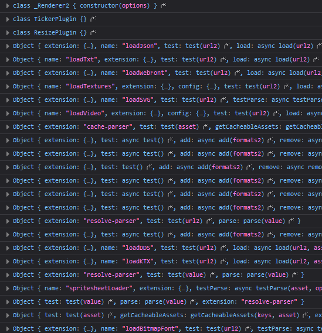

# 第一章 hello Pixi 从最简单的例子入手分析 PixiJS 源码

我一般是以使用角度作为切入点查看分析源码，例子中用到什么类，什么方法，再入源码。

高屋建瓴的角度咱也做不到啊，毕竟水平有限

> pixijs 的源码之前折腾了半天都运行不起来，文档也没有明确说明如何调式
> 我在 github 上看到过也有歪果仁在问如何本地调式最后他放弃了转用了别的库...
> 还有就是 npm 在我们迷之大陆确实不太友好

源码 pixijs 7.3.2 版下载地址 https://github.com/pixijs/pixijs/tree/v7.3.2

## 本地调式环境说明

npm 8.19.2

Node.js v16.18.0

安装命令

`npm install`

运行命令

`npm start`


serve 静态服务器全局安装 

https://www.npmjs.com/package/serve

## 源码目录结构

- 根目录
  - bundles 打包后源码
  - examples 例子
  - packages 源码
  - scripts 工程脚本
  - test 测试目录 (我们用不到)
  - tools 服务于测试的工具目录 (我们用不到)

项目源码根目录下有个主包的 package.json name 是 pixi.js-monorepo

从名字可以看出来，这个项目是用 monorepo 方式来组织管理代码的

在 rollup.config.mjs 配置文件内配置有一个方法：

```
await workspacesRun.default({ cwd: process.cwd(), orderByDeps: true }, async (pkg) =>
{
    if (!pkg.config.private)
    {
        packages.push(pkg);
    }
});
```

主要作用就是遍历所有子项目，将非私有项目加入到 'packages' 数组变量中，然后分析依赖关系再打包输出

PixiJS 源码在 packages 目录

/packages 目录下每一个 "大类" 模块都是单独的项目

每一个 "大类" 都有自己单独 package.json 文件， 在 package.json 文件内指定自己的依赖

比如 app 模块的 package.json 文件内指定了依赖：

```
"peerDependencies": {
    "@pixi/core": "file:../core",
    "@pixi/display": "file:../display"
  }
```

其中的 src 就是此"大类"源码目录，与 src 同级的 test 是此"大类"的测试用例

> 调式过程中我发现编译真的挺慢的 ... 

## 调式步骤

为了调式大致需要以下几步

1. npm install 安装依赖包
2. npm start 将源码运行起来
3. 那我就将调式的 html 网页放到 example 文件夹下
4. 在 html 文件中引用 `<script src="/bundles/pixi.js/dist/pixi.js"></script>`
5. terminal 在根目录起一个 serve 静态服务 `serve .`
6. 浏览器访问静态服务跳转到 example 目录下的具体 html 例子中

完成以上步骤后，你就可以在 /packages 目录下的任意源码内添加 console.log 或 debugger 进行源码调式了

> 相信上面步骤最大的挑战是 `npm install` T_T!

## 尝试第一个源码调式

源码中添加一个 console.log 看看能不能成功输出先

测试的 example/simple.html 文件如下：

```
<!DOCTYPE html>
<html lang="en">
<head>
  <meta charset="UTF-8">
  <meta name="viewport" content="width=device-width, initial-scale=1.0">
  <meta http-equiv="X-UA-Compatible" content="ie=edge">
  <title> 最简单的例子 </title>
  <style type="text/css">
    *{
      margin: 0;
      padding: 0;
    }
  </style>
</head>
<body>
  <script src="/bundles/pixi.js/dist/pixi.js"></script>
  <script type="text/javascript">
    const app = new PIXI.Application({ width: 800, height: 600 });  
    document.body.appendChild(app.view);  
  
    const rectangle = PIXI.Sprite.from('logo.png');  
    rectangle.x = 100;  
    rectangle.y = 100;  
    rectangle.anchor.set(0.5);  
    rectangle.rotation = Math.PI / 4;  
    app.stage.addChild(rectangle);  
  
    app.ticker.add(() => {  
      rectangle.rotation += 0.01;  
    });  
  </script>

</body>

</html>
```

以上例子中实现的功能：

1. simple.html 首先中引入 pixi.js 文件
2. 通过 new PIXI.Application 建一个 800*800 的画布实例 app
3. 利用 PIXI.Sprite.from 方法引入 logo.png 图片实例  rectangle
4. 为 rectangle 设置坐标、anchor、旋转角度
5. 通过 app.stage.addChild 将 rectangle添加到舞台上
6. 在 app.ticker 定时器内添加一个回调用定时更新旋转

如果你在本地服务器环境下打开 simple.html 文件，你将会看到一个旋转的 logo.png

这里用到了二个类 Application、Sprite

Application 类是 PixiJS 的入口类在  `/packages/app/src/Application.ts`

源码中已说明这个类是创建 PixiJS 应用的便捷类，这个类会自动创建 renderer, ticker 和 root container


Application.ts 源码的 constructor 构造方法内添加个 console.log 试试能不能成功输出

Application.ts 71-85 行
```
  constructor(options)
  {
      // The default options
      options = Object.assign({
          forceCanvas: false,
      }, options);

      this.renderer = autoDetectRenderer(options);
      console.log('hello', 88888);
      // install plugins here
      Application._plugins.forEach((plugin) =>
      {
          plugin.init.call(this, options);
      });
  }
```

> 移除掉 typescript 类型的源码果然看起来眉清目秀一些

**成功的关键要注意两点** ：

1. 先 npm start 项目， 作用是 watch 源码变化自动化编译到 bundles 目录

2. 确保你是在本地服务器环境下打开网页就像这样访问 `http://localhost:3000/examples/simple` 
   
打开网页调式器如果输出 `hello 88888` 就说明成功可以调式源码了

Amazing！


Application 的构造方法就做了两件事，创建渲染器 (renderer) 和 初始化插件 (plugin)

renderer 是 PixiJS 的渲染器，渲染器会根据浏览器环境自动选择渲染方式，如 WebGL、Canvas

_plugins 静态属性是一个用于存放插件数组

Application 类本身的其它主要属性：

- stage 主要用于添加子显示对象
- renderer 渲染器
- view  canvas dom 渲染  元素引用
- screen 屏幕信息，更准确的说应该是画布信息，x,y,width,height

在例子代码中 `app.ticker`  ticker 对象即是 `/packages/ticker/TickerPlugin.ts`，是 PixiJS 设计用于解耦的插件件，它有自己的官方插件扩展也可以自定义插件扩展

## autoDetectRenderer

autoDetectRenderer 用于自动判断使用哪种方式渲染，如 WebGL、Canvas


`/packages/core/src/autoDetectRenderer.ts` 第 41-52 行
```
export function autoDetectRenderer<VIEW extends ICanvas = ICanvas>(options?: Partial<IRendererOptionsAuto>): IRenderer<VIEW>
{
    for (const RendererType of renderers)
    {
        if (RendererType.test(options))
        {
            return new RendererType(options) as IRenderer<VIEW>;
        }
    }

    throw new Error('Unable to auto-detect a suitable renderer.');
}

```

显然， 通过循环检测所有的 renderers 渲染器类型 与构造函数传递过来的 options 参数进行检测返回符合条件的渲染器

RendererType.test 就是渲染器的一个检测方法

而 renderers 数组就定义在了第 29 -32 行

```
const renderers: IRendererConstructor<ICanvas>[] = [];

extensions.handleByList(ExtensionType.Renderer, renderers);
```

这里又用到了一个叫 `extensions` 的全局对象，这个全局对象顾名思议，就是用来管理所有扩展插件的，嗯，所以渲染器也是 extensions 的一部分


## extensions 扩展插件简介

扩展插件源码文件 `/packages/extensions/src/index.ts` 

官方的插件的类型有这些：

```
'renderer'
'application'
'renderer-webgl-system'
'renderer-webgl-plugin'
'renderer-canvas-system'
'renderer-canvas-plugin'
'asset'
'load-parser'
'resolve-parser'
'cache-parser'
'detection-parser
```

具体插件类或对象都是注册到对应的类型下的

类先通过 extensions 全局对象的  `handleByList` 或 `handleByMap` 方法注册插件类型

当真正添加插件时，调用的是 extensions 全局对象的  `add` 方法插件就会添加到对应的插件类型下

比如 TikerPlugin.ts  ResizePlugin.ts 就是注册到了 'application' 类型下

又比如 load 相关的插件就注册到了 'load-parser' 类型下

最后具体的插件是注册到具体类的 _plugins 属性上比如： Application._plugins


在 `/packages/extensions/src/index.ts` 文件中第 240-265 行，找到 `handleByList` 方法

在 extensions/index.ts 244 行加个 console.log 打印一下：
```
handleByList(type: ExtensionType, list: any[], defaultPriority = -1)
  {
      return this.handle(
          type,
          (extension) =>
          {
              if (list.includes(extension.ref))
              {
                  return;
              }
              console.log(extension.ref);
              list.push(extension.ref);
              list.sort((a, b) => normalizePriority(b, defaultPriority) - normalizePriority(a, defaultPriority));
          },
          (extension) =>
          {
              const index = list.indexOf(extension.ref);

              if (index !== -1)
              {
                  list.splice(index, 1);
              }
          }
      );
  },
```

输出：



图 1-1

可以看到输出了一堆 class 和 对象 (实现了 ExtensionFormat "接口" 的对象), 只知道有这些，现在还不知道具体干啥

把 handleByList方法的 type 和 list 也打印出来看看


可以看到每个插件类型都可以拥有多个 extention  数组

再看看它的 add 方法

在 extensions/index.ts  152 - 175 行

```ts
add(...extensions: Array<ExtensionFormatLoose | any>)
{
    extensions.map(normalizeExtension).forEach((ext) =>
    {
        ext.type.forEach((type) =>
        {
            const handlers = this._addHandlers;
            const queue = this._queue;
            // 如果添加的插件还没有插件类型，就放到 _queue 内存起来
            if (!handlers[type])
            {
                queue[type] = queue[type] || [];
                queue[type].push(ext);
            }
            else
            {
                // 如果已经有相应的插件类型了，就添加到对应插件类型下
                handlers[type](ext);
            }
        });
    });

    return this;
},

```

可以看到它接收一个插件数组对象 'extensions' 将传进来的对象进行 

'插件对象标准化'后，该对象拥有 type, name, priority, ref 这些属性

```ts
interface ExtensionFormatLoose
{
    type: ExtensionType | ExtensionType[];
    
    name?: string;
    
    priority?: number;
    
    ref: any;
}
```

## 解耦与注入插件

逻辑如下：

1. Application.ts 在全局 extensions 对象中注册插件类型并传入用于存储插件的数组
   `extensions.handleByList(ExtensionType.Application, Application._plugins);`

2. TickerPlugin.ts 在 extensions 注入至对应的 Application 类型插件数组
   `extensions.add(TickerPlugin); `

3. Application.ts 在实例化时会它所有插件的 init 方法，将插件也“实例化”

4. 其它插件或自定义插件实现注册与调用同样适用，不需要再进入 Application.ts 修改逻辑实现解耦

我们以  `/packages/ticker/TickerPlugin.ts` 时钟插件举例


在 tickerPlugin.ts 文件的最后一行有一句  `extensions.add(TickerPlugin); `

这一句就是将 TickerPlugin 对象添加到了Application 类的 _plugins 数组

TickerPlugin.ts 35 行标明了这个扩展属于 Application 类

```
static extension: ExtensionMetadata = ExtensionType.Application;
```

仔细观察 TickerPlugin.ts 文件，发现它并没有 constructor 构造函数

而是有一个公开的 `init` 函数，这个函数就是插件的入口函数，它会被 Application 构造函数调用并将 this 指向了 Application 对象本身

所以在 `init` 函数内访问的 this 就是 Application 对象本身


## Ticker

我们都知道与浏览器的自动更新渲染方式不同，在 canvas 更新渲染画面都是通过手动擦掉旧的像素重新绘制新像素实现的

时钟插件就是用于管理渲染更新的，它属于 Application 类的扩展插件.


在 TickerPlugin.ts 的 init 方法内，文件第 115 行

```
this.ticker = options.sharedTicker ? Ticker.shared : new Ticker();
```

即说明实例化 Application 后自动创建了一个 Ticker 实例, sharedTicker 看名字就知道是个共享的时钟

> 共有三种 ticker: sharedTicker, systemTicker, 普通 ticker

只要 this.ticker 被赋值，旧的 Application render 方法会删除并添加一个新的 render 回调进入 ticker 队列， 还有个 UPDATE_PRIORITY.LOW 用来管理回调队列的优先级


TickerPlugin.ts 的 init 方法内，文件第 57 - 75 行：

```
Object.defineProperty(this, 'ticker',
    {
        set(ticker)
        {
            if (this._ticker)
            {
                this._ticker.remove(this.render, this);
            }
            this._ticker = ticker;
            if (ticker)
            {
                ticker.add(this.render, this, UPDATE_PRIORITY.LOW);
            }
        },
        get()
        {
            return this._ticker;
        },
    });
```


让我们进入 Ticker.ts 类看看

渲染相关的回调通过 Ticker.add 和 Ticker.addOnce 添加加到 Ticker 类中

顾名思义 addOnce 就是一次性的回调，只要理解 add 方法就可以了

Ticker.ts 198 - 201 行：

```
add<T = any>(fn: TickerCallback<T>, context?: T, priority = UPDATE_PRIORITY.NORMAL): this
{
    return this._addListener(new TickerListener(fn, context, priority));
}
```

渲染回调还用 TickerListener.ts 类，包装了一下，包装的主要目的是将相应的渲染回调函数根据 priority 权重组成一个回调 “链表队列” 

priority 权重在  `/packages/ticker/const.ts` 定义


TickerListener.ts 类主要的两个方法： emit 触发函数和 connect 连接函数

`/packages/ticker/TickerListener.ts` 97 - 106 行 connect 函数：

```
connect(previous: TickerListener): void
{
    this.previous = previous;
    if (previous.next)
    {
        previous.next.previous = this;
    }
    this.next = previous.next;
    previous.next = this;
}
```

得结合 Ticker 类的 _addListener 一起看：

`/packages/ticker/Ticker.ts`  223 - 258 行：

```
private _addListener(listener: TickerListener): this
{
    // For attaching to head
    let current = this._head.next;
    let previous = this._head;

    // 如果还没有添过，就添加到 _head 后面
    if (!current)
    {
        listener.connect(previous);
    }
    else
    {
        // priority 优先级从最高到最低
        while (current)
        {
            if (listener.priority > current.priority)
            {
                listener.connect(previous);
                break;
            }
            previous = current;
            current = current.next;
        }

        // 如果还没有加入到链表中，则加入到链表尾部
        if (!listener.previous)
        {
            listener.connect(previous);
        }
    }

    this._startIfPossible();

    return this;
}
```

可以看到通过 while 循环整个 this._head 存储的链表，根据 priority 权重找到需要插入的位置，然后插入到链表中。

如果没找到位置，则添加到链表最后

_addListener 函数最后还调用了 _startIfPossible 既而调用了 _requestIfNeeded 方法

_requestIfNeeded 即刻发起 this._tick “请求”

```
private _requestIfNeeded(): void
{
    if (this._requestId === null && this._head.next)
    {
        // ensure callbacks get correct delta
        this.lastTime = performance.now();
        this._lastFrame = this.lastTime;
        this._requestId = requestAnimationFrame(this._tick);
    }
}
```

`this._tick` 函数定义在 Ticker.ts 的构造函数内

`/packages/ticker/Ticker.ts`  116 - 137 行

```
constructor()
{
    this._head = new TickerListener(null, null, Infinity);
    this.deltaMS = 1 / Ticker.targetFPMS;
    this.elapsedMS = 1 / Ticker.targetFPMS;

    this._tick = (time: number): void =>
    {
        this._requestId = null;

        if (this.started)
        {
            // 此处触发回调函数，并传入 delta time
            this.update(time);
            // 回调函数执行后可能会影响 ticker状态，所以需要再次检查
            if (this.started && this._requestId === null && this._head.next)
            {
                // 继续执行下一帧
                this._requestId = requestAnimationFrame(this._tick);
            }
        }
    };
}
```

_tick 函数就是每一帧都会执行

this._head 链表头部，为方便处理统一加一个虚拟头部节点

this.deltaMS 默认为 1/0.06 = 16.66666 刷新率

this.elaspedMS 帧间隔时间

即使你没有往画布中绘制任何图形，也会执行。不信你可以在 _tick 内添加一个 console.log 看看

当 _tick 触发时调用的就是 update 函数

`/packages/ticker/Ticker.ts` 369 - 442 行

```
update(currentTime = performance.now()): void
{
    let elapsedMS;

    // update 也可由用户主动触发
    // 如果间隔时间是0或是负数不不需要触发通知回调
    // currentTime 
    if (currentTime > this.lastTime)
    {
        // Save uncapped elapsedMS for measurement
        elapsedMS = this.elapsedMS = currentTime - this.lastTime;

        // cap the milliseconds elapsed used for deltaTime
        if (elapsedMS > this._maxElapsedMS)
        {
            elapsedMS = this._maxElapsedMS;
        }

        elapsedMS *= this.speed;

        // If not enough time has passed, exit the function.
        // Get ready for next frame by setting _lastFrame, but based on _minElapsedMS
        // adjustment to ensure a relatively stable interval.
        if (this._minElapsedMS)
        {
            const delta = currentTime - this._lastFrame | 0;

            if (delta < this._minElapsedMS)
            {
                return;
            }

            this._lastFrame = currentTime - (delta % this._minElapsedMS);
        }

        this.deltaMS = elapsedMS;
        this.deltaTime = this.deltaMS * Ticker.targetFPMS;

        // Cache a local reference, in-case ticker is destroyed
        // during the emit, we can still check for head.next
        const head = this._head;

        // Invoke listeners added to internal emitter
        let listener = head.next;

        while (listener)
        {
            listener = listener.emit(this.deltaTime);
        }

        if (!head.next)
        {
            this._cancelIfNeeded();
        }
    }
    else
    {
        this.deltaTime = this.deltaMS = this.elapsedMS = 0;
    }

    this.lastTime = currentTime;
}
```
> 额外小知识
>
> 对于需要高精度时间戳的动画或输入处理，performance.now() 可以提供比 Date.now() 更高的精度。
> 
> 与 requestAnimationFrame 结合使用：
> 
> requestAnimationFrame 的回调函数接收一个高精度的时间戳作为参数，这个时间戳与 performance.now() 返回的时间戳是同步的。
> 
> 因此，你可以使用 performance.now() 来与 requestAnimationFrame 回调中的时间戳进行比较或计算。
> 
> 需要注意的是，performance.now() 返回的时间戳是相对于某个特定时间点的，而不是绝对的时间（如日期和时间）。因此，它主要用于测量时间间隔，而不是获取当前的日期和时间。


update 方法主要功能就是判断当前时间与上一次调用的时间差，如果大于最大间隔时间(需要更新一帧时)就执行回调链表

`listener.emit(this.deltaTime);`

注意 listener.emit() 执行后返回的是下一个回调函数，即 listener.next 以完成 while 循环


## PixiJS Ticker 与 EaselJS Ticker 的区别

1. PixiJS Ticker 默认是开启的，EaselJS Ticker 直到有添加 Ticker 回调才开启
   
2. PixiJS Ticker 可被实例化，有构造函数，而 EaselJS Ticker 更像是一个全局对象
   
3. PixiJS Ticker 回调使用函数采用链表方式存储拥有可调节的权重, EaselJS Ticker 直接使用了 EventDispatcher “标准事件” 方式实现回调，回调使用数组存储没有权重可调节
   
4. PixiJS Ticker 使用 requestAnimationFrame 实现 tick，EaselJS Ticker 库较早，所以还支持 setTimeout 方式


## 本章小节

这一章先介绍源码如何下载并搭建本地调式环境，然后用一个简单的例子来打印出调式信息

以 Appllication 类为入口进入源码， 了解了 PixiJS 的基本扩展插件机制

最后分析最重要的 Ticker 实现

说实话我在现实前端项目中从未用到过链表，很意外在分析PixiJS源码的时候居然发现 Ticker 回调是用链表实现的，look! 没用的知识又增加了！

上面 simple.html 例子中的 PIXI.Sprite 和 app.stage 还没有进入源码， 下一章先尝试进入 stage 这一部分，如果可以的话 Sprite 也过一遍


