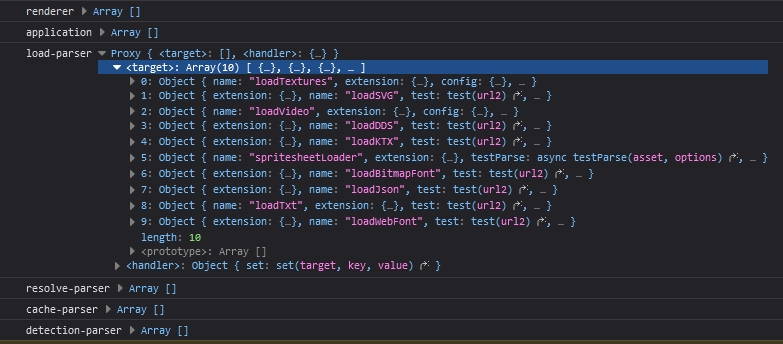

# 第一章 hello Pixi 从最简单的例子入手分析 PixiJS 源码

我一般是以使用角度作为切入点查看分析源码，例子中用到什么类，什么方法，再入源码。高屋建瓴的角度咱也做不到啊，毕竟水平有限


> pixijs 的源码之前折腾了半天都运行不起来，文档也没有明确说明如何调式
> 我在 github 上看到过也有歪果仁在问如何本地调式最后他放弃了转用了别的库...
> npm 在我们迷之大陆确实不太友好

源码 pixijs 7.3.2 版下载地址 https://github.com/pixijs/pixijs/tree/v7.3.2

## 本地调式环境说明

npm 8.19.2

Node.js v16.18.0

安装命令

`npm install`

运行命令

`npm start`


serve 静态服务器全局安装 

https://www.npmjs.com/package/serve

## 源码目录结构

- 根目录
  - bundles 打包后源码
  - examples 例子
  - packages 源码
  - scripts 工程脚本
  - test 测试目录 (我们用不到)
  - tools 服务于测试的工具目录 (我们用不到)

项目源码根目录下有个主包的 package.json name 是 pixi.js-monorepo

从名字可以看出来，这个项目是用 monorepo 方式来组织管理代码的

在 rollup.config.mjs 配置文件内配置有一个方法：

```
await workspacesRun.default({ cwd: process.cwd(), orderByDeps: true }, async (pkg) =>
{
    if (!pkg.config.private)
    {
        packages.push(pkg);
    }
});
```

主要作用就是遍历所有子项目，将非私有项目加入到 'packages' 数组变量中，然后分析依赖关系再打包输出

PixiJS 源码在 packages 目录

/packages 目录下每一个 "大类" 模块都是单独的项目

每一个 "大类" 都有自己单独 package.json 文件， 在 package.json 文件内指定自己的依赖

比如 app 模块的 package.json 文件内指定了依赖：

```
"peerDependencies": {
    "@pixi/core": "file:../core",
    "@pixi/display": "file:../display"
  }
```

其中的 src 就是此"大类"源码目录，与 src 同级的 test 是此"大类"的测试用例

> 调式过程中我发现编译真的挺慢的 ... 

## 调式步骤

为了调式大致需要以下几步

1. npm install 安装依赖包
2. npm start 将源码运行起来
3. 那我就将调式的 html 网页放到 example 文件夹下
4. 在 html 文件中引用 `<script src="/bundles/pixi.js/dist/pixi.js"></script>`
5. terminal 在根目录起一个 serve 静态服务 `serve .`
6. 浏览器访问静态服务跳转到 example 目录下的具体 html 例子中

完成以上步骤后，你就可以在 /packages 目录下的任意源码内添加 console.log 或 debugger 进行源码调式了

> 相信上面步骤最大的挑战是 `npm install` T_T!

## 尝试第一个源码调式

源码中添加一个 console.log 看看能不能成功输出先

测试的 example/simple.html 文件如下：

```
<!DOCTYPE html>
<html lang="en">
<head>
  <meta charset="UTF-8">
  <meta name="viewport" content="width=device-width, initial-scale=1.0">
  <meta http-equiv="X-UA-Compatible" content="ie=edge">
  <title> 最简单的例子 </title>
  <style type="text/css">
    *{
      margin: 0;
      padding: 0;
    }
  </style>
</head>
<body>
  <script src="/bundles/pixi.js/dist/pixi.js"></script>
  <script type="text/javascript">
    const app = new PIXI.Application({ width: 800, height: 600 });  
    document.body.appendChild(app.view);  
  
    const rectangle = PIXI.Sprite.from('logo.png');  
    rectangle.x = 100;  
    rectangle.y = 100;  
    rectangle.anchor.set(0.5);  
    rectangle.rotation = Math.PI / 4;  
    app.stage.addChild(rectangle);  
  
    app.ticker.add(() => {  
      rectangle.rotation += 0.01;  
    });  
  </script>

</body>

</html>
```

以上例子中实现的功能：

1. simple.html 首先中引入 pixi.js 文件
2. 通过 new PIXI.Application 建一个 800*800 的画布实例 app
3. 利用 PIXI.Sprite.from 方法引入 logo.png 图片实例  rectangle
4. 为 rectangle 设置坐标、anchor、旋转角度
5. 通过 app.stage.addChild 将 rectangle添加到舞台上
6. 在 app.ticker 定时器内添加一个回调用定时更新旋转

如果你在本地服务器环境下打开 simple.html 文件，你将会看到一个旋转的 logo.png

这里用到了二个类 Application、Sprite

Application 类是 PixiJS 的入口类在  `/packages/app/src/Application.ts`

源码中已说明这个类是创建 PixiJS 应用的便捷类，这个类会自动创建 renderer, ticker 和 root container


Application.ts 源码的 constructor 构造方法内添加个 console.log 试试能不能成功输出

Application.ts 71-85 行
```
  constructor(options)
  {
      // The default options
      options = Object.assign({
          forceCanvas: false,
      }, options);

      this.renderer = autoDetectRenderer(options);
      console.log('hello', 88888);
      // install plugins here
      Application._plugins.forEach((plugin) =>
      {
          plugin.init.call(this, options);
      });
  }
```

> 移除掉 typescript 类型的源码果然看起来眉清目秀一些

**成功的关键要注意两点** ：

1. 先 npm start 项目， 作用是 watch 源码变化自动化编译到 bundles 目录

2. 确保你是在本地服务器环境下打开网页就像这样访问 `http://localhost:3000/examples/simple` 
   
打开网页调式器如果输出 `hello 88888` 就说明成功可以调式源码了

Amazing！


Application 的构造方法就做了两件事，创建渲染器 (renderer) 和 初始化插件 (plugin)

renderer 是 PixiJS 的渲染器，渲染器会根据浏览器环境自动选择渲染方式，如 WebGL、Canvas

_plugins 静态属性是一个数组，插件是 PixiJS 的扩展，它有自己的官方插件扩展也可以自定义插件扩展


## autoDetectRenderer

autoDetectRenderer 用于自动判断使用哪种方式渲染，如 WebGL、Canvas


`/packages/core/src/autoDetectRenderer.ts` 第 41-52 行
```
export function autoDetectRenderer<VIEW extends ICanvas = ICanvas>(options?: Partial<IRendererOptionsAuto>): IRenderer<VIEW>
{
    for (const RendererType of renderers)
    {
        if (RendererType.test(options))
        {
            return new RendererType(options) as IRenderer<VIEW>;
        }
    }

    throw new Error('Unable to auto-detect a suitable renderer.');
}

```

显然， 通过循环检测所有的 renderers 渲染器类型 与构造函数传递过来的 options 参数进行检测返回符合条件的渲染器

RendererType.test 就是渲染器的一个检测方法

而 renderers 数组就定义在了第 29 -32 行

```
const renderers: IRendererConstructor<ICanvas>[] = [];

extensions.handleByList(ExtensionType.Renderer, renderers);
```

这里又用到了一个叫 `extensions` 的全局对象，这个全局对象顾名思议，就是用来管理所有扩展插件的，嗯，所以渲染器也是 extensions 的一部分


## extensions 扩展插件简介

扩展插件源码文件 `/packages/extensions/src/index.ts` 

官方的插件的类型有这些：

```
'renderer'
'application'
'renderer-webgl-system'
'renderer-webgl-plugin'
'renderer-canvas-system'
'renderer-canvas-plugin'
'asset'
'load-parser'
'resolve-parser'
'cache-parser'
'detection-parser
```

具体插件类或对象都是注册到对应的类型下的

类先通过 extensions 全局对象的  `handleByList` 或 `handleByMap` 方法注册插件类型

当真正添加插件时，调用的是 extensions 全局对象的  `add` 方法插件就会添加到对应的插件类型下

比如 TikerPlugin.ts  ResizePlugin.ts 就是注册到了 'application' 类型下

又比如 load 相关的插件就注册到了 'load-parser' 类型下

最后具体的插件是注册到具体类的 _plugins 属性上比如： Application._plugins


在 `/packages/extensions/src/index.ts` 文件中第 240-265 行，找到 `handleByList` 方法

在 extensions/index.ts 244 行加个 console.log 打印一下：
```
handleByList(type: ExtensionType, list: any[], defaultPriority = -1)
  {
      return this.handle(
          type,
          (extension) =>
          {
              if (list.includes(extension.ref))
              {
                  return;
              }
              console.log(extension.ref);
              list.push(extension.ref);
              list.sort((a, b) => normalizePriority(b, defaultPriority) - normalizePriority(a, defaultPriority));
          },
          (extension) =>
          {
              const index = list.indexOf(extension.ref);

              if (index !== -1)
              {
                  list.splice(index, 1);
              }
          }
      );
  },
```

输出：


图 1-1

可以看到输出了一堆 class 和 对象 (实现了 ExtensionFormat "接口" 的对象), 只知道有这些，现在还不知道具体干啥

把 handleByList方法的 type 和 list 也打印出来看看



可以看到每个插件类型都可以拥有多个 extention  数组

再看看它的 add 方法

在 extensions/index.ts  152 - 175 行

```ts
add(...extensions: Array<ExtensionFormatLoose | any>)
{
    extensions.map(normalizeExtension).forEach((ext) =>
    {
        ext.type.forEach((type) =>
        {
            const handlers = this._addHandlers;
            const queue = this._queue;
            // 如果添加的插件还没有插件类型，就放到 _queue 内存起来
            if (!handlers[type])
            {
                queue[type] = queue[type] || [];
                queue[type].push(ext);
            }
            else
            {
                // 如果已经有相应的插件类型了，就添加到对应插件类型下
                handlers[type](ext);
            }
        });
    });

    return this;
},

```

可以看到它接收一个插件数组对象 'extensions' 将传进来的对象进行 

'插件对象标准化'后，该对象拥有 type, name, priority, ref 这些属性

```ts
interface ExtensionFormatLoose
{
    type: ExtensionType | ExtensionType[];
    
    name?: string;
    
    priority?: number;
    
    ref: any;
}
```

后面在分析到插件类的时候，这些类底部都会有一句调用 extensions.add(xxx); 的代码来注册


