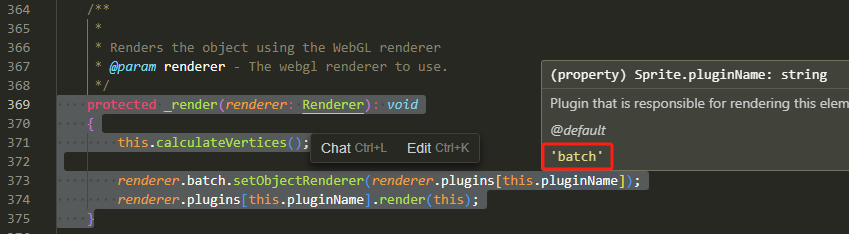

> 牢记，按第一章介绍的 npm start 启动本地调式环境才可进行调式
> 
> 如果是example 文件夹内的例子还需要开始 serve . 本地静态服务器

上一章介绍一下调式环境安装，以及基本的调试方法。本章要研究一下它是如何渲染的

## 渲染在哪里开始？

渲染开始大致步骤：

1. TickerPlugin 的 ticker 会自动开启并调用注册的回调函数 'TickerListener'

2. 'TickerListener' 回调内调用 Application render 方法

3. Application render 方法会调用渲染器 this.renderer.render(this.stage) 并传入 stage

4. stage 是即是显示对像又是容器，所以只要渲染器开始调用 stage 的 render 方法，就会渲染 stage 下的所有子对象从而实现整颗显示对象树的渲染
   
还是以 example/simple.html 例子为例

```javascript
<script type="text/javascript">
const app = new PIXI.Application({ width: 800, height: 600 });  
document.body.appendChild(app.view);  

const rectangle = PIXI.Sprite.from('logo.png');  
rectangle.x = 100;  
rectangle.y = 100;  
rectangle.anchor.set(0.5);  
rectangle.rotation = Math.PI / 4;  
app.stage.addChild(rectangle);  

app.ticker.add(() => {  
    rectangle.rotation += 0.01;  
});  
</script>
```

rectangle 是 Sprite 对象的实例, Sprite 实例继承自: Container -> DisplayObject -> EventEmitter

朔源至最顶层是 EventEmitter, 这是一个高性能事件库 

> EventEmitter https://github.com/primus/eventemitter3  
> 
> 想要探究为何它是高性能的话，可以研究这个库的源码

我们暂时不用去管这个 EventEmitter, 把它当做一个简单的事件收发库就行

先关注一下 DisplayObject，想要在画布中渲染，它必须得继承自  DisplayObject  `/packages/display/src/DisplayObject.ts`

源码 210 行 可以看到它是一个抽象类

```ts
export abstract class DisplayObject extends utils.EventEmitter<DisplayObjectEvents>
```

以下显示对象都继承实现了这个抽象类

```ts
PIXI.Container
PIXI.Graphics 
PIXI.Sprite   
PIXI.Text     
PIXI.BitmapText    
PIXI.TilingSprite  
PIXI.AnimatedSprite
PIXI.Mesh     
PIXI.NineSlicePlane
PIXI.SimpleMesh    
PIXI.SimplePlane   
PIXI.SimpleRope    
```

DisplayObject 有一个叫  render 的抽你方法需要子类实现

```
abstract render(renderer: Renderer): void;
```

render 方法就是各子类显示对像需要自己去实现绘制自己的方法


回到 example/simple.html 文件

app.stage 就是 Application 类的 stage 属性，它是一个 Container 对象，继承自 DisplayObject

stage 可以看作就是一棵显示对象树，而最顶层就是渲染方法就是 Application 的 render 方法

Application 实例化时它自身公开的 render 方法就被 TickerPlugin 插件的 init 方法调用了 

`/packages/ticker/TickerPlugin.ts`  源码 68 行

```ts
ticker.add(this.render, this, UPDATE_PRIORITY.LOW); // 在ticker 内添加了 render() 回调
```

只要 ticker 开启，就会调用 Application 实例的 render 方法 

`/packages/app/src/Application.ts` 第 70 - 90 行 构造函数与 render 方法

```ts
constructor(options?: Partial<IApplicationOptions>)
{
    // The default options
    options = Object.assign({
        forceCanvas: false,
    }, options);

    this.renderer = autoDetectRenderer<VIEW>(options);
    // console.log('hello', 88888);
    // install plugins here
    Application._plugins.forEach((plugin) =>
    {
        plugin.init.call(this, options);
    });
}

/** Render the current stage. */
public render(): void
{
    this.renderer.render(this.stage);
}
```

this.renderer 就是渲染器，把 this.stage 整个传到渲染器内渲染


往 stage 内添加子显示对象其实就是往一个 Container 内添加子显示对象，当然由于 Container 继承自 DisplayObject，所以 Container 也需要实现自己的 render 方法

 `/packages/display/src/Container.ts`

```ts
render(renderer: Renderer): void
{
    // if the object is not visible or the alpha is 0 then no need to render this element
    if (!this.visible || this.worldAlpha <= 0 || !this.renderable)
    {
        return;
    }

    // do a quick check to see if this element has a mask or a filter.
    if (this._mask || this.filters?.length)
    {
        this.renderAdvanced(renderer);
    }
    else if (this.cullable)
    {
        this._renderWithCulling(renderer);
    }
    else
    {
        this._render(renderer);

        for (let i = 0, j = this.children.length; i < j; ++i)
        {
            this.children[i].render(renderer);
        }
    }
}
```

这个 render 方法很简单，它接受一个 renderer 调用自己的 _render 后再遍历子显示对象调用子显示对象公开的 render 方法

就是一个显示对象树，从顶层开始调用往树了枝叶遍历调用 render 从而实现显示对象树的渲染

有一点需要注意，render 方法内显示它如果是一个mask遮罩或自带filters 滤镜，那么需要调用更高极的渲染方法 renderAdvanced 或 _renderWithCulling，否则它先自己 `this._render(renderer);`

Container 本身自己的 _render 就去是空的，意味着它本身不会被渲染，只会被子显示对象渲染，但是继承实现它的子类，比如 Sprite，会去实现自己的 _render 方法实现渲染


## renderer 渲染器

进入渲染器看看

渲染器是由 Application 类的构造函数内 autoDetectRenderer 判断返回的

渲染器类型分为三类：
```ts
export enum RENDERER_TYPE
{
    /**
     * Unknown render type.
     * @default 0
     */
    UNKNOWN,
    /**
     * WebGL render type.
     * @default 1
     */
    WEBGL,
    /**
     * Canvas render type.
     * @default 2
     */
    CANVAS,
}
```

我们找到  StartupSystem.ts 文件内的 defaultOptions 对象，将 hello 设为 true 

```ts
static defaultOptions: StartupSystemOptions = {
    /**
        * {@link PIXI.IRendererOptions.hello}
        * @default false
        * @memberof PIXI.settings.RENDER_OPTIONS
        */
    hello: true,
};
```

本地服务器下打开 example/simple.html, 浏览器控制台会输出 


由输出的 PixiJS 7.3.2 - WebGL 2 可知，现在使用的是 WebGL 2

Renderer 类就是我们现在用到的渲染器  `/packages/core/src/Renderer.ts`

进入到 Renderer.ts 文件可以看到此类继承自 SystemManager 并实现了 IRenderer 接口

```
export class Renderer extends SystemManager<Renderer> implements IRenderer
```

进入构造函数：
`/packages/core/src/Renderer.ts`  第  292 - 364 行：

```ts
constructor(options?: Partial<IRendererOptions>)
{
    super();

    // Add the default render options
    options = Object.assign({}, settings.RENDER_OPTIONS, options);

    this.gl = null;

    this.CONTEXT_UID = 0;

    this.globalUniforms = new UniformGroup({
        projectionMatrix: new Matrix(),
    }, true);

    const systemConfig = {
        runners: [
            'init',
            'destroy',
            'contextChange',
            'resolutionChange',
            'reset',
            'update',
            'postrender',
            'prerender',
            'resize'
        ],
        systems: Renderer.__systems,
        priority: [
            '_view',
            'textureGenerator',
            'background',
            '_plugin',
            'startup',
            // low level WebGL systems
            'context',
            'state',
            'texture',
            'buffer',
            'geometry',
            'framebuffer',
            'transformFeedback',
            // high level pixi specific rendering
            'mask',
            'scissor',
            'stencil',
            'projection',
            'textureGC',
            'filter',
            'renderTexture',
            'batch',
            'objectRenderer',
            '_multisample'
        ],
    };

    this.setup(systemConfig);

    if ('useContextAlpha' in options)
    {
        if (process.env.DEBUG)
        {
            // eslint-disable-next-line max-len
            deprecation('7.0.0', 'options.useContextAlpha is deprecated, use options.premultipliedAlpha and options.backgroundAlpha instead');
        }
        options.premultipliedAlpha = options.useContextAlpha && options.useContextAlpha !== 'notMultiplied';
        options.backgroundAlpha = options.useContextAlpha === false ? 1 : options.backgroundAlpha;
    }

    this._plugin.rendererPlugins = Renderer.__plugins;
    this.options = options as IRendererOptions;
    this.startup.run(this.options);
}
```

Renderer 类内有一堆的 runners， plugins, systems 

runners 即所谓的 signal '信号', 可以理解为 生命周期+状态变更时就会触发

plugins 即为 Renderer 所专门使用的插件

systems 即为 Renderer 所使用的系统，它由各个系统组合形成了渲染器 Renderer

在构造函数中调用的 `this.setup(systemConfig)`  就是安装渲染函数所需要用到的系统，它来自  `/packages/core/system/SystemManager.ts` 

进入 SystemManager.ts 找到 setup 方法：

```ts
setup(config: ISystemConfig<R>): void
{
    this.addRunners(...config.runners);

    // Remove keys that aren't available
    const priority = (config.priority ?? []).filter((key) => config.systems[key]);

    // Order the systems by priority
    const orderByPriority = [
        ...priority,
        ...Object.keys(config.systems)
            .filter((key) => !priority.includes(key))
    ];

    for (const i of orderByPriority)
    {
        this.addSystem(config.systems[i], i);
    }
    console.log('看看runners里是什么：',this.runners)
}
```
可以看到，创建了很多个 Runner 对象存储了 this.runners 内

在 setup 函数最后一行打印看看 runners 里存了些啥


可以看到各个 Runner 对象的 items 里保存了所有的 system 当 Runner 被调用时，也即触发调用 items 内系统

找到 addSystem 方法：

```ts
addSystem(ClassRef: ISystemConstructor<R>, name: string): this
{
    const system = new ClassRef(this as any as R);

    if ((this as any)[name])
    {
        throw new Error(`Whoops! The name "${name}" is already in use`);
    }
    
    (this as any)[name] = system;

    this._systemsHash[name] = system;

    for (const i in this.runners)
    {
        this.runners[i].add(system);
    }

    /**
        * Fired after rendering finishes.
        * @event PIXI.Renderer#postrender
        */

    /**
        * Fired before rendering starts.
        * @event PIXI.Renderer#prerender
        */

    /**
        * Fired when the WebGL context is set.
        * @event PIXI.Renderer#context
        * @param {WebGLRenderingContext} gl - WebGL context.
        */

    return this;
}
```

在 `(this as any)[name] = system;`  这一句就把系统按名称赋值到了 this 也即 Renderer 实例属性上了


所以通过 this.setup 后， 构造函数最后的 this.startup 属性 (StartupSystem) 可以访问，因为此时已经存在

根据注释，StartupSystem 就是用于负责初始化渲染器的，这是一切的开始...

StartupSystem 的 run 方法 `/packages/core/startup/StartupSystem.ts` 

第 56 - 69 行
```
run(options: StartupSystemOptions): void
{
    const { renderer } = this;
    console.log(renderer.runners.init)
    renderer.runners.init.emit(renderer.options);

    if (options.hello)
    {
        // eslint-disable-next-line no-console
        console.log(`PixiJS ${process.env.VERSION} - ${renderer.rendererLogId} - https://pixijs.com`);
    }

    renderer.resize(renderer.screen.width, renderer.screen.height);
}
```

第 58 行输出 `console.log(renderer.runners.init)` 看看名为  init 的 Runner 属性 items 内有 6 个系统需要触发 emit


好吧，再让我们看看 Runner 类 `/packages/core/runner/Runner.ts` 

根据注释：Runner是一种高性能且简单的信号替代方案。最适合在事件以高频率分配给许多对象的情况下使用(比如每帧!)

注释中举的例子已经很清晰的说明了 Runner 的使用场景了

Runner 类似 Signal 模式：

```js
import { Runner } from '@pixi/runner';

const myObject = {
    loaded: new Runner('loaded'),
};

const listener = {
    loaded: function() {
        // Do something when loaded
    }
};

myObject.loaded.add(listener);

myObject.loaded.emit();
```

或用于处理多次调用相同函数

```js
import { Runner } from '@pixi/runner';

const myGame = {
    update: new Runner('update'),
};

const gameObject = {
    update: function(time) {
        // Update my gamey state
    },
};

myGame.update.add(gameObject);

myGame.update.emit(time);
```

>Signal 和  观察者模式 之间的主要区别在于实现方式和使用场景。观察者模式通常涉及一个主题（Subject）和多个观察者（Observers），主题维护观察者列表并在状态变化时通知观察者。
>
>观察者模式更加结构化，观察者需要显式地注册和注销，而且通常是一对多的关系。
>
>相比之下，Signal 更加简单和灵活，它通常用于处理单个事件或消息的订阅和分发。
>
>Signal 不需要维护观察者列表，而是直接将事件发送给所有订阅者。
>
>Signal 更加轻量级，适用于简单的事件处理场景，而观察者模式更适合需要更多结构和控制的情况。


## renderer 的 render 函数

渲染器内调用的 render 是名为 objectRenderer 的对象

```ts
render(displayObject: IRenderableObject, options?: IRendererRenderOptions): void
{
    this.objectRenderer.render(displayObject, options);
}
```

可以看到调用的是 ObjectRendererSystem 系统的 render 方法
`/packages/core/src/render/ObjectRendererSystem.ts`  第  49 - 125 行：

```ts
render(displayObject: IRenderableObject, options?: IRendererRenderOptions): void
{
    const renderer = this.renderer;

    let renderTexture: RenderTexture;
    let clear: boolean;
    let transform: Matrix;
    let skipUpdateTransform: boolean;

    if (options)
    {
        renderTexture = options.renderTexture;
        clear = options.clear;
        transform = options.transform;
        skipUpdateTransform = options.skipUpdateTransform;
    }

    // can be handy to know!
    this.renderingToScreen = !renderTexture;

    renderer.runners.prerender.emit();
    renderer.emit('prerender');

    // apply a transform at a GPU level
    renderer.projection.transform = transform;

    // no point rendering if our context has been blown up!
    if (renderer.context.isLost)
    {
        return;
    }

    if (!renderTexture)
    {
        this.lastObjectRendered = displayObject;
    }

    if (!skipUpdateTransform)
    {
        // update the scene graph
        const cacheParent = displayObject.enableTempParent();

        displayObject.updateTransform();
        displayObject.disableTempParent(cacheParent);
        // displayObject.hitArea = //TODO add a temp hit area
    }

    renderer.renderTexture.bind(renderTexture);
    renderer.batch.currentRenderer.start();

    if (clear ?? renderer.background.clearBeforeRender)
    {
        renderer.renderTexture.clear();
    }

    displayObject.render(renderer);

    // apply transform..
    renderer.batch.currentRenderer.flush();

    if (renderTexture)
    {
        if (options.blit)
        {
            renderer.framebuffer.blit();
        }

        renderTexture.baseTexture.update();
    }

    renderer.runners.postrender.emit();

    // reset transform after render
    renderer.projection.transform = null;

    renderer.emit('postrender');
}
```

找到 ` displayObject.render(renderer); ` 这一句，也就是传进来的 stage 对象，遍历子显示对象的 render 并将渲染器传入。

最终会调用到 Sprite 内的 _render 方法就是我们加入到 stage 的 'logo.png'

在 `/packages/sprite/src/Sprite.ts` 的第  369 - 375 行



batch 就是 BatchSystem 的实例

batch 的当前渲染器 ExtensionType.RendererPlugin

再调用 batch 渲染器的 render(this)  将 this 即当前 Sprite 对象传入


## batch

上面的 batch 就是批处理，由 BatchSystem 

batch 渲染器就是我们之前在 `/packages/core/batch/src/BatchRenderer.ts` 中定义的。


