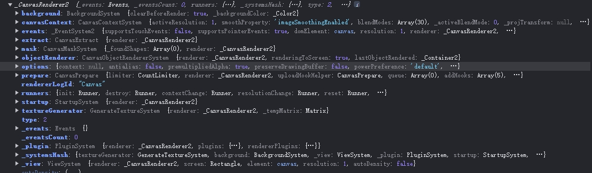
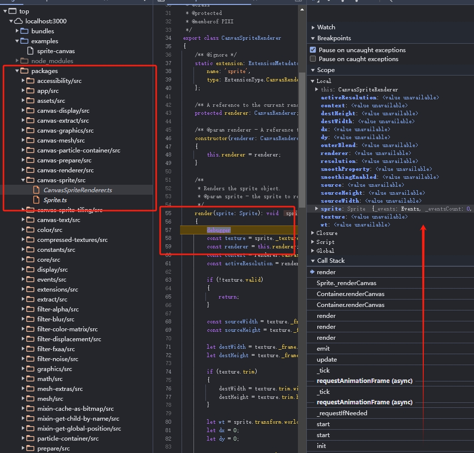

## 使用 canvasRenderer 渲染

上一章分析了一下 Sprite 在默认 webgl  渲染器上的渲染，这章让我们把目光聚集到 canvasRenderer 上


## 使用 canvas 渲染器渲染图片的 demo

要使用 canvas 作为渲染器，我们需要引用 pixi-legacy.js

`/bundles/pixi.js-legacy/dist/pixi-legacy.js`


像下面这样先建一个简单的 demo 用于测试：


```
<script src="/bundles/pixi.js-legacy/dist/pixi-legacy.js"></script>
<script type="text/javascript">
const app = new PIXI.Application({ width: 800, height: 600 , forceCanvas: true});  
document.body.appendChild(app.view);  

const rectangle = PIXI.Sprite.from('logo.png');  
rectangle.x = 100;  
rectangle.y = 100;  
rectangle.anchor.set(0.5);  
rectangle.rotation = Math.PI / 4;  
app.stage.addChild(rectangle);  
</script>
```
同样创建一个简单的加载显示 logo 的 demo

运行它应该可以看到在第一章 `simple.html` 中一模一样的一张 logo 图被渲染在了网页上

在 Application.ts 的 constructor 函数内，即 78 行添加 `console.log(this.renderer);` 输出当前的渲染器看看

```
constructor(options?: Partial<IApplicationOptions>)
    {
        // The default options
        options = Object.assign({
            forceCanvas: false,
        }, options);

        this.renderer = autoDetectRenderer<VIEW>(options);
        console.log(this.renderer);
        // install plugins here
        Application._plugins.forEach((plugin) =>
        {
            plugin.init.call(this, options);
        });
    }
```



图 3-1 

> 图 3-1  中可以发现输出了一个  _CanvasRenderer2 的而不是 CanvasRenderer 实例，是因为其实在 demo 中加载的 pixi.js 是经过 rollup 编译后的。

demo  `https://github.com/willian12345/blogpost/tree/main/analysis/PixiJS/pixijs-dev/examples/sprite-canvas.html`

## Sprite 类

Sprite 是 webgl 渲染器和 canvas 渲染器共用的

**注意** Sprite.ts 类本身并不做渲染，保存了 Sprite 的基本信息

在此处最终渲染到 canvas 上用的是 `CanvasSpriteRenderer` 渲染类

我们在直接使用 html 的 canvas 绘制图像时，是直接调用 `context.drawImage` 方法，并传递一个“图像源”

但在 pixi.js 内，这个图像源并不是直接的图像或 canvas，而是先封装成了一个 texture 即纹理对象，统一管理

找到  /packages/CanvasSpriteRenderer.ts 的第  37 - 40 行

```
static extension: ExtensionMetadata = {
    name: 'sprite',
    type: ExtensionType.CanvasRendererPlugin,
};
```

可以看到 CanvasSpriteRenderer 是一个渲染器的插件，当需要渲染一个 sprite 的时候调用的是此插件


最终被调用的 sprite  渲染方法, 即绘制图片或路径等到 canvas 上

```
render(sprite: Sprite): void
{
    const texture = sprite._texture;
    const renderer = this.renderer;
    const context = renderer.canvasContext.activeContext;
    const activeResolution = renderer.canvasContext.activeResolution;

    if (!texture.valid)
    {
        return;
    }

    const sourceWidth = texture._frame.width;
    const sourceHeight = texture._frame.height;

    let destWidth = texture._frame.width;
    let destHeight = texture._frame.height;

    if (texture.trim)
    {
        destWidth = texture.trim.width;
        destHeight = texture.trim.height;
    }

    let wt = sprite.transform.worldTransform;
    let dx = 0;
    let dy = 0;

    const source = texture.baseTexture.getDrawableSource();

    if (texture.orig.width <= 0 || texture.orig.height <= 0 || !texture.valid || !source)
    {
        return;
    }

    renderer.canvasContext.setBlendMode(sprite.blendMode, true);

    context.globalAlpha = sprite.worldAlpha;

    // If smoothingEnabled is supported and we need to change the smoothing property for sprite texture
    const smoothingEnabled = texture.baseTexture.scaleMode === SCALE_MODES.LINEAR;
    const smoothProperty = renderer.canvasContext.smoothProperty;

    if (smoothProperty
        && context[smoothProperty] !== smoothingEnabled)
    {
        context[smoothProperty] = smoothingEnabled;
    }

    if (texture.trim)
    {
        dx = (texture.trim.width / 2) + texture.trim.x - (sprite.anchor.x * texture.orig.width);
        dy = (texture.trim.height / 2) + texture.trim.y - (sprite.anchor.y * texture.orig.height);
    }
    else
    {
        dx = (0.5 - sprite.anchor.x) * texture.orig.width;
        dy = (0.5 - sprite.anchor.y) * texture.orig.height;
    }

    if (texture.rotate)
    {
        wt.copyTo(canvasRenderWorldTransform);
        wt = canvasRenderWorldTransform;
        groupD8.matrixAppendRotationInv(wt, texture.rotate, dx, dy);
        // the anchor has already been applied above, so lets set it to zero
        dx = 0;
        dy = 0;
    }

    dx -= destWidth / 2;
    dy -= destHeight / 2;

    renderer.canvasContext.setContextTransform(wt, sprite.roundPixels, 1);
    // Allow for pixel rounding
    if (sprite.roundPixels)
    {
        dx = dx | 0;
        dy = dy | 0;
    }

    const resolution = texture.baseTexture.resolution;

    const outerBlend = renderer.canvasContext._outerBlend;

    if (outerBlend)
    {
        context.save();
        context.beginPath();
        context.rect(
            dx * activeResolution,
            dy * activeResolution,
            destWidth * activeResolution,
            destHeight * activeResolution
        );
        context.clip();
    }

    if (sprite.tint !== 0xFFFFFF)
    {
        if (sprite._cachedTint !== sprite.tintValue || sprite._tintedCanvas.tintId !== sprite._texture._updateID)
        {
            sprite._cachedTint = sprite.tintValue;

            // TODO clean up caching - how to clean up the caches?
            sprite._tintedCanvas = canvasUtils.getTintedCanvas(sprite, sprite.tintValue);
        }

        context.drawImage(
            sprite._tintedCanvas,
            0,
            0,
            Math.floor(sourceWidth * resolution),
            Math.floor(sourceHeight * resolution),
            Math.floor(dx * activeResolution),
            Math.floor(dy * activeResolution),
            Math.floor(destWidth * activeResolution),
            Math.floor(destHeight * activeResolution)
        );
    }
    else
    {
        context.drawImage(
            source,
            texture._frame.x * resolution,
            texture._frame.y * resolution,
            Math.floor(sourceWidth * resolution),
            Math.floor(sourceHeight * resolution),
            Math.floor(dx * activeResolution),
            Math.floor(dy * activeResolution),
            Math.floor(destWidth * activeResolution),
            Math.floor(destHeight * activeResolution)
        );
    }

    if (outerBlend)
    {
        context.restore();
    }
    // just in case, leaking outer blend here will be catastrophic!
    renderer.canvasContext.setBlendMode(BLEND_MODES.NORMAL);
}
```

我想 sprite  render 方法估计是在使用 pixi 时用的最多的方法

在此 render 方法内 打一个 debugger 后：



图 3-2 

看一下方法的调用栈 从 图 3-2 中的红色向上箭头可以看到 _tick 函数一级一级往 render 方法内调用


## render 函数做了什么

render 方法大致做了以下几步：

1. 接受一个 sprite 对象实例，获取到这个 sprite 的当前 "激活的canvas2d上下文" activeContext
   
   当前激活的上下文不是固定的“根上下文” rootContext 而是可变的，因为可以并允许创建多个 canvas 的情况存在比如 “离屏渲染，用新的canvas缓存图片” 等

   在 `/packages/canvas-render/CanvasContextSystem.ts` 文件的第 79 行 `init()`  初始化方法内可以看到 `this.activeContext = this.rootContext;`  默认就是“根上下文”


2. 接下来是确定当前 canvas context 的渲染模式 ` renderer.canvasContext.setBlendMode(sprite.blendMode, true);`
   
   即根据传递进来的 sprite 的 blendMode 确定当前 canvas context 的渲染模式， blendMode 是一个枚举值
   
   blendMode 对应的是 可以查看 `/packages/canvas-render/src/utils/mapCanvasBlendModesToPixi.ts` 中的生成并存储的 CanvasRenderingContext2D.globalCompositeOperation 值

   具体值所对应的效果可查看 https://developer.mozilla.org/en-US/docs/Web/API/CanvasRenderingContext2D/globalCompositeOperation

   除了做特效外，碰到过最多blendMode 的应用场景是在一些 html5 做那种刮奖效果


3. 生成当前 context 上下文的变幻矩阵(transform)
   
   根据传递进来的 sprite 的 texture 确定绘制“图形”的尺寸，旋转信息，转换成当前上下文的变幻矩阵(transform)
   
   render 方法内的 'wt' 变量(word transform) , 就是这一句 `renderer.canvasContext.setContextTransform(wt, sprite.roundPixels, 1);`

4. 根据 outerBlend 确定是否需要上下文进行 clip 裁剪
   
   其实就是是否要用就遮罩效果 相关信息可查看 https://developer.mozilla.org/en-US/docs/Web/API/Canvas_API/Tutorial/Compositing

5. 调用上下文的 canvas 原生方法 drawImage 开始真正的绘制工作, 这里的 tint 值比较有意思，后面再详细介绍它
   
   绘制前先判断之前是否有缓存过图形，如果之前绘制过就直接绘制缓存的图形以提高性能

   此处作者还注释了一句，`// TODO clean up caching - how to clean up the caches?` , 充分说明了写程序肯定不是一蹴而就的 ^_^!


## 用 tint 给显示对象（DisplayObject）上色

tint 属性用于改变显示对象的颜色。

它通过混合原始颜色与指定的颜色来给显示对象

这里有几个关键点来理解 tint 属性的工作方式：

1. 颜色混合：tint接受一个十六进制颜色值，这个值用来与对象原有的颜色进行混合。混合操作不是简单地替换颜色，而是基于色彩理论进行的，因此可以得到不同的视觉效果。

2. 透明度影响：tint操作同时影响颜色和alpha（透明度）。这意味着，即使不直接改变对象的透明度，颜色的变化也可能影响其视觉上的透明程度。

3. 全白或全透明不受影响：如果一个像素是完全白色（#FFFFFF）或完全透明，那么tint不会改变它。这是因为全白像素可以吸收任何颜色的混合，而全透明像素则不显示颜色变化。

4. 多边形和纹理：对于包含纹理的显示对象（如Sprite），tint会影响整个纹理的颜色。而对于矢量图形（如通过Graphics绘制的形状），颜色混合会直接应用于线条或填充颜色。

5. 性能考虑：与直接更换纹理或颜色相比使用 tint 在很多情况下更高效，因为它避免了重新加载或创建新的纹理资源。

在这里判断是否需要处理 tint 缓存比较有意思，如果你将 render 内的 sprite.tint 用 console.log 输出会得到值  `16777215` 

而用 `console.log(0xFFFFFF)` 输出的也是 `16777215`, 都会转换成十进制

以我们这个 `sprite-canvas.html` 为例，它是不缓存的，所以会直接走最下面的直接绘制逻辑


如果把我们的 sprite-canvas.html 代码修改一下，加一句 `rectangle.tint = 'red';` 如下：

```
<script type="text/javascript">
const app = new PIXI.Application({ width: 800, height: 600 , forceCanvas: true});  
document.body.appendChild(app.view);  

const rectangle = PIXI.Sprite.from('logo.png');  
rectangle.x = 100;  
rectangle.y = 100;  
rectangle.anchor.set(0.5);  
rectangle.rotation = Math.PI / 4;  
rectangle.tint = 'red';
app.stage.addChild(rectangle);  
</script>
```

你可以看到，整个 PixiJS 的 logo 变成了绝色 


图 3-3 

更准确的说应该说是混合成了红色

在 render 函数内的 `sprite._tintedCanvas = canvasUtils.getTintedCanvas(sprite, sprite.tintValue);` 

在 `/packages/canvas-render/src/canvasUtils.ts` 源文件  50 行找到  的  `getTintedCanvas` 方法

此方法内会调用 canvasUtils.tintMethod(texture, color, canvas);

```
canvasUtils.tintMethod = canvasUtils.canUseMultiply ? canvasUtils.tintWithMultiply : canvasUtils.tintWithPerPixel;
```

最后根据能不能使用 multiply 确定使用哪种 tint 方法，优先使用 tintWithMultiply 方法


`/packages/canvas-render/src/canvasUtils.ts` 源文件  110 - 159 行:
``` 
tintWithMultiply: (texture: Texture, color: number, canvas: ICanvas): void =>
{
    const context = canvas.getContext('2d');
    const crop = texture._frame.clone();
    const resolution = texture.baseTexture.resolution;

    crop.x *= resolution;
    crop.y *= resolution;
    crop.width *= resolution;
    crop.height *= resolution;

    canvas.width = Math.ceil(crop.width);
    canvas.height = Math.ceil(crop.height);

    context.save();
    context.fillStyle = Color.shared.setValue(color).toHex();

    context.fillRect(0, 0, crop.width, crop.height);

    context.globalCompositeOperation = 'multiply';

    const source = texture.baseTexture.getDrawableSource();

    context.drawImage(
        source,
        crop.x,
        crop.y,
        crop.width,
        crop.height,
        0,
        0,
        crop.width,
        crop.height
    );

    context.globalCompositeOperation = 'destination-atop';

    context.drawImage(
        source,
        crop.x,
        crop.y,
        crop.width,
        crop.height,
        0,
        0,
        crop.width,
        crop.height
    );
    context.restore();
},
```

在  tintWithMultiply 这个方法通过设置 context 上下文的 fillStyle 结合 globalCompositeOperation  绘制一个矩形框叠加到图像源(source)上 实现变色，当然这里使用的肯定是独立于 rootContext 的 canvas

```
context.fillStyle = Color.shared.setValue(color).toHex();

context.fillRect(0, 0, crop.width, crop.height);

context.globalCompositeOperation = 'multiply';
```


如果不支持 Multiply 则调用性能消耗更高的 tintWithPerPixel 方法

```
tintWithPerPixel: (texture: Texture, color: number, canvas: ICanvas): void =>
{
    const context = canvas.getContext('2d');
    const crop = texture._frame.clone();
    const resolution = texture.baseTexture.resolution;

    crop.x *= resolution;
    crop.y *= resolution;
    crop.width *= resolution;
    crop.height *= resolution;

    canvas.width = Math.ceil(crop.width);
    canvas.height = Math.ceil(crop.height);

    context.save();
    context.globalCompositeOperation = 'copy';
    context.drawImage(
        texture.baseTexture.getDrawableSource(),
        crop.x,
        crop.y,
        crop.width,
        crop.height,
        0,
        0,
        crop.width,
        crop.height
    );
    context.restore();

    const [r, g, b] = Color.shared.setValue(color).toArray();
    const pixelData = context.getImageData(0, 0, crop.width, crop.height);

    const pixels = pixelData.data;

    for (let i = 0; i < pixels.length; i += 4)
    {
        pixels[i + 0] *= r;
        pixels[i + 1] *= g;
        pixels[i + 2] *= b;
    }

    context.putImageData(pixelData, 0, 0);
},
```

注意 tintWithPerPixel 这个方法内是先绘制源图像，再利用 getImageData 和 putImageData 像素级操作实现的变色效果，所以传统比较消耗性能


在 render 方法的最后一句 `renderer.canvasContext.setBlendMode(BLEND_MODES.NORMAL);` 将上下文的渲染模式恢复为普通值，以免影响全局的渲染

至上 canvas-sprite 渲染流程算是走完了

## 本章小节

果然 canvas 的渲染比起 webgl 的渲染容易理解一些，虽然都是顺序执行的命令行，但是 webgl 的渲染模式需要绘制到 GPU 之前需要收集的命令比 canvas 渲染要多出许多步骤

下一章让我们聚焦到最重要的事件交互上，PixiJS 是如何在 canvas 上实现交互事件的，如何处理最典型的鼠标点击事件并响应点击

还有，如果你到现在还是没能在你本地把调式项目跑起来，那么首先参考这个系列文章的第一章，然后直接下载我这个 https://github.com/willian12345/blogpost/tree/main/analysis/PixiJS/pixijs-dev 调式项目


