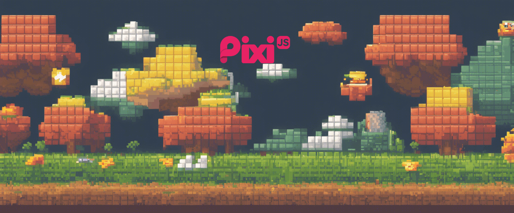
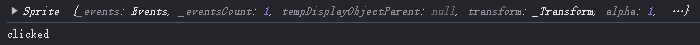
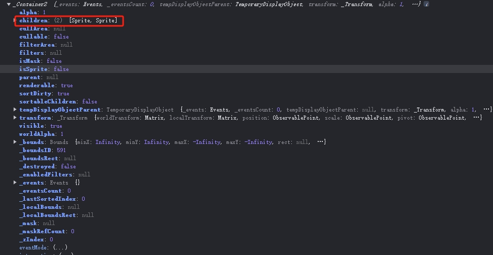
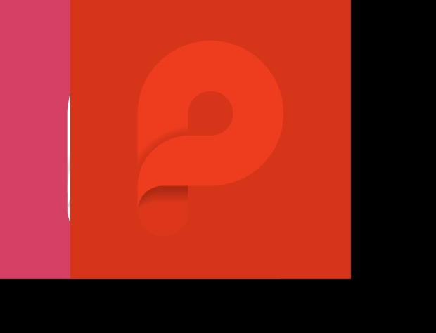
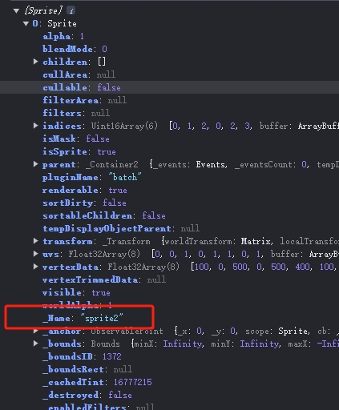
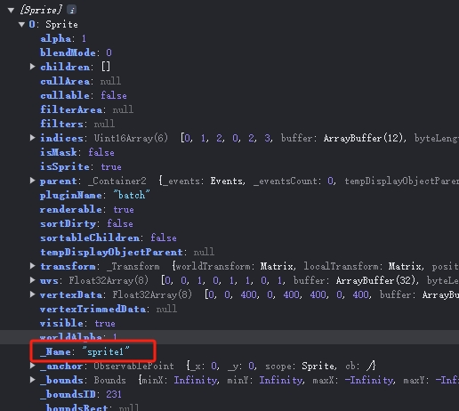

# 响应 Pointer 交互事件(上篇)

上一章我们分析了 sprite 在 canvasRenderer 上的渲染，那么接下来得看看交互上最重要的事件系统了



## 最简单的 demo

还是用一个最简单的 demo 演示 `example/sprite-pointerdown.html`

为 sprite 添加一个 pointerdown 事件，即点击事件，移动设备上就是 touch 事件， desktop 设备上即 click 事件

```
const app = new PIXI.Application({ width: 800, height: 600, autoStart: false });  
document.body.appendChild(app.view);  

const sprite = PIXI.Sprite.from('logo.png');

sprite.on('pointerdown', ()=> {
    console.log('clicked')
})

app.stage.addChild(sprite);  
app.start()
```

试着用鼠标点击 sprite ，会发现控制台并未输出期望的 'clicked'

奇奇怪怪... 看下官网的例子，需要为 sprite 添加  `sprite.eventMode = 'static';`;

再运行，就可以看到控制台正常输出 'clicked' 了


## 显示对象没有自己的事件

Canvas 本身不像 DOM 那样每个元素都有自带的事件的系统用于响应事件

需要自己实现事件系统，可交互的元素都应该是 DisplayObject 及继承自它的子类元素

`/packages/display/src/DisplayObject.ts` 第 210 行

```
export abstract class DisplayObject extends utils.EventEmitter<DisplayObjectEvents>
```

说明，DisplayObject 继承了 EventEmitter 类，因此就有了自定义的事件系统，所有对应的 API

> eventemitter3:   https://github.com/primus/eventemitter3

eventemitter3 的 REAMDME 过于简单

得看它的 测试用例  https://github.com/primus/eventemitter3/blob/master/test/test.js

可以发现 监听事件可以用 on, 触发事件可以用 emit 

所以 PixiJS 中的 DisplayObject 类实例对象就可以用 on  监听事件，用 emit 触发事件，即**有了自定义事件的能力**

当显示对象有了自定义事件能力后，需要一个事件管理系统来管理显示对象的事件触发、监听、移除

来看看 EventSystem 类

`/packages/events/src/EventSystem.ts` 204 -238 行 

```
constructor(renderer: IRenderer)
  {
    this.renderer = renderer;
    this.rootBoundary = new EventBoundary(null);
    EventsTicker.init(this);

    this.autoPreventDefault = true;
    this.eventsAdded = false;

    this.rootPointerEvent = new FederatedPointerEvent(null);
    this.rootWheelEvent = new FederatedWheelEvent(null);

    this.cursorStyles = {
        default: 'inherit',
        pointer: 'pointer',
    };

    this.features = new Proxy({ ...EventSystem.defaultEventFeatures }, {
        set: (target, key, value) =>
        {
            if (key === 'globalMove')
            {
                this.rootBoundary.enableGlobalMoveEvents = value;
            }
            target[key as keyof EventSystemFeatures] = value;

            return true;
        }
    });
    this.onPointerDown = this.onPointerDown.bind(this);
    this.onPointerMove = this.onPointerMove.bind(this);
    this.onPointerUp = this.onPointerUp.bind(this);
    this.onPointerOverOut = this.onPointerOverOut.bind(this);
    this.onWheel = this.onWheel.bind(this);
  }
```

> EventSystem.ts 的最后一行 extensions.add(EventSystem); 会将它以扩展插件的方式集成到 pixiJS 内

可以看到构造函数内很简单，

1. 传入了渲染器实例

2. rootBoudary “根边界” 这个对象很重要，后面会具体介绍

3. 单独创建一个 ticker 用于管理事件，确保运行状态下显示对象的碰撞检测事件

4. 实例化了两个事件对象，用于触发时传递，事件对象内的数据结构

5. onPointerDown/onPointerMove/onPointerUp/onPointerOverOut/onWheel 等绑定到当前 this 上

当 EventSystem 加入 PixiJS 管理后，会被触发 'init' 这个 Runner ， 可理解这个 init 生命周期函数被触发

在 EventSystem.ts 第 245 - 254 行：

```
init(options: EventSystemOptions): void
{
    const { view, resolution } = this.renderer;

    this.setTargetElement(view as HTMLCanvasElement);
    this.resolution = resolution;
    EventSystem._defaultEventMode = options.eventMode ?? 'auto';
    Object.assign(this.features, options.eventFeatures ?? {});
    this.rootBoundary.enableGlobalMoveEvents = this.features.globalMove;
}
```

可以看到，setTargetElement 用于设置事件目标元素，就是 渲染器对应的 view， 可以认为这个 view 就是 canvas 本身，它是可以响应浏览器的 DOM 事件的, 当然包括，鼠标的点击，移动 等。


setTargetElement 函数 最终会调到 addEvents() 


在 EventSystem.ts 第 483 - 546 行：
```
private addEvents(): void
    {
      ... 省略部分源码
        if (this.supportsPointerEvents)
        {
            globalThis.document.addEventListener('pointermove', this.onPointerMove, true);
            this.domElement.addEventListener('pointerdown', this.onPointerDown, true);
            ... 省略部分源码
            globalThis.addEventListener('pointerup', this.onPointerUp, true);
        }
        else
        {
            globalThis.document.addEventListener('mousemove', this.onPointerMove, true);
            this.domElement.addEventListener('mousedown', this.onPointerDown, true);
            ... 省略部分源码

            if (this.supportsTouchEvents)
            {
                this.domElement.addEventListener('touchstart', this.onPointerDown, true);
               ... 省略部分源码
            }
        }

        this.domElement.addEventListener('wheel', this.onWheel, {
            passive: true,
            capture: true,
        });

        this.eventsAdded = true;
    }
```

此函数是真正为根元素（或者说是整个 canvas 内自定义事件发起事件的元素）添加事件监听器的地方。

如果支持 pointer 事件则使用 pointer 事件，

如果不支持 pointer 事件则使用 mouse 事件。

如果支持 touch 事件则也要添加上 touch 事件

> 注意 move 相关的事件是添加在 document 元素上的

至此，当用户点击 canvas 元素时，就相关的回调函数就会执行，如注册的   this.onPointerDown、this.onPointerUp 等

触发的回调函数内会去触发 eventemitter3 的自定义事件。

还是以我们在 sprite-pointer.html 中的例子为例，我们注册了 sprite-pointer.html 中 sprite.on('pointerdown', function() {})，那么当用户点击 canvas 元素时，就会触发这个回调函数。


在 onPointerDown 

在 EventSystem.ts 第 343 - 377 行：

private onPointerDown(nativeEvent: MouseEvent | PointerEvent | TouchEvent): void
{
    ... 省略部分源码
    this.rootBoundary.rootTarget = this.renderer.lastObjectRendered as DisplayObject;

    const events = this.normalizeToPointerData(nativeEvent);
    ... 省略部分源码

    for (let i = 0, j = events.length; i < j; i++)
    {
        const nativeEvent = events[i];
        const federatedEvent = this.bootstrapEvent(this.rootPointerEvent, nativeEvent);

        this.rootBoundary.mapEvent(federatedEvent);
    }

    ... 省略部分
}

1. 先指定当前 rootBoundary.rootTarget = this.renderer.lastObjectRendered 即响应事件的目标对象"为渲染器最上层的一个显示对象"

2. 适配浏览器原生事件 nativeEvent 后，调用 this.rootBoundary.mapEvent(federatedEvent)， federatedEvent 即标准化为 PixiJS 自定义事件


##  事件边界 EventBoundary

canvas 内绘制的元素要准确的响应用户点击的操作，必须先确定用户点击的范围在哪里，然后将范围内的 DisplayObject 显示元素触发对应用户绑定的点击事件回调

`/packages/events/src/EventBoundary.ts`

EventBoundary.ts 构造函数 149 - 172 行 ：

```
constructor(rootTarget?: DisplayObject)
  {
      this.rootTarget = rootTarget;

      this.hitPruneFn = this.hitPruneFn.bind(this);
      this.hitTestFn = this.hitTestFn.bind(this);
      this.mapPointerDown = this.mapPointerDown.bind(this);
      this.mapPointerMove = this.mapPointerMove.bind(this);
      this.mapPointerOut = this.mapPointerOut.bind(this);
      this.mapPointerOver = this.mapPointerOver.bind(this);
      this.mapPointerUp = this.mapPointerUp.bind(this);
      this.mapPointerUpOutside = this.mapPointerUpOutside.bind(this);
      this.mapWheel = this.mapWheel.bind(this);

      this.mappingTable = {};
      this.addEventMapping('pointerdown', this.mapPointerDown);
      this.addEventMapping('pointermove', this.mapPointerMove);
      this.addEventMapping('pointerout', this.mapPointerOut);
      this.addEventMapping('pointerleave', this.mapPointerOut);
      this.addEventMapping('pointerover', this.mapPointerOver);
      this.addEventMapping('pointerup', this.mapPointerUp);
      this.addEventMapping('pointerupoutside', this.mapPointerUpOutside);
      this.addEventMapping('wheel', this.mapWheel);
  }
```

构造函数内表明实例化后， 由 addEventMapping  方法 将pointerdown，pointermove， pointerout .... 等  8 类事件的回调映射函数保存在了 `mappingTable` 对象内

后续使用过程中用户添加到显示对象上的交互事件，都会被存储到对应的这 8 类事件列表中


当鼠标点击例子中的 sprite 显示对象时，这个 mapPointerDown 会被触发

EventBoundary.ts 构造函数 672 - 701 行 ：

```
protected mapPointerDown(from: FederatedEvent): void
{
    if (!(from instanceof FederatedPointerEvent))
    {
        console.warn('EventBoundary cannot map a non-pointer event as a pointer event');

        return;
    }

    const e = this.createPointerEvent(from);
    console.log(e.target)
    this.dispatchEvent(e, 'pointerdown');

    if (e.pointerType === 'touch')
    {
        this.dispatchEvent(e, 'touchstart');
    }
    else if (e.pointerType === 'mouse' || e.pointerType === 'pen')
    {
        const isRightButton = e.button === 2;

        this.dispatchEvent(e, isRightButton ? 'rightdown' : 'mousedown');
    }

    const trackingData = this.trackingData(from.pointerId);

    trackingData.pressTargetsByButton[from.button] = e.composedPath();

    this.freeEvent(e);
}
```

当 view 被点击后，先创建事件对象，然后向目标对象发送事件，接下来就是找到那个目标对象了


## 找到目标对象即点击的对象

把 mapPointerDown 函数的 `const e = this.createPointerEvent(from);` 的事件对象打出来看看



图 4-1 

果然 e.target 把当前点击的就是 sprite，显然在这一步确定了 **当前点击的对象**  `this.createPointerEvent(from);` 方法调用非常重要

createPointerEvent 该当在 EventBoundary.ts 文件的 1181 - 1205 行 ：

```
protected createPointerEvent(
    from: FederatedPointerEvent,
    type?: string,
    target?: FederatedEventTarget
): FederatedPointerEvent
{
    const event = this.allocateEvent(FederatedPointerEvent);

    this.copyPointerData(from, event);
    this.copyMouseData(from, event);
    this.copyData(from, event);

    event.nativeEvent = from.nativeEvent;
    event.originalEvent = from;
    event.target = target
        ?? this.hitTest(event.global.x, event.global.y) as FederatedEventTarget
        ?? this._hitElements[0];

    if (typeof type === 'string')
    {
        event.type = type;
    }

    return event;
}
```

可以看到正是在这个 `createPointerEvent` 方法内调用 hitTest 或 _hitElements

注意 mapPointerDown 方法内调用  `const e = this.createPointerEvent(from);` 时只传了一个参数 from

所以此处 target 的确定就是由 `this.hitTest(event.global.x, event.global.y) as FederatedEventTarget` 来决定的

向 hitTest 方法 传入了当前事件的全局的 x, y 坐标

在 EventBoundary.ts 文件的 247 - 265 行 ：
```
public hitTest(
    x: number,
    y: number,
): DisplayObject
{
    EventsTicker.pauseUpdate = true;
    // if we are using global move events, we need to hit test the whole scene graph
    const useMove = this._isPointerMoveEvent && this.enableGlobalMoveEvents;
    const fn = useMove ? 'hitTestMoveRecursive' : 'hitTestRecursive';
    console.log(this.rootTarget)
    const invertedPath = this[fn](
        this.rootTarget,
        this.rootTarget.eventMode,
        tempHitLocation.set(x, y),
        this.hitTestFn,
        this.hitPruneFn,
    );

    return invertedPath && invertedPath[0];
}
```

由于对 move 事件需要特殊处理，所以需要判断 在 hitTest 函数内调用了 hitTestMoveRecursive || hitTestRecursive

我们当前 demo 中用的是点击事件，所以调用的会是 hitTestRecursive

把 this.rootTarget 打印出来看看



图 4-2

可以看到图 4-2 当前 rootTarget 是一个 container 对象

当点击事件发生时，需要判断的不止是当前对象，而是当前 container 下的所有子对象，所以才需要用到  hitTestRecursive 即是递归判断


## 递归遍历

hitTestRecursive 函数的最生两个参数分别是用于具体碰撞检测的 hitTestFn 函数 和 用于判断是否可剔除用于碰撞判断的 hitPruneFn 函数

在 EventBoundary.ts 文件的 407 - 539 行 ：

```
protected hitTestRecursive(
    currentTarget: DisplayObject,
    eventMode: EventMode,
    location: Point,
    testFn: (object: DisplayObject, pt: Point) => boolean,
    pruneFn?: (object: DisplayObject, pt: Point) => boolean
): DisplayObject[]
{
    // Attempt to prune this DisplayObject and its subtree as an optimization.
    if (this._interactivePrune(currentTarget) || pruneFn(currentTarget, location))
    {
        return null;
    }

    if (currentTarget.eventMode === 'dynamic' || eventMode === 'dynamic')
    {
        EventsTicker.pauseUpdate = false;
    }

    // Find a child that passes the hit testing and return one, if any.
    if (currentTarget.interactiveChildren && currentTarget.children)
    {
        const children = currentTarget.children;

        for (let i = children.length - 1; i >= 0; i--)
        {
            const child = children[i] as DisplayObject;

            const nestedHit = this.hitTestRecursive(
                child,
                this._isInteractive(eventMode) ? eventMode : child.eventMode,
                location,
                testFn,
                pruneFn
            );

            if (nestedHit)
            {
                // Its a good idea to check if a child has lost its parent.
                // this means it has been removed whilst looping so its best
                if (nestedHit.length > 0 && !nestedHit[nestedHit.length - 1].parent)
                {
                    continue;
                }

                // Only add the current hit-test target to the hit-test chain if the chain
                // has already started (i.e. the event target has been found) or if the current
                // target is interactive (i.e. it becomes the event target).
                const isInteractive = currentTarget.isInteractive();

                if (nestedHit.length > 0 || isInteractive) nestedHit.push(currentTarget);

                return nestedHit;
            }
        }
    }

    const isInteractiveMode = this._isInteractive(eventMode);
    const isInteractiveTarget = currentTarget.isInteractive();

    // Finally, hit test this DisplayObject itself.
    if (isInteractiveMode && testFn(currentTarget, location))
    {
        // The current hit-test target is the event's target only if it is interactive. Otherwise,
        // the first interactive ancestor will be the event's target.
        return isInteractiveTarget ? [currentTarget] : [];
    }

    return null;
}
```

函数大致流程 

1. 进来先判断是否需要进行碰撞检测 `if (this._interactivePrune(currentTarget) || pruneFn(currentTarget, location))` 
   
   剔除需要进行碰撞检测的对象，比如遮罩、不可见、不可交互、无需渲染等对象

2. 如果有子显示对象，则需要循环所有子显示对象，并递归检测子显示对象

3. 如果碰撞检测成功（点击位置有子显示对象）则在返回的 nextedHit 数组内把 currentTarget 添加进队尾, 并返回 nestedHit 数组
   
   ```
   if (nestedHit.length > 0 || isInteractive) nestedHit.push(currentTarget);
   return nestedHit;
   ```
4. 最后 如果是 isInteractiveMode 并且 testFn 碰撞检测成功，则把当前碰撞对象放到数组内返回

注意在这个函数内的这一行  `const isInteractiveMode = this._isInteractive(eventMode);` 

在 EventBoundary.ts 文件的 541 -544 行 ：
```
private _isInteractive(int: EventMode): int is 'static' | 'dynamic'
{
    return int === 'static' || int === 'dynamic';
}
```

**到这里终于知道我们 demo 中当没有指定 eventMode 为 static 或 dynamic 时，没有响应点击事件的原因了**

这是检测 rootTarget 父级对象的, 如果父级对象比如 container 都不支持交互了，就不必再对其子显示对象进行碰撞检测了

还有 `const isInteractiveTarget = currentTarget.isInteractive();` 这一行，判断元素本身是否可交互 也是判断 eventMode 这是检测当前 target 的

在`/packages/events/src/FederatedEventTarget.ts` 事件定义内 657 - 660 行：

```
isInteractive()
{
    return this.eventMode === 'static' || this.eventMode === 'dynamic';
},
```

接下来就要用碰撞检测来检测是否是点击对象了

## 找到碰撞检测函数

注意看最后的 testFn 即传入来的 hitTestFn 碰撞检测函数

在 EventBoundary.ts 文件的 615 - 637 行 ：

```
protected hitTestFn(displayObject: DisplayObject, location: Point): boolean
{
    // If the displayObject is passive then it cannot be hit directly.
    if (displayObject.eventMode === 'passive')
    {
        return false;
    }

    // If the display object failed pruning with a hitArea, then it must pass it.
    if (displayObject.hitArea)
    {
        return true;
    }

    if ((displayObject as any).containsPoint)
    {
        return (displayObject as any).containsPoint(location) as boolean;
    }

    // TODO: Should we hit test based on bounds?

    return false;
}
```

主要进行了三个判断 

1. eventMode === 'passive' 直接不进行碰撞检测，用于优化性能，比如在滚动区域内滚动时可以设置内部的元素为 passive

2. displayObject.hitArea 判断 主要作用

    - 自定义交互区域：你可以定义一个特定的区域来响应用户交互，而不是使用显示对象的整个边界框。这在某些情况下非常有用，例如当你有一个复杂形状的对象，但只希望某个部分响应交互。
    - 提高性能：通过定义较小的交互区域，可以减少不必要的命中测试，从而提高性能。
    - 精确控制：你可以精确控制哪些区域应该响应用户交互，这在游戏开发和复杂的用户界面中非常有用。

3. displayObject.containsPoint 检测，可以看到，`containsPoint` 是由显示对象各自自己实现的方法

**注意：** GraphicsGeometry.containsPoint 方法，内可知，如果你绘制的是直线、贝塞尔曲线等线条添加鼠标事件是不会起作用的，因为这些只是路径，并不是形状，你需要为这些添加 hitArea 后才交互事件才会起作用


以 sprite 类实现的 `containsPoint` 举例

`/packages/sprite/src/Sprite.ts` 第 439 - 459 行：

```
public containsPoint(point: IPointData): boolean
{
    this.worldTransform.applyInverse(point, tempPoint);

    const width = this._texture.orig.width;
    const height = this._texture.orig.height;
    const x1 = -width * this.anchor.x;
    let y1 = 0;

    if (tempPoint.x >= x1 && tempPoint.x < x1 + width)
    {
        y1 = -height * this.anchor.y;

        if (tempPoint.y >= y1 && tempPoint.y < y1 + height)
        {
            return true;
        }
    }

    return false;
}
```

sprite 的 containsPoint 判断坐标点是否在显示对象的矩形内比较简单，就是将全局坐标点转换为 sprite 的本地坐标点，然后判断是否在矩形内

this.worldTransform.applyInverse 方法，传入一个坐标点，返回一个由世界坐标转换成本地坐标的新坐标点，这个新坐标点就是 sprite 本地坐标点


## 如何处理 sprite 叠加时的碰撞检测

如果只是简单的点与形状的碰撞检测，那么如果两个显示对象叠加在一起时，点击上层的显示对像，如果不加处理，叠在下面的对象也会响应点击事件

新建个 demo 演示 `example/two-sprite-pointerdown.html` 

```
const app = new PIXI.Application({ width: 800, height: 600, autoStart: false });  
document.body.appendChild(app.view);  

const sprite = PIXI.Sprite.from('logo.png');  
sprite.eventMode = 'static';
sprite._Name = 'sprite1';
sprite.on('pointerdown', ()=> {
    console.log('clicked')
})

const sprite2 = PIXI.Sprite.from('logo.png');
sprite2.tint = 'red';
sprite2.eventMode = 'static';
sprite2._Name = 'sprite2';
sprite2.x = 100
sprite2.on('pointerdown', ()=> {
    console.log('clicked2')
})

app.stage.addChild(sprite);  
app.stage.addChild(sprite2);  
app.start()
```

1. 其它代码与 `sprite-pointerdown.html` 几乎一样，就是添加了两个 sprite 且有一部分重叠在一起

2. 分别给这两个 sprite 分别添加了 _Name 属性，方便调试 sprite1 和 sprite2

3. sprite2 的 tint 属性设置为红色

3. 修改了 sprite2 的x 值，使得 sprite2 只覆盖一部分 sprite1

如图：4-3



图 4-3

在 hitTestRecursive 函数内把 for 循环内的 nestedHit 打印出来 

在 EventBoundary.ts 文件的 407 - 539 行 ：

```
protected hitTestRecursive(
    currentTarget: DisplayObject,
    eventMode: EventMode,
    location: Point,
    testFn: (object: DisplayObject, pt: Point) => boolean,
    pruneFn?: (object: DisplayObject, pt: Point) => boolean
): DisplayObject[]
{
    ...省略部分代码
    if (currentTarget.interactiveChildren && currentTarget.children)
    {
        const children = currentTarget.children;

        for (let i = children.length - 1; i >= 0; i--)
        {
            const child = children[i] as DisplayObject;

            const nestedHit = this.hitTestRecursive(
                child,
                this._isInteractive(eventMode) ? eventMode : child.eventMode,
                location,
                testFn,
                pruneFn
            );
            console.log(nestedHit)
            ...省略部分代码
        }
    }
    ...省略部分代码
}
```

测试，点击与左侧logo重叠的位置右侧红色的 pixijs logo 



图 4-4

输出结果确实是正确的，并没有把 sprite1 输出，仔细看 for 循环可以发现它是倒序遍历的，也就是添加在最后的显示对象，先响应碰撞

因为后面添加的对象理论上是覆盖在上层，所以应该先响应碰撞

如果把 for 循环的遍历顺序改成正序，那么就会输出 sprite1

```
...省略部分代码
for (let i = 0; i < children.length; i++)
{
    const child = children[i] as DisplayObject;

    const nestedHit = this.hitTestRecursive(
        child,
        this._isInteractive(eventMode) ? eventMode : child.eventMode,
        location,
        testFn,
        pruneFn
    );
    console.log(nestedHit)
    ...省略部分代码
}
```


图 4-5

可以看到，通过 for 循环的倒序遍历就实现了盖在上层的显示对象优先响应的功能

## 本章小节

碰撞检测的粗略流程：

EventSystem.ts 的 init -> pointerdown -> onPointerDown -> mapPointerDown -> createPointerEvent -> hitTest -> hitTestRecursive -> hitTestFn -> containsPoint


事件的检测为什么不是像素级:

与 EaselJS 库的像素级碰撞检测不同，  PixiJS 采用的是点与形状的碰撞检测

> https://github.com/pixijs/pixijs/wiki/v5-Hacks#pixel-perfect-interaction


绕了一圈函数调用，才成功实现碰撞检测，下一篇再关注一下，碰撞检测成功后，**派发事件**


