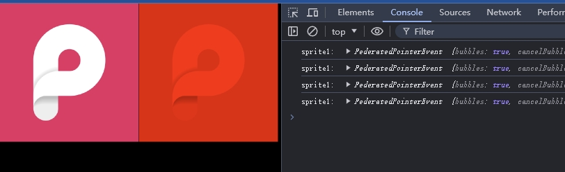
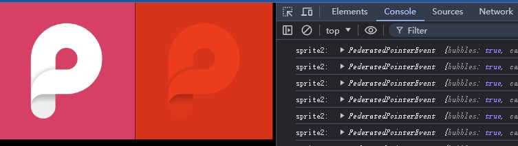

# 响应 Pointer 交互事件(下篇)

紧接上一章我们分析了 Pointer 交互事件 pointerdown 如何通过碰撞检测获得点击的物体。这一篇我们来分析获取到具体碰撞物体后事件的派发

最后还有 EventEmitter3 的核心源码分析

## 事件的派发,传播与通知

PixiJS 的事件会尽量与 DOM 事件保持一至，或者说是兼容 DOM 事件

`/packages/events/src/EventBoundary.ts` 构造函数 672 - 701 行 ：

```
protected mapPointerDown(from: FederatedEvent): void
{
   ... 省略部分源码
    const e = this.createPointerEvent(from);
    this.dispatchEvent(e, 'pointerdown');

    if (e.pointerType === 'touch')
    {
        this.dispatchEvent(e, 'touchstart');
    }
    else if (e.pointerType === 'mouse' || e.pointerType === 'pen')
    {
        const isRightButton = e.button === 2;

        this.dispatchEvent(e, isRightButton ? 'rightdown' : 'mousedown');
    }
  ... 省略部分源码
}
```

还记得上一篇中我们也是通过这个函数内的 createPointerEvent 创建事件

一旦创建了，就需要调用 dispatchEvent 派发事件，用以触发用户的事件监听函数

可以看到这两行都会被执行

```
this.dispatchEvent(e, 'pointerdown');
this.dispatchEvent(e, 'touchstart');
```

为了保证在移动设备上也能兼容用于 PC 上的代码，派发的事件会 触发 click (即 pointerdown 事件) 和 touch 事件


看看这个 `dispatchEvent` 函数：

```
public dispatchEvent(e: FederatedEvent, type?: string): void
{
    e.propagationStopped = false;
    e.propagationImmediatelyStopped = false;

    this.propagate(e, type);
    this.dispatch.emit(type || e.type, e);
}
```

`dispatchEvent` 函数内又调用了 propagate 函数，就像这个函数名的意义一样，“传播”，

dispatchEvent 与 Dom 事件一样，事件 propagate 都是先捕获，再冒泡

```
public propagate(e: FederatedEvent, type?: string): void
{
    ...省略部分代码
    const composedPath = e.composedPath();

    // Capturing phase
    e.eventPhase = e.CAPTURING_PHASE;

    for (let i = 0, j = composedPath.length - 1; i < j; i++)
    {
        e.currentTarget = composedPath[i];

        this.notifyTarget(e, type);

        if (e.propagationStopped || e.propagationImmediatelyStopped) return;
    }

    // At target phase
    e.eventPhase = e.AT_TARGET;
    e.currentTarget = e.target;

    this.notifyTarget(e, type);

    if (e.propagationStopped || e.propagationImmediatelyStopped) return;

    // Bubbling phase
    e.eventPhase = e.BUBBLING_PHASE;

    for (let i = composedPath.length - 2; i >= 0; i--)
    {
        e.currentTarget = composedPath[i];

        this.notifyTarget(e, type);

        if (e.propagationStopped || e.propagationImmediatelyStopped) return;
    }
}
```

composedPath 是当前事件发生的节点路径，路径保存的是从最顶层的渲染节点到当前事件发生节点


1. 将当前事件的事件阶段定义为捕获 `CAPTURING_PHASE`

2. 正序遍历这（从顶层渲染节点到子渲染节点）个路径，依次调用 notifyTarget 函数

3. 完成捕获阶段后，将事件阶段定义为当前对象 `AT_TARGET` 并派发事件 `this.notifyTarget(e, type);`

4. 完成当前对象的事件派发后继续 `e.eventPhase = e.BUBBLING_PHASE;` 设为冒泡阶段

5. 倒序遍历这个路径（从子渲染节点到顶层渲染节点），依次调用 notifyTarget 函数


注意，所有 notifyTarget 派发事件后都要判断事件是否有被阻止

propagate 函数内每一次通知事件对象前都会将 e.currentTarget 设置为当前遍历到的节点

eventPhase 的值定义在 `FederatedEvent.ts` 文件内底部定义了三个常量用于表示事件阶段

`/packages/events/src/FederatedEvent.ts` 221 - 224 行: 

```
readonly NONE = 0;
readonly CAPTURING_PHASE = 1;
readonly AT_TARGET = 2;
readonly BUBBLING_PHASE = 3;
```

分别表示

- 0 无，
- 1 捕获阶段，
- 2 正处于事件发生当前对象，
- 3 事件冒泡阶段

建一个简单的 demo `/examples/container-sprite-pointerdown`

```
<script type="text/javascript">
const app = new PIXI.Application({ width: 800, height: 600, autoStart: false });  
document.body.appendChild(app.view);  

const sprite = PIXI.Sprite.from('logo.png');  
sprite.eventMode = 'static';
sprite.on('pointerdown', ()=> {
    console.log('clicked1')
})

const container =  new PIXI.Container();
container.eventMode = 'static';
container.addChild(sprite);
container.on('pointerdown', ()=> {
    console.log('clicked2')
})
app.stage.addChild(container);  
app.start()
</script>
```

例子很简单: 一个 container 对象添加了一个 sprite 对象

sprite 监听了 pointerdown 事件触发时输出 clicked1

container 监听了 pointerdown 事件触发时输出 clicked2

在 `/packages/events/src/EventBoundary.ts` 函数 mapPointerDown 内 680 行 

将 e 输出：

```
protected mapPointerDown(from: FederatedEvent): void
{
    ...省略部分代码

    const e = this.createPointerEvent(from);
    console.log(e)

    ...省略部分代码
}
```

测试：用鼠标点击 sprite 后查看控制台可以看到输出


图 5-1 

图 5 - 1 红色箭头处显示的是 3 即事件冒泡阶段

图 5 - 1 红色框内 path 显示有 2 个 container 和 1 个 sprite，但我们明明只添加了一个 container

path 数组内第一个 container 应该就是顶层的 stage 对象，为了验证是不是 stage 对象，我们在 demo 中为 stage 对象添加一个 _Name 属性 值为  'hello'

`/examples/container-sprite-pointerdown`

```
app.stage._Name = 'hello';
```

刷新后点击 sprite 后控制台输出


图 5-2

currentTarget _Name 就是 'hello' 即舞台


图 5-3


path 数组第一个 container 就是 stage 对象，_Name 就是 'hello' 即舞台


## 事件通知

从 mapPointerDown 开始依次调用 dispatchEvent -> propagate -> notifyTarget -> notifyListeners

notifyListeners 函数在 `/packages/events/src/EventBoundary.ts` 1441 - 1464 行：

```
private notifyListeners(e: FederatedEvent, type: string): void
{
    const listeners = ((e.currentTarget as any)._events as EmitterListeners)[type];

    if (!listeners) return;
    if (!e.currentTarget.isInteractive()) return;

    if ('fn' in listeners)
    {
        if (listeners.once) e.currentTarget.removeListener(type, listeners.fn, undefined, true);
        listeners.fn.call(listeners.context, e);
    }
    else
    {
        for (
            let i = 0, j = listeners.length;
            i < j && !e.propagationImmediatelyStopped;
            i++)
        {
            if (listeners[i].once) e.currentTarget.removeListener(type, listeners[i].fn, undefined, true);
            listeners[i].fn.call(listeners[i].context, e);
        }
    }
}
```

在 notifyListeners 函数内，添加以下 debugger 断点代码

注意这里添加了事件判断，只对 mousedown 事件添加断点，后面会具体说明原因

```
if(type=== 'mousedown'){
    console.log(e.currentTarget)
    debugger
}

```

刷新后点击 sprite 后控制台输出：


图 5-4


图 5-5

注意 notifyListeners 函数第一句  `const listeners = ((e.currentTarget as any)._events as EmitterListeners)[type];` 的 `_events` 属性


`_events` 属性是 eventemitter3 事件库内的一个 “私有属性”


notifyListeners 函数就是简单的找到事件名对应的事件监听函数，然后调用，即“触发事件”

派发事件前还判断了 ‘once’ 属性，如果为 true，则移除该事件监听函数


## 特殊的 pointermove 事件

`this.hitTest` 函数中可以看到有这么一句：

在 `/packages/events/src/EventBoundary.ts`  255 行：

```
const fn = useMove ? 'hitTestMoveRecursive' : 'hitTestRecursive';
```

为什么碰撞检测递归函数要区别开呢？

新建个 demo 演示 `example/hit-test.html` 

```
<script type="text/javascript">
    const app = new PIXI.Application({ width: 800, height: 600, autoStart: true });  
    document.body.appendChild(app.view);  
  
    const sprite = PIXI.Sprite.from('logo.png');  
    sprite.eventMode = 'static';
    sprite.width = 200;
    sprite.height = 200;
    sprite.on('pointermove', (e)=> {
      console.log('sprite1: ',e)
    })

    const sprite2 = PIXI.Sprite.from('logo.png');
    sprite2.tint = 'red';
    sprite2.eventMode = 'static';
    sprite2.width = 200;
    sprite2.height = 200;
    sprite2.x = 200;

    app.stage.addChild(sprite);  
    app.stage.addChild(sprite2);  
    app.start()
  </script>
```

上面的 hit-test.html 很简单，加载显示了 sprite1 和 sprite2

为 sprite1 添加了 'pointermove' 事件

然后把 
在 `/packages/events/src/EventBoundary.ts`  255 行换去掉 `hitTestMoveRecursive`

```
const fn = 'hitTestRecursive';
```

运行 demo 测试，当鼠标移动到 sprite1 上方时，控制台还是会正常输出值：



图 5-6

可以看到，碰撞检测还是正常在运行

我们再给我们的 demo 内的 sprite2 添加一个 `globalpointermove` 事件

```
// 注册全局指针移动事件监听器
sprite2.on('globalpointermove', (e) => {
  console.log('sprite2: ', e);
});
```

再运行代码，你会发现 sprite2 无法正常输出值

把代码还原回来，在 `/packages/events/src/EventBoundary.ts`  255 行：

```
const fn = useMove ? 'hitTestMoveRecursive' : 'hitTestRecursive';
```

再次运行 demo 会发现，无论鼠标在网页的何处运动，sprite2 监听的`globalpointermove` 事件 都会输出值



图 5-7

查看 `hitTestMoveRecursive` 函数， 在 `/packages/events/src/EventBoundary.ts` 370 - 453 行：

```
protected hitTestMoveRecursive(
  currentTarget: DisplayObject,
  eventMode: EventMode,
  location: Point,
  testFn: (object: DisplayObject, pt: Point) => boolean,
  pruneFn?: (object: DisplayObject, pt: Point) => boolean,
  ignore = false
): DisplayObject[]
{
  ... 省略部分代码
  if (isInteractiveMode && isInteractiveTarget) this._allInteractiveElements.push(currentTarget);
  ... 省略部分代码
}
```

可以看到函数内有一个属性名为 `_allInteractiveElements` 的数组，收集了所有需要交互对象，不像 pointerdown 这样独立的事件， pointermove 触发时也需要触发 globalpointermove


在 mapPointerMove 函数内  在 `/packages/events/src/EventBoundary.ts` 707 - 840 行：

pointermove 函数需要处理 `mouseout`, `pointerout`, `pointerleave`, `mouseleave`, `mouseover`, `pointerover`, `pointerenter`, `mouseenter`, `touchmove`, `mousemove` 等事件

最后收集完成所有需要'通知' 的对象有，调用 `this.all(e, allMethods);` 函数


在 all 函数内  在 `/packages/events/src/EventBoundary.ts` 324 - 342 行：
```
public all(e: FederatedEvent, type?: string | string[], targets = this._allInteractiveElements): void
  {
      if (targets.length === 0) return;

      e.eventPhase = e.BUBBLING_PHASE;

      const events = Array.isArray(type) ? type : [type];

      // loop through all interactive elements and notify them of the event
      // loop through targets backwards
      for (let i = targets.length - 1; i >= 0; i--)
      {
          events.forEach((event) =>
          {
              e.currentTarget = targets[i];
              this.notifyTarget(e, event);
          });
      }
  }
```

可以看到，这个函数参数最后一个参数默认就是 `this._allInteractiveElements` 数组

并且对传入函数的 type 即事件名称参数进行判断后，所有事件都遍历并'通知'一遍


## EventEmitter3 会比其它事件库快？

以下是该事件库的源码，可到 github 查看

> EventEmitter3:   https://github.com/primus/eventemitter3

eventemitter3 库非常的轻量，源码即使包含了注释也才 336 行代码

它凭啥比其它库更快呢？

### 一、对添加事件监听的优化

```
function addListener(emitter, event, fn, context, once) {
  if (typeof fn !== 'function') {
    throw new TypeError('The listener must be a function');
  }

  var listener = new EE(fn, context || emitter, once)
    , evt = prefix ? prefix + event : event;

  if (!emitter._events[evt]) emitter._events[evt] = listener, emitter._eventsCount++;
  else if (!emitter._events[evt].fn) emitter._events[evt].push(listener);
  else emitter._events[evt] = [emitter._events[evt], listener];

  return emitter;
}
```

在 `addListener` 函数内可以看到三种情况判断：

1. 当 `!emitter._events[evt]` 时说明 evt 没有监听器，直接将监听器对象 listener 赋值给 `emitter._events[evt] = listener`
    这种方式避免了创建数组的开销，并且在发射事件时可以直接调用监听器函数

2. 当 `!emitter._events[evt].fn` 时说明 evt 有监听器，但是监听器没有fn (回调函数)，说明是多个监听器即是个数组，此时将监听器对象 listener 添加到数组中

3. 最后如果事件 evt 已经有一个监听器（但不是数组），则将现有监听器和新监听器放入一个数组中


### 二、对派发事件进行优化

与添加事件监听与之对应的 EventEmitter3 发射事件时会根据监听器的类型（单个或多个）进行不同的处理，以提高性能

```
EventEmitter.prototype.emit = function emit(event, a1, a2, a3, a4, a5) {
  const evt = prefix ? prefix + event : event;

  if (!this._events[evt]) return false;

  const listeners = this._events[evt];
  const len = arguments.length;
  let args, i;

  if (listeners.fn) {
    if (listeners.once) this.removeListener(event, listeners.fn, undefined, true);

    switch (len) {
      case 1: return listeners.fn.call(listeners.context), true;
      case 2: return listeners.fn.call(listeners.context, a1), true;
      case 3: return listeners.fn.call(listeners.context, a1, a2), true;
      case 4: return listeners.fn.call(listeners.context, a1, a2, a3), true;
      case 5: return listeners.fn.call(listeners.context, a1, a2, a3, a4), true;
      case 6: return listeners.fn.call(listeners.context, a1, a2, a3, a4, a5), true;
    }

    for (i = 1, args = new Array(len - 1); i < len; i++) {
      args[i - 1] = arguments[i];
    }

    listeners.fn.apply(listeners.context, args);
  } else {
    const length = listeners.length;
    let j;

    for (i = 0; i < length; i++) {
      if (listeners[i].once) this.removeListener(event, listeners[i].fn, undefined, true);

      switch (len) {
        case 1: listeners[i].fn.call(listeners[i].context); break;
        case 2: listeners[i].fn.call(listeners[i].context, a1); break;
        case 3: listeners[i].fn.call(listeners[i].context, a1, a2); break;
        case 4: listeners[i].fn.call(listeners[i].context, a1, a2, a3); break;
        default:
          if (!args) for (j = 1, args = new Array(len - 1); j < len; j++) {
            args[j - 1] = arguments[j];
          }

          listeners[i].fn.apply(listeners[i].context, args);
      }
    }
  }

  return true;
};
```

如果事件 evt 只有一个监听器，直接调用该监听器函数。

如果事件 evt 有多个监听器，遍历监听器数组并依次调用每个监听器函数。

还有一点优化是在发射事件时不进行类型检查与错误处理，直接调用监听器函数


### 三、简化的事件存储结构

```
class EventEmitter {
  constructor() {
    this._events = Object.create(null);
    this._eventsCount = 0;
  }
}
```

_events 使用 Object.create(null) 创建一个没有原型链的对象，这样可以避免不必要的属性检查和原型链查找。


### 四、重剑无锋，大巧不工

我看过某些程序员对这个库的源码分析，其中提到的一个缺点就是说这个库的代码“不够抽象”，“不够高级”

就如上面的 EventEmitter.prototype.emit 函数，它里面有 switch 语句，一般程序员看到，那还能忍？必须想着把它进行抽像，不然不是显得不高级么？

却实，这个库的代码是平铺直叙的没有调来调去的上下文调用。但正是因为这样的代码，代码很简洁，逻辑清晰，很容易理解，也不会进行上下文调用的开销


## 本章小节

本节大致走完了事件派发的实现原理，以及介绍了事件库 EventEmitter3 从中可以了解到 PixiJS 虽然是一个渲染库，但也实现了交互事件模块，它使用了 EventEmitter3 作为事件库，实现了事件派发，并实现了事件监听，事件发射，事件移除等功能

虽然差出了话题讲了一部分 EventEmitter3 的源码，且 EventEmitter3 库源码已是 2014 年就实现了，但依然时分值得借鉴


