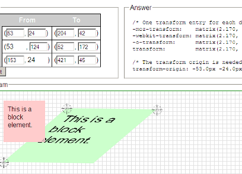
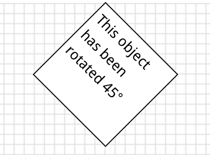
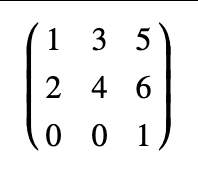
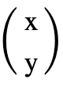

The CSS3 matrix() Transform for the Mathematically Challenged

数学挑战 css3 matrix() 变幻

> 原文作者： zoltan
> 译者：池中物王二狗 sheldon

原文地址：

<https://www.useragentman.com/blog/2011/01/07/css3-matrix-transform-for-the-mathematically-challenged/>


The CSS3 transform property can do some really cool things - with it, web designers can rotate, scale, skew and flip objects quite easily. However, in order for deisgners to have fine-grained, pixel level control over their transforms, it would be really helpful to understand how the matrix() function works. With the matrix() function, designers can position and shape their transformations exactly where they want to.

CSS3 的transform 属性可以做非常酷的事情 -- 有了它，网页设计师实现对物体进行旋转，绽放，扭曲和翻转将非常容易。为网页设计师可以通过 transform 属性获得更细颗粒度象达到素级别的控制，理解 matrix() 函数如何运行是非常有帮助的。使用 maxtrix() 函数，网页设计师可以对需要变化的物体精确控制位置与形状，指哪儿打哪儿。

The problem is, not many people actually understand what the numbers in the matrix filter actually mean. To solve this issue, I have created a tool, which I call the CSS3 Matrix Construction Set that can take any block-element, positioned anywhere on the page, transform it anywhere else on the page using the matrix() filter, and reveal the correct CSS code for this operation. Look at the tool now and if that is all you are interested in, you can stop there. However, if you what to know what the numbers in the matrix() function actually mean, and why you want such knowledge in the first place, read on. I'll try to explain this as simply as possible (and please feel free to use the feedback form if you have any opinions on how to make this article better).

问题是，很多人事实上并不理解 matrix 函数内的数字具体的意义。为了解决这个问题，我创建了一个工具，我把它称为 CSS3 矩阵构建器 (CSS3 Matrix Construction Set)，通过 matrix() 滤镜它能对页面中的任何块级元素进行定位、任意变化，并对执行的变化生成展示的正确的 CSS 代码。现在先关注工具，如果你的兴趣止步于此，那么你现在就可以停下了。当然，如果你想知道 matrix() 函数内的数字的意义，以及为啥你首先要了解这些知识，那么请继续往下阅读。我会尽可能以简单的方式来解释（译者注：这里作者表达了如果你想提建议可以通过某个无法访问的网站提，我就翻译了.. 人家就是谦虚一下）





可以看看我做的这个工具 <https://www.useragentman.com/matrix/>

> 注意： 在低版本浏览器或IE浏览器中这个工作不兼容


## Matrices: Why Should I Care?

Matrices are to transforms like RGB hex codes are to colors: they are representations that are easy for computers to understand, but not human beings. Sure, web designers can use the rotate(), skew(), scale() and translate() functions to fulfill their transformation needs ... why should we bother with matrix() at all? There are a few cases when you may want to:

Brevity:
Using matrices, it is possible to represent a complex string of 2D transforms like this:

## 矩阵：我为什么需要了解矩阵？

矩阵用于变形比如将16进制的RGB代码转换为颜色：转换后的颜色代码更容易被计算机解析，但不易于人类阅读。的确，网页设计师可以用 rotate(), skew(), scale() 和 translate() 等函数方法满足他们对形变的需求... 那么为什么还要介入了解 matrix() 方法呢？这里有几个例子用来解答你的疑惑：

简洁：

利用矩阵，可以用更简洁的字符表示复杂的2D形变：

```
#object {
    transform-origin: 0 0;
    transform: rotate(15deg) translateX(230px)  scale(1.5, 2.6) skew(220deg, -150deg) translateX(230px)
}

```

using one matrix() rule like this:
使用一句 matrix() 实现如下：

```
#object {
    transform-origin: 0 0;
    transform: matrix(1.06, 1.84, 0.54, 2.8, 466px, 482px)
}
```

(Note: I have ignored the vendor-specific variants (e.g. moz-transform, etc.) for the sake of brevity).

(注意：为了简洁我省略了css属性的兼容性前缀)。

Pixel-Perfection:
If you know exactly how you want your transformation to look, it'll take a bit of fiddling around to get it to look how you want using the other transform functions, and it may not be pixel perfect if you lack patience (like I do). However, using a tool like the Matrix Construction Set, you can place the transform exactly where you want (This is analogous to using a color wheel to choose RGB colors for you, instead of using keywords like red, green or peachpuff).
JavaScript:
Revealing an object's transform information using JavaScript's getComputedStyle() function will yield a matrix() function in all current web browsers that support CSS3 transforms, even if it was rendered using other transform functions like rotate(). For example, the object below has been rotated 45° using transform: rotate(45deg):

像素级完美：

如果你精确的知道你想要的形变样式，如果用 transfrom 方法会费点儿精力，如果你没有足够的耐心，可做不到像素极的还原需求（像我一样没耐心）。然而使用像矩阵构建器这样的工具，你想把变形应用在哪里就应用在哪里（这与用可择取的色盘类似，不用输入关键词，红，绿或桃色）。

Javascript:

所有支持CSS3形变能力的现代浏览器在使用 JavaScript getComputedStyle() 方法获取对象的形变信息时它总是以 matrix() 方法形象展现，即使形变渲染时使用的是 rotate() 方法。举个例子，一个对象利用 `transform: rotate(45deg)` 旋转了 45 度：




## Ok, What Does The Markup Look Like?

The matrix() function takes 6 parameters in order for it to work:

## 好的，矩阵表示应试是什么样的？

matrix() 方法共有 6 个参数值共同作用：

```
#transformedObject {
     -moz-transform:    matrix(1.4488, -0.3882, 0.3882, 1.4489, 400, -100);
     -webkit-transform: matrix(1.4488, -0.3882, 0.3882, 1.4489, 400, -100);
     -o-transform:      matrix(1.4488, -0.3882, 0.3882, 1.4489, 400, -100);
     transform:         matrix(1.4488, -0.3882, 0.3882, 1.4489, 400, -100);
}
```

## But What Do The Numbers Mean?

In order to explain what they mean, I will have to define a few math-concepts here. Don't panic if you are mathematically challenged. These concepts are not that hard to understand, but there is a bit of explanation needed. Why should you torture yourself if you hate math?

If you are a designer:

Think of the stuff below as informational. If you use the Matrix Construction Set you won't need to calculate anything by hand (but wouldn't you want to have an idea what the numbers mean anyway?)

If you are a JavaScript developer:

This information will be invaluable when optimizing scripts that rely on transformation effects. Just try to understand the basic concepts here, and if you still need help, use the Sylvester JavaScript library to do the heavy lifting for you.

If you want to be an über-geek:

All those matrix jokes you hear at parties will suddenly start to make sense!

## 这些数值各自代表什么意思？

为了解释这些参数的意义，我不得不先定义一些数学概念。如果你觉数学对你来讲太有挑战也别慌。这些概念不难，一点点数学概念也仅是出于解释的需要。如果你厌恶数学为什么又要需要自虐？

如果你是设计师：

更底层的思考。如果你用矩阵构建器你不需要手动计算（你难道不想知道这些数字意味着什么吗？）

如果你是Javascript 开发者：

在对形变特效进行优化时这些知识极为有用。在这里试着理解基础概念，如果你仍需要帮助，那么用 Sylvester JavaScript 库吧帮你完成复杂的数学运算吧。

如果你想成为电脑砖家（über-geek）：

在派对上你就能听懂矩阵一类的笑话了！


（译都注：这真的很冷）

## Terminology

### Matrix

The easiest way to think of a matrix is as a group of numbers written in a rectangle or square. For our purposes, we will be dealing with 3x3 matrices, such as this one below:

## 术语

### 矩阵

最简单的方式理解矩阵就是把它看作是一组写成矩形或正方式的数字组合。当然我们现在只需要处理3x3的矩阵就可以了，就像下面这样：



That's nine numbers! So how come the CSS3 matrix() function only has six?

这些数字看起来不错！但为什么 CSS3 matrix() 方法的参数只有 6 个？

```
#transformedObject {
    transform:  matrix(1, 2, 3, 4, 5, 6);
}
```

For CSS3 2D transforms, we only deal with 3x3 matrices that have the two bottom-left numbers that are equal to zero, and the bottom-right value equal to 1. As a result, these two notations are equal:

为了 CSS3 2D 形变，我们仅处理 3x3 左下两个值为 0，右下一个值为 1 的矩阵。结果就是下面两个表达式相等：


Dot Product
Next we are going to explain what a dot product is. At first, this may not seem like this is related to matrices at all, but I promise it does ... just read on and you'll understand why in no time. Trust me. :-)

Let's say you have two (x, y) points,  (1  2) and  (4  5)
 . The dot product of these two points (written  (1  2) · (4  5)) is what you get when you multiply the two x-coordinates, multiply the two y-coordinates, and then add them together:


## 点积

接下来我们解释什么是点积。首先，这可能看起来不像是矩阵相关的东西，但我保证，它就是... 请继续阅读你会立即理解的，信我。 :-)

假设有两个 (x, y) 点， (1, 2) 和 (4,5)。 两个点的点积(写作 `(1,2)·(4,5)`) 就是 x 轴数相乘 y 轴相乘之和:

```
(1  2)·(4  5) = 1x4 + 2x5 = 4 + 10 = 14
```

This doesn't only work for 2-dimensional coordinates, but also in 3-dimensions and higher:

这不仅作用在2维坐标系内，3维或更高维度都适用：

```
(123) · (456) = 1x4 + 2x5 + 3x6 = 4 + 10 + 18 = 32

(12310) ·  (45620) = 1x4 + 2x5 + 3x6 + 10x20 = 4 + 10 + 18 + 200 = 232

```

Got it? It's pretty simple, right? Note that when we write (x, y) co-ordinates like  (x  y) , we call  (x  y) a vector. Vector notation can be written horizontally, (e.g.  (xy) ) or vertically (e.g.  ). When using them in 2D transforms, we always add an extra co-ordinate with a number 1 at the end. So (20, 90) would be written  (20 90 1) or like   in vector notation.


