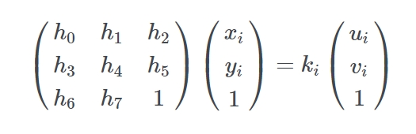
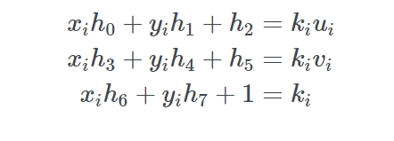

2d:

```
matrix(a, b, c, d, tx, ty) 
```

3d:

```
matrix3d(a, b, 0, 0, c, d, 0, 0, 0, 0, 1, 0, tx, ty, 0, 1)
```


https://developer.mozilla.org/zh-CN/docs/Web/CSS/transform-function/matrix


我们现在目的四个角（坐标点）对应编号：

(x1,y1), (x2,y2) , (x3,y3) , (x4,y4) 

将它们映射到对应的

(u1,v1), (u2,v2) , (u3,v3) , (u4,v4) 

即将坐标 (x<sub>i</sub>, y<sub>i</sub>) 映射到 (u<sub>i</sub>, v<sub>i</sub>)

根据 matrix3d 文档 我们需要用的是齐次矩阵， 所以先要用齐次坐标来表示每个坐标点

坐标 (x, y) 被表示为 (kx, ky, k), k 不为 0

举例 (3, 2, 1) 和 (6, 4, 2) 都表示坐标点 (3, 2)


于是我们要求得转置矩阵 H 要满足上面等式中所有已知的角 (x<sub>i</sub>, y<sub>i</sub>), (u<sub>i</sub>, v<sub>i</sub>)

注意，求得的 H 解不是唯一的，例如 H 乘以一个常数，得出的结果矩阵仍然对应正确的坐标点



为了简化问题设 h8 设为 1

然后将乘数乘进去




现在将第3行等式代入前两行把 k<sub>i</sub> 去掉先


记住我们要解决的是 h<sub>i</sub> 所以我们应该尝试先把它们分开来


两个等式中 h0..h7 空出缺少的部分用 0 填充 （为何要填充：H 等于 k<sub>i</sub> 若要等式相等则 H 必须是 h0..h7 完整）

将 h 提出来来，用矩形形式表示就是:


由于我们要表示的是四个坐标点，所以我们可以写成这样：


至此已经可以了，就是一个 Ah=b 的问题，可以用线性代数库来求解 h ，解得的 h 对应的 h<sub>i</sub> 用于 transform 形变矩阵


最后一个小问题，就是 Matrix3d 需要的是 4x4 的矩阵，我们从开始就忽略掉了 z 轴值（由于四个点都在同一个平面，所以 z = 0）, 所以把 z 重新映射回矩阵：


这就是最后用于 matrix3d 的矩阵， 记住按列优先的顺序指定，还有，根据你自身的需求设置好 transform-origin 原点


  

参考资料

https://developer.mozilla.org/zh-CN/docs/Web/CSS/transform-function/matrix

https://franklinta.com/2014/09/08/computing-css-matrix3d-transforms/

https://docs.opencv.org/2.4/modules/imgproc/doc/geometric_transformations.html#getperspectivetransform%22