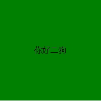
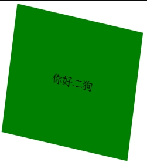
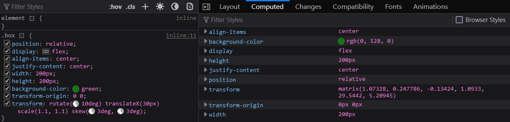
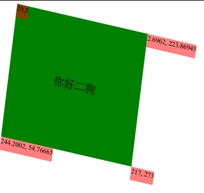
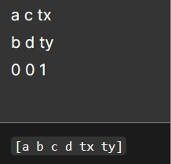
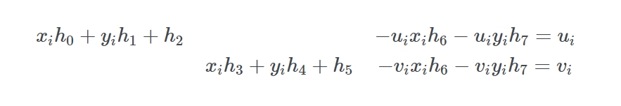
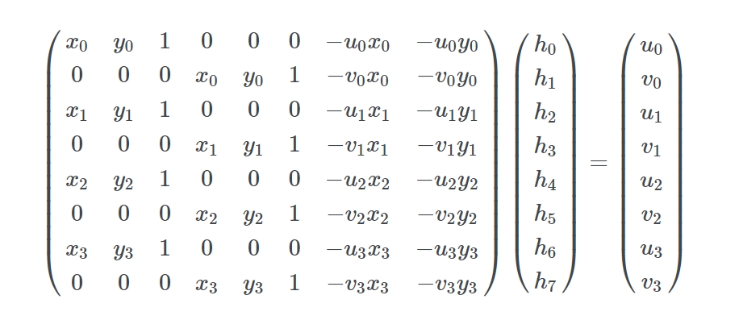
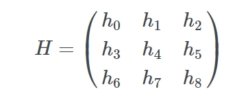

老师学这个有什么用？老师的回答是考试用..

行列式

在 css 中利用 transform 对某个元素进行 旋转，平移，缩放，倾斜非常常见以及常用

这些基础应用都被讲烂了

像这样


```
.box {
    transform-origin:0 0;
    transform: rotate(10deg) translateX(30px)  scale(1.1, 1.1) skew(3deg, 3deg);
}
```



transform 后：




但你应该明白它最终是以矩阵形式表达的，八股文中有没有要背的我不知道，毕竟这些知识很多人已经讲过了。如果你这都不知道，基础知道还得加强啊

通过火狐的开发者工具查看 computed 面板中可以看到其实转换成了对应的 matrix


结果 matrix:



线性变幻 linear transform 包括以下几种

1) scale 缩放
2) rotate 旋转
3) skew 斜切
4) translate 平移

用矩阵形式表达如下图示：


这些都可以组合在一起形成 **单个**  matrix 矩阵实现变幻,

这在之前的我的 "EaselJS 源码分析系列--第二篇" 中有提到过，多种变幻合成到一个 matrix 一次变幻到位


## 那么它到底是怎么应用 matrix 变幻的呢？

拿上面的例子举例： 实质是对绿色 box 四个坐标 (0,0)、(200,0)、(0,200)、(200,200) 分别点乘了 (Dot product) matrix 矩阵:

```
matrix(1.07328, 0.247786, -0.13424, 1.0933, 29.5442, 5.20945)
```

得到新坐标:

(29,5), (244.2002, 54.76665), (2.6962, 223.86945), (217, 273)




怎么点乘？

说到点乘简单复习一下大学数学基础知识（看看就行了，你不需要自己算）

2 · 2


3 · 3


虽然你不用自己算，但 matrix 函数参数得搞明白

注意函数 matrix 参数 a, b, c, d, tx, ty 对应的位置:

```
matrix(a, b, c, d, tx, ty) 
```




手动计算是不可能的我们可以使用 numeric.js 数学库用于点乘计算：

```
// 在 numeric.dot 中的位置
numeric.dot([
    [a, c, tx],
    [b, d ty],
    [0, 0, 1]
]
, [0, 0, 1]
)
```

这是上面四个坐标的计算：

```
// matrix(1.07328, 0.247786, -0.13424, 1.0933, 29.5442, 5.20945);
// 位置 (0, 0)
const pos1 = numeric.dot([
    [1.07328, -0.13424, 29.5442],
    [0.247786, 1.0933, 5.20945],
    [0, 0, 1]]
    , [0, 0, 1])

// 位置 (200 ,0 )
const pos2 = numeric.dot([
    [1.07328, -0.13424, 29.5442],
    [0.247786, 1.0933, 5.20945],
    [0, 0, 1]]
    , [200, 0, 1])

// 位置 (0, 200) 
const pos3 = numeric.dot([
    [1.07328, -0.13424, 29.5442],
    [0.247786, 1.0933, 5.20945],
    [0, 0, 1]]
    , [0, 200, 1])

// 位置 (200, 200) 
const pos4 = numeric.dot([
    [1.07328, -0.13424, 29.5442],
    [0.247786, 1.0933, 5.20945],
    [0, 0, 1]]
    , [200, 200, 1])

console.log(pos1, pos2, pos3, pos4)

// (29,5), (244.2002, 54.76665), (2.6962, 223.86945), (217, 273)
```


讲了这么多，虽然看起来很厉害，但这又有什么卵用呢？

再仔细想想，想要更自由的变幻直接使用 matrix 是符合直觉的

**旧坐标 · matrix = 新坐标**

所以想要自由就得得到 matrix 

## 自由变幻的理论基础

先要进行亿点点线性代数运算

我们现在给四个角（坐标点）对应编号(“旧坐标”)：

(x1,y1), (x2,y2) , (x3,y3) , (x4,y4) 

目的是将它们映射（变幻）到对应的(“新坐标”)：

(u1,v1), (u2,v2) , (u3,v3) , (u4,v4) 

即将坐标 (x<sub>i</sub>, y<sub>i</sub>) 映射到 (u<sub>i</sub>, v<sub>i</sub>)

还有根据  matrix3d 文档 我们需要用的是齐次矩阵， 所以先要用齐次坐标来表示每个坐标点

```
matrix3d(a, b, 0, 0, c, d, 0, 0, 0, 0, 1, 0, tx, ty, 0, 1)
```


坐标 (x, y) 被表示为 (kx, ky, k), k 不为 0


于是我们要求得转置矩阵 H 要满足上面等式中所有已知的角 (x<sub>i</sub>, y<sub>i</sub>), (u<sub>i</sub>, v<sub>i</sub>)


为了简化问题设 h8 设为 1

然后将乘数乘进去


现在将第3行等式代入前两行把 k<sub>i</sub> 去掉先


记住我们要解决的是 h<sub>i</sub> 所以我们应该尝试先把它们分开来



两个等式中 h0..h7 空出缺少的部分用 0 填充 （为何要填充：H 等于 k<sub>i</sub> 若要等式相等则 H 必须是 h0..h7 完整）

将 h 提出来来，用矩形形式表示就是:


由于我们要表示的是四个坐标点，所以我们可以写成这样：



至此已经可以了，就是一个 Ah=b 的问题（即矩阵中常见的 Ax=b），可以用线性代数库（比如：numeric.js 的 numeric.solve）来求解 h ，解得的 h 对应的 h<sub>i</sub> 用于 transform 形变矩阵



最后一个小问题，就是 Matrix3d 需要的是 4x4 的矩阵，我们从开始就忽略掉了 z 轴值（由于四个点都在同一个平面，所以 z = 0）, 所以把 z 重新映射回矩阵：


这就是最后用于 css 上的 matrix3d 的矩阵

  

----
参考资料

https://developer.mozilla.org/zh-CN/docs/Web/CSS/transform-function/matrix

https://angrytools.com/css-generator/transform/

https://franklinta.com/2014/09/08/computing-css-matrix3d-transforms/

https://docs.opencv.org/2.4/modules/imgproc/doc/geometric_transformations.html#getperspectivetransform%22

https://www.zweigmedia.com/RealWorld/tutorialsf1/frames3_2.html