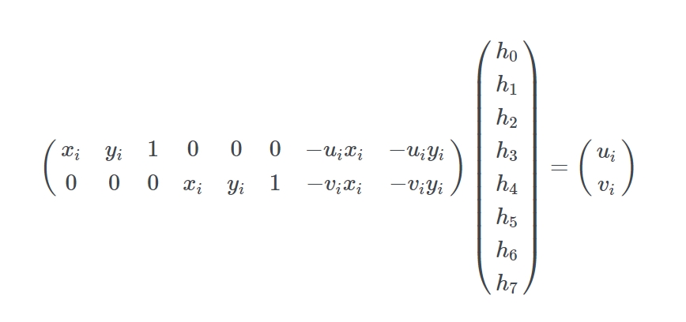
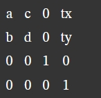

# 如何应用 matrix3d 映射变幻

## 先上 demo 

记得是在 2015 看到过的一个 html5 演示效果， 很惊艳

当时没明白如何实现，现在我会了，做一个类似的：


## 我数学真的很差

“你好老师！学这个矩阵具体有什么用？”

老师喝着水貌似想了一会儿回答：“考试用”..

这个问题我真问过老师

在校期间数学课上学到矩阵行列式相关的课程时，曾经问过当时的数学老师，学这个做啥用的，老师犹豫了半天给我的答案是 “考试用”

果然.. 最后我的成绩是不及格

当然不能怪老师，我本来的数学成绩一直也是垫底的

对于我这样的学渣来说，学习不能学以致用就像玩的游戏没有及时正反馈一样的难受

我是真的很难提起兴趣去学

为啥选了前端开发这个坑呢？就是因为代码写了刷新一下浏览器就能看到效果，真实时反馈

直到工作多年以后，学到图形学相关的知识才一知半解

为啥是一知半解呢，因为知道有这个东西，也知道用在哪里，可就是不会用，至少在大部分的前端开发工作上用不到

能在网上找到的相关应用就是 css 中利用 transform 对某个元素进行 旋转，平移，缩放，倾斜等， 这些基础应用都被讲烂了

像这样：

```
.box {
    transform-origin:0 0;
    transform: rotate(10deg) translateX(30px)  scale(1.1, 1.1) skew(3deg, 3deg);
}
```


transform 后：


但你应该明白它最终是以矩阵形式表达的，八股文中有没有要背的我不知道，毕竟这些知识很多人已经讲过了。当然如果你这都不知道，可能八股还得再八股一下

通过火狐的开发者工具查看 computed 面板中可以看到其实转换成了对应的 matrix


结果 matrix:


线性变幻 linear transform 包括以下几种

1) scale 缩放
2) rotate 旋转
3) skew 斜切
4) translate 平移

用矩阵形式表达如下图示：


这些都可以组合在一起形成 **单个**  matrix 矩阵实现变幻,

这在之前的我的 "EaselJS 源码分析系列--第二篇" 中有提到过，宽高，旋转，斜切，转换成 matrix 后一次变幻到位


## 那么它到底是怎么应用 matrix 变幻的呢？

拿上面的例子举例： 实质是对绿色 box 四个坐标 (0,0)、(200,0)、(0,200)、(200,200) 分别点乘了 (Dot product) matrix 矩阵:

```
matrix(1.07328, 0.247786, -0.13424, 1.0933, 29.5442, 5.20945)
```

得到新坐标:

(29,5), (244.2002, 54.76665), (2.6962, 223.86945), (217, 273)


怎么点乘？

说到点乘简单复习一下大学数学基础知识（看看就行了，你不需要自己算）

2 · 2


3 · 3


虽然你不用自己算，但 matrix 函数参数得搞明白

注意函数 matrix 参数 a, b, c, d, tx, ty 对应的位置:

```
matrix(a, b, c, d, tx, ty) 
```


手动计算是不可能的我们可以使用 numeric.js 数学库用于点乘计算：

```
// 在 numeric.dot 中的位置
numeric.dot([
    [a, c, tx],
    [b, d ty],
    [0, 0, 1]
]
, [0, 0, 1]
)
```

这是上面四个坐标的计算：

```
// matrix(1.07328, 0.247786, -0.13424, 1.0933, 29.5442, 5.20945);
// 位置 (0, 0)
const pos1 = numeric.dot([
    [1.07328, -0.13424, 29.5442],
    [0.247786, 1.0933, 5.20945],
    [0, 0, 1]]
    , [0, 0, 1])

// 位置 (200 ,0 )
const pos2 = numeric.dot([
    [1.07328, -0.13424, 29.5442],
    [0.247786, 1.0933, 5.20945],
    [0, 0, 1]]
    , [200, 0, 1])

// 位置 (0, 200) 
const pos3 = numeric.dot([
    [1.07328, -0.13424, 29.5442],
    [0.247786, 1.0933, 5.20945],
    [0, 0, 1]]
    , [0, 200, 1])

// 位置 (200, 200) 
const pos4 = numeric.dot([
    [1.07328, -0.13424, 29.5442],
    [0.247786, 1.0933, 5.20945],
    [0, 0, 1]]
    , [200, 200, 1])

console.log(pos1, pos2, pos3, pos4)

// (29,5), (244.2002, 54.76665), (2.6962, 223.86945), (217, 273)
```


## 讲了这么多，虽然看起来很厉害，但这又有什么卵用呢？

再仔细想想，想要仿射变换直接使用 matrix 是符合直觉的

**旧坐标 · matrix = 新坐标**

所以想要自由就得用到 matrix 

## “仿射变换”的理论基础

先要进行亿点点线性代数运算

我们现在给四个角（坐标点）对应编号(“旧坐标”)：

(x1,y1), (x2,y2) , (x3,y3) , (x4,y4) 

目的是将它们映射（变幻）到对应的(“新坐标”)：

(u1,v1), (u2,v2) , (u3,v3) , (u4,v4) 

即将坐标 (x<sub>i</sub>, y<sub>i</sub>) 映射到 (u<sub>i</sub>, v<sub>i</sub>)


坐标 (x, y) 被表示为 (kx, ky, k), k 不为 0

在齐次坐标中 (3,2,1) 和 (6,4,2) 都可以表示 (3,2)


于是我们要求得转置矩阵 H 要满足上面等式中所有已知的角 (x<sub>i</sub>, y<sub>i</sub>), (u<sub>i</sub>, v<sub>i</sub>)


满足 H 的值不是唯一的，举例，给 H 缩放乘以一个常数，结果矩阵依然会映射对应的点（右侧的 k<sub>i</sub> 也是一样的）

为了简化问题设假定将两边都缩放直到 h8 为 1 （简化问题计算）

然后将乘数乘进去


现在将第3行等式代入前两行把 k<sub>i</sub> 去掉先


记住我们要解决的是 h<sub>i</sub> 所以我们应该尝试先把它们分开来


两个等式中 h0..h7 空出缺少的部分用 0 填充 （为何要填充：H 等于 k<sub>i</sub> 若要等式相等则 H 必须是 h0..h7 完整）

将 h 提出来来，用矩形形式表示就是:



由于我们要表示的是四个坐标点的映射，所以我们可以写成这样：


至此已经可以了，就是一个 Ah=b 的问题（即矩阵中常见的 Ax=b），可以用线性代数库（比如：numeric.js 的 numeric.solve）来求解 h ，解得的 h 对应的 h<sub>i</sub> 用于 transform 形变矩阵


最后一个小问题，就是 Matrix3d 需要的是 4x4 的矩阵，我们从开始就忽略掉了 z 轴值（由于四个点都在同一个平面，所以 z = 0）, 所以把 z 重新映射回矩阵


```
matrix3d(a, b, 0, 0, c, d, 0, 0, 0, 0, 1, 0, tx, ty, 0, 1)
```




这就是最后用于 css 上的 matrix3d 的矩阵


## 将其应用到 HTML/Javascript 内

创建一个 id 为 box 的 div 作为变化源

创建一个 id 为 targetBox 的 div 作为目标

1. 创建一个 getPoints 用于获取四个点坐标
   
   ```
   ... 省略获取 targetBox，box 的代码

   function getPoints(element){
        const rect = element.getBoundingClientRect();
        return [
            [rect.left, rect.top],
            [rect.left, rect.bottom],
            [rect.right, rect.top],
            [rect.right, rect.bottom],
        ];
    }

    const target = getPoints(targetBox)
    const origin = getPoints(box)
   ```

2. 分别转换成相对坐标点
   
   ```
   function getFromPoints(points){
    // 映射前四个点相对坐标 
    const result = [];
    const len = points.length;
    for (let k = 0; k < len; k++) {
        let p = points[k];
        result.push({
        x: p[0] - points[0][0],
        y: p[1] - points[0][1]
        });
    }
    /**
        result 
        [
        {x1, y1},
        {x2, y2},
        {x3, y3},
        {x4, y4},
        ]
    */
    return result;
    }
    function getToPoints(origin, target){
        // 映射后四个点相对坐标 
        const result = [];
        for (let k = 0, len = target.length; k < len; k++) {
            p = target[k];
            result.push({
            x: p[0] - origin[0][0],
            y: p[1] - origin[0][1]
            });
        }
        return result;
    }

    const from = getFromPoints(origin);
    const to = getToPoints(origin, target);
   ```

3. 通过 from 与 to 获取 H
   
   ```
   function getTransform(from, to) {
        var A, H, b, h;
        A = []; // 8x8
        // 四个点的坐标
        for (let i =0 ; i < 4; i++) {
          A.push([from[i].x, from[i].y, 1, 0, 0, 0, -from[i].x * to[i].x, -from[i].y * to[i].x]);
          A.push([0, 0, 0, from[i].x, from[i].y, 1, -from[i].x * to[i].y, -from[i].y * to[i].y]);
        }
        b = []; // 8x1
        for (let i = 0; i < 4; i++) {
          b.push(to[i].x);
          b.push(to[i].y);
        }
        // Solve A * h = b for h
        // 即矩阵中常见的 Ax=b
        // numeric.solve eg:
        // IN> numeric.solve([[1,2],[3,4]],[17,39])
        // OUT> [5,6]
        // https://ccc-js.github.io/numeric2/documentation.html
        h = numeric.solve(A, b);

        /**
          解得: h matrix
          [
            h0, h1, 0 h2
            h3, h4, 0 h5
            0,  0, 0, 1
            h6, h7, 0 h8
          ]
        */
        H = [
              [h[0], h[1], 0, h[2]],
              [h[3], h[4], 0, h[5]],
              [0, 0, 1, 0],
              [h[6], h[7], 0, 1]
            ];
        return H;
    };

    const H = getTransform(from, to);
   ```
4. 生成 css 值应用到 div 上
   
   ```
   function getMatrixCSSParameters(H){
        // 获取 css matrix3d(a, b, 0, 0, c, d, 0, 0, 0, 0, 1, 0, tx, ty, 0, 1) 参数
        const result = [];
        for (let i =0; i < 4; i++) {
            const  result1 = [];
            for (let j = 0; j < 4; j++) {
            result1.push(H[j][i].toFixed(20));
            }
            result.push(result1);
        }
        return result.join(',');
    }

    div.style.transform = `matrix3d(${getMatrixCSSParameters(H)})`;
   ```

走了一大圈，现在终于可以实现“仿射变换”了


## 用上面的代码实现 demo 

demo 1 matrix3d 动画变化

https://github.com/willian12345/blogpost/blob/main/matrix/free-css-3d-transform/transform3d.html

demo 2 matrix3d 四角拖动变化

https://github.com/willian12345/blogpost/blob/main/matrix/free-css-3d-transform/drag.html


## 直接使用现成的库

我们碰到的问题大概率编程的前辈们都碰到过了

通过搜索后发现“仿射变换” 在 opencv 中有现成的函数

```
const H = cv.getPerspectiveTransform(from, to);
```

然后就 github 上找了一下，果然是有人实现了

然后用它提供的函数实现一遍 demo2

https://github.com/willian12345/blogpost/blob/main/matrix/free-css-3d-transform/drag-perspective-transform.html


----
参考资料

https://developer.mozilla.org/zh-CN/docs/Web/CSS/transform-function/matrix

https://angrytools.com/css-generator/transform/

https://franklinta.com/2014/09/08/computing-css-matrix3d-transforms/

https://docs.opencv.org/2.4/modules/imgproc/doc/geometric_transformations.html#getperspectivetransform%22

https://www.zweigmedia.com/RealWorld/tutorialsf1/frames3_2.html

https://ccc-js.github.io/numeric2/

https://github.com/fccm/getPerspectiveTransform